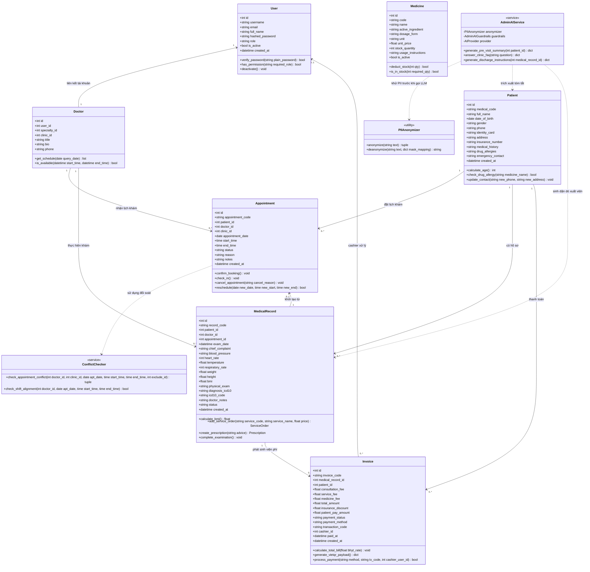
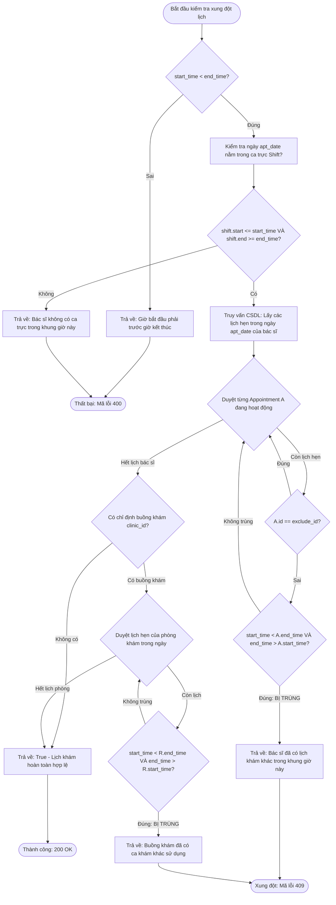
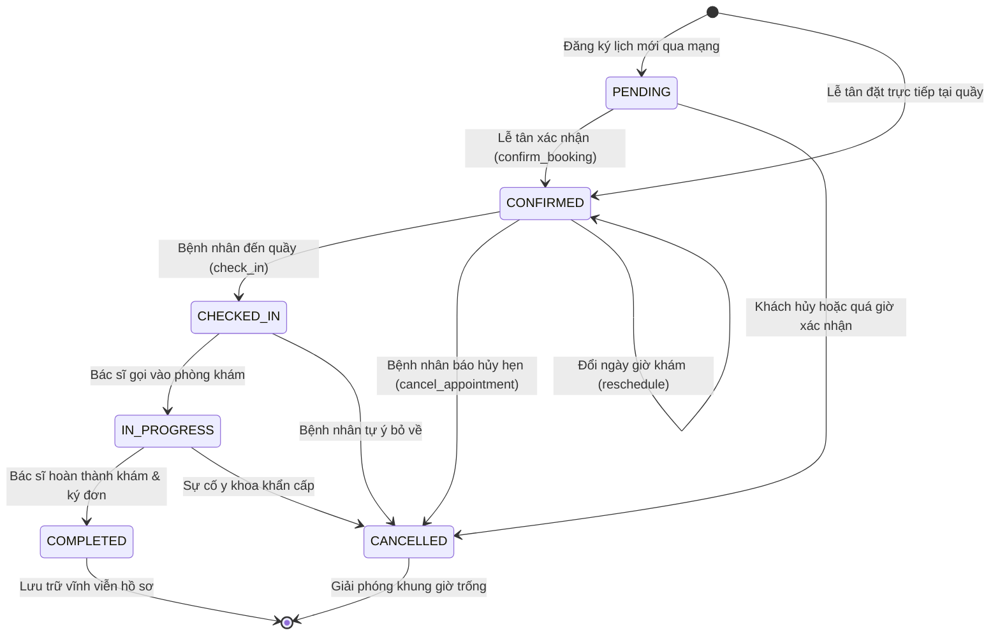
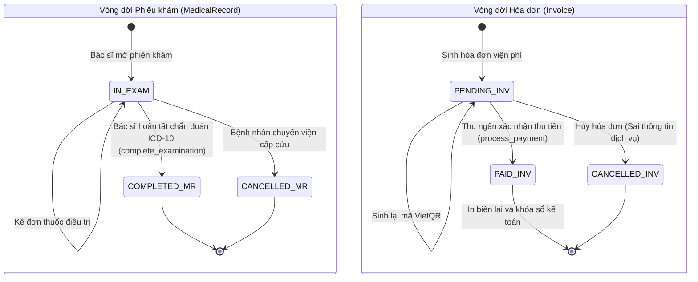
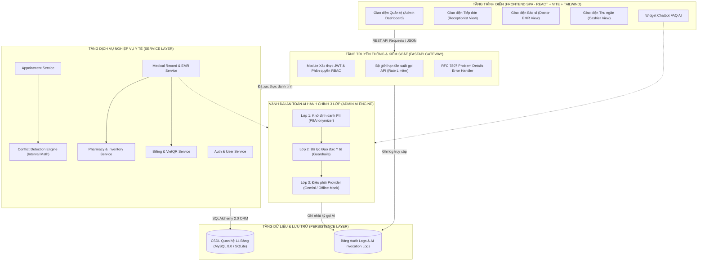

# Kỹ năng Thiết kế Biểu đồ UML & Trực quan hóa Hệ thống Phòng khám Thông minh (Diagram Design Skill)

## 1. Objective & Thông tin Đề tài (Nhóm 07)

Kỹ năng này quy định quy chuẩn chuyên môn, phương pháp luận và khuôn mẫu chi tiết để thiết kế, biểu diễn và trực quan hóa toàn bộ hệ thống sơ đồ UML (Unified Modeling Language) và các biểu đồ kiến trúc cho đề tài:

* **Tên ứng dụng:** Hệ thống quản lý phòng khám có tích hợp AI (Clinic Management System with Administrative AI Assistant - CMS-AI)
* **Đơn vị thực hiện:** Nhóm 07
  * **1. Đinh Gia Bảo (Trưởng nhóm)**
  * **2. Trần Đặng Công Tâm**
* **Thời gian thực hiện:** Từ 27/07/2026 đến 27/09/2026 (9 tuần)

### Mục tiêu cốt lõi của Kỹ năng:
1. **Mô hình hóa chức năng (Use Case Modeling):** Xây dựng sơ đồ Use Case tổng quan và phân rã chi tiết cho 4 vai trò nhân sự y tế (Admin, Lễ tân, Bác sĩ, Thu ngân/Kế toán) và 2 tác nhân hỗ trợ (Bệnh nhân, AI Engine), chuẩn hóa các quan hệ `<<include>>` và `<<extend>>`.
2. **Mô hình hóa cấu trúc tĩnh (Class Diagram):** Chuẩn hóa mô hình lớp hướng đối tượng dựa trên 10 thực thể cốt lõi (`User`, `Patient`, `Doctor`, `Appointment`, `ConflictChecker`, `MedicalRecord`, `Medicine`, `Invoice`, `PIIAnonymizer`, `AdminAIService`), xác định đúng các mối quan hệ Association, Aggregation, Composition, Dependency.
3. **Mô hình hóa hành vi động (Sequence & Activity Diagrams):** Đặc tả luồng tương tác thông điệp giữa người dùng, hệ thống backend và AI Engine qua 5 kịch bản thực tế quan trọng nhất; biểu diễn quy trình nghiệp vụ tổng thể và giải thuật kiểm tra xung đột lịch khám.
4. **Mô hình hóa vòng đời trạng thái (State Machine Diagrams):** Quản lý chu kỳ biến đổi trạng thái của Lịch hẹn (`Appointment`), Bệnh án (`MedicalRecord`) và Hóa đơn viện phí (`Invoice`).
5. **Cung cấp AI Prompts trực quan hóa:** Thiết lập bộ prompt mẫu chuẩn mực để kỹ sư hoặc giảng viên có thể copy dán trực tiếp vào các mô hình AI tạo sinh (ChatGPT, Claude, Midjourney, Draw.io AI, Napkin.ai, Eraser.io) để kết xuất hình ảnh đồ họa trực quan chuyên nghiệp.

---

## 2. Mô hình Khái niệm SDLC (Conceptual Model)

Trong khuôn khổ AI-Augmented SDLC:

```
+-----------------------------------------------------------------------------------------------+
|                                    MÔ HÌNH KHÁI NIỆM DIAGRAM DESIGN                           |
+-----------------------------------------------------------------------------------------------+
|  1. CODEX (AI Agent)         : Kỹ sư Thiết kế Hệ thống Hướng đối tượng (UML & System Designer)|
|                                Trích xuất thực thể, phân tích Use Case, sinh mã Mermaid/UML.   |
|  2. SKILL (Procedural Standard): Bộ quy chuẩn thiết kế biểu đồ UML, cấu trúc 10 class, quy định|
|                                quan hệ include/extend và bộ AI Prompts chuẩn (Skill này).     |
|  3. TOOL (Environment Action): Công cụ kiểm tra cú pháp Mermaid, script xuất file Word (.docx),|
|                                công cụ kiểm thử tự động pytest bảo đảm tính nhất quán mã nguồn.|
|  4. MCP (Model Context Protocol): Kết nối dữ liệu schema CSDL và các Endpoint API để đối soát |
|                                tính toàn vẹn của mô hình lớp so với mã nguồn thực thi.         |
+-----------------------------------------------------------------------------------------------+
```

---

## 3. Quy chuẩn Thiết kế Biểu đồ Use Case (Use Case Diagrams)

### 3.1. Phân loại Tác nhân (Actors)
Hệ thống xác định 4 tác nhân chính (Primary Actors) thuộc quyền kiểm soát của nhân sự phòng khám và 2 tác nhân hỗ trợ/bên ngoài (Supporting/External Actors):

1. **Quản trị viên (Admin):** Quản trị danh mục hệ thống, tài khoản, phân quyền RBAC, ca trực bác sĩ, giám sát Audit logs và cấu hình AI Engine.
2. **Lễ tân (Receptionist):** Tiếp đón bệnh nhân, quản lý thông tin hành chính người bệnh, tra cứu BHYT, đặt/đổi/hủy lịch khám và check-in vào phòng khám.
3. **Bác sĩ (Doctor):** Tiếp nhận danh sách chờ khám, xem tóm tắt AI Pre-visit, khám lâm sàng, ghi nhận sinh hiệu & ICD-10, chỉ định xét nghiệm, kê đơn thuốc và sinh dặn dò xuất viện AI.
4. **Thu ngân / Kế toán (Accountant):** Quản lý hóa đơn viện phí, tính mức hưởng BHYT, sinh mã VietQR động, thu tiền và in phiếu thu.
5. **Bệnh nhân (Patient - External Actor):** Đặt lịch hẹn trực tuyến, hỏi đáp chatbot quy trình khám bệnh, thực hiện chuyển khoản VietQR.
6. **Trợ lý AI / LLM Engine (AI Assistant - Supporting Actor):** Cung cấp các tác vụ tính toán hành chính (Tóm tắt hồ sơ bệnh án, FAQ quy trình, dặn dò đơn thuốc sau khám).

---

### 3.2. Sơ đồ Use Case Tổng quan Toàn hệ thống (Mermaid)

```mermaid
flowchart LR
    %% ACTORS
    Admin([Quản trị viên])
    Rec([Lễ tân])
    Doc([Bác sĩ])
    Acc([Thu ngân / Kế toán])
    Pat([Bệnh nhân])
    AI_Sys{{Trợ lý AI Hành chính}}
    VietQR_GW{{Cổng Napas / VietQR}}

    subgraph SYSTEM ["HỆ THỐNG QUẢN LÝ PHÒNG KHÁM CMS-AI"]
        direction TB

        %% CORE AUTH
        UC_Auth(Xác thực & Đăng nhập JWT)

        %% RECEPTIONIST USE CASES
        subgraph REC_MODULE ["Phân hệ Tiếp đón & Điều phối"]
            UC_RegPatient(Tiếp nhận & Đăng ký bệnh nhân)
            UC_BookAppt(Đặt lịch hẹn khám bệnh)
            UC_ReschedAppt(Đổi lịch / Hủy lịch hẹn)
            UC_CheckIn(Check-in tiếp nhận vào phòng)
            UC_SearchPatient(Tra cứu thông tin hồ sơ & BHYT)
            UC_ChatbotFAQ(Tư vấn quy trình qua Chatbot)
        end

        %% DOCTOR USE CASES
        subgraph DOC_MODULE ["Phân hệ Phòng khám Lâm sàng"]
            UC_ViewQueue(Xem danh sách chờ khám)
            UC_ViewSummary(Xem tóm tắt AI Pre-visit Briefing)
            UC_Examine(Khám lâm sàng & Ghi nhận ICD-10)
            UC_OrderService(Chỉ định dịch vụ Cận lâm sàng)
            UC_Prescribe(Kê đơn thuốc điều trị)
            UC_DischargeAI(Sinh hướng dẫn dặn dò xuất viện AI)
        end

        %% ACCOUNTANT USE CASES
        subgraph ACC_MODULE ["Phân hệ Viện phí & Thu ngân"]
            UC_ViewInvoice(Xem danh sách hóa đơn chờ)
            UC_CalcBill(Tính viện phí & Giảm trừ BHYT)
            UC_GenVietQR(Sinh mã thanh toán VietQR động)
            UC_ProcessPay(Ghi nhận thanh toán & In hóa đơn)
            UC_RevReport(Xem báo cáo doanh thu phòng khám)
        end

        %% ADMIN USE CASES
        subgraph ADM_MODULE ["Phân hệ Quản trị & Giám sát"]
            UC_ManageUser(Quản trị tài khoản & Phân quyền RBAC)
            UC_ManageDoctor(Quản lý Bác sĩ & Chuyên khoa)
            UC_ManageShift(Phân công ca trực Bác sĩ)
            UC_ManageMedicine(Quản lý kho Dược & Bảng giá)
            UC_ViewAudit(Giám sát Audit Trail & AI Logs)
        end

        %% COMMON INCLUDES & EXTENDS
        UC_Conflict(Kiểm tra xung đột lịch khám)
        UC_PII(Khử định danh dữ liệu PII)
        UC_AllergyCheck(Cảnh báo dị ứng thuốc)
        UC_StockCheck(Kiểm tra tồn kho Dược)
    end

    %% ACTOR CONNECTIONS
    Admin --> UC_ManageUser
    Admin --> UC_ManageDoctor
    Admin --> UC_ManageShift
    Admin --> UC_ManageMedicine
    Admin --> UC_ViewAudit

    Rec --> UC_RegPatient
    Rec --> UC_BookAppt
    Rec --> UC_ReschedAppt
    Rec --> UC_CheckIn
    Rec --> UC_SearchPatient
    Rec --> UC_ChatbotFAQ

    Doc --> UC_ViewQueue
    Doc --> UC_ViewSummary
    Doc --> UC_Examine
    Doc --> UC_OrderService
    Doc --> UC_Prescribe
    Doc --> UC_DischargeAI

    Acc --> UC_ViewInvoice
    Acc --> UC_CalcBill
    Acc --> UC_GenVietQR
    Acc --> UC_ProcessPay
    Acc --> UC_RevReport

    Pat --> UC_ChatbotFAQ
    Pat -.-> UC_BookAppt

    %% RELATIONS: INCLUDE
    UC_BookAppt -.->|<<include>>| UC_Conflict
    UC_ReschedAppt -.->|<<include>>| UC_Conflict

    UC_ViewSummary -.->|<<include>>| UC_PII
    UC_ViewSummary -.-> AI_Sys

    UC_DischargeAI -.->|<<include>>| UC_PII
    UC_DischargeAI -.-> AI_Sys

    UC_ChatbotFAQ -.-> AI_Sys

    UC_Prescribe -.->|<<include>>| UC_AllergyCheck
    UC_Prescribe -.->|<<include>>| UC_StockCheck

    UC_GenVietQR -.-> VietQR_GW

    %% AUTH INCLUDE
    UC_BookAppt -.->|<<include>>| UC_Auth
    UC_Examine -.->|<<include>>| UC_Auth
    UC_ProcessPay -.->|<<include>>| UC_Auth
    UC_ManageUser -.->|<<include>>| UC_Auth
```



---

### 3.3. Đặc tả Quan hệ `<<include>>` và `<<extend>>`

| Use Case Gốc | Quan hệ | Use Case Được Gọi | Điều kiện Kích hoạt / Mục đích Nghiệp vụ |
| :--- | :---: | :--- | :--- |
| **Đặt lịch hẹn (UC_BookAppt)** | `<<include>>` | Kiểm tra xung đột lịch (ConflictChecker) | Bắt buộc thực thi kiểm tra trùng giờ bác sĩ & buồng khám trước khi lưu lịch |
| **Đổi lịch hẹn (UC_ReschedAppt)** | `<<include>>` | Kiểm tra xung đột lịch (ConflictChecker) | Bắt buộc đối soát khung giờ mới và loại trừ ID lịch hiện tại |
| **Xem tóm tắt AI (UC_ViewSummary)** | `<<include>>` | Khử định danh PII (PIIAnonymizer) | Bắt buộc lọc sạch CCCD, SĐT, Tên trước khi gửi dữ liệu sang LLM |
| **Dặn dò sau khám AI (UC_DischargeAI)**| `<<include>>` | Khử định danh PII (PIIAnonymizer) | Bảo vệ thông tin cá nhân người bệnh theo Nghị định 13/2023/NĐ-CP |
| **Kê đơn thuốc (UC_Prescribe)** | `<<include>>` | Kiểm tra dị ứng thuốc (Patient.check_drug_allergy) | Đối soát tên thuốc dự kê với tiền sử dị ứng đã lưu của bệnh nhân |
| **Kê đơn thuốc (UC_Prescribe)** | `<<include>>` | Kiểm tra tồn kho (Medicine.is_in_stock) | Ngăn chặn việc kê đơn đối với thuốc đã hết hàng trong kho |
| **Kê đơn thuốc (UC_Prescribe)** | `<<extend>>` | Cảnh báo sốc phản vệ / Chống chỉ định | Kích hoạt khi phát hiện thuốc trùng với mục dị ứng của bệnh nhân |
| **Gọi Trợ lý AI (AdminAIService)** | `<<extend>>` | Tự động chuyển Fallback Mock Engine | Kích hoạt khi mất kết nối mạng hoặc LLM Cloud API quá tải/hết quota |
| **Thanh toán viện phí (UC_ProcessPay)** | `<<extend>>` | Áp dụng mức hưởng BHYT đúng tuyến | Kích hoạt khi bệnh nhân có thẻ BHYT hợp lệ trong hệ thống |

---

## 4. Quy chuẩn Thiết kế Biểu đồ Lớp (Class Diagram)

### 4.1. Cấu trúc Mô hình Lớp chuẩn hóa từ 10 Thực thể Cốt lõi
Biểu đồ lớp dưới đây phản ánh chính xác 10 lớp được phân bổ theo 4 nhóm chức năng:
1. **Nhóm Định danh & Nhân sự:** `User`, `Doctor`, `Specialty`, `Clinic`, `Shift`
2. **Nhóm Tiếp đón & Lịch hẹn:** `Patient`, `Appointment`, `ConflictChecker`
3. **Nhóm Khám chữa bệnh & Dược phẩm:** `MedicalRecord`, `ServiceOrder`, `Prescription`, `PrescriptionItem`, `Medicine`
4. **Nhóm Tài chính & Trợ lý AI:** `Invoice`, `PIIAnonymizer`, `AdminAIService`



---

## 5. Quy chuẩn Thiết kế Biểu đồ Tuần tự (Sequence Diagrams)

### 5.1. Kịch bản 1: Tiếp nhận Đặt lịch khám & Phát hiện Xung đột thời gian thực

```mermaid
sequenceDiagram
    autonumber
    actor Rec as Lễ tân (Receptionist)
    boundary FE as Giao diện Web SPA
    control API as AppointmentRouter / API Gateway
    control CC as ConflictChecker Service
    entity DB as Cơ sở Dữ liệu (MySQL/SQLite)

    Rec->>FE: Nhập thông tin đặt lịch (Bác sĩ, Ngày, Giờ bắt đầu, Giờ kết thúc)
    FE->>API: POST /api/appointments (doctor_id, clinic_id, apt_date, start_time, end_time)
    API->>CC: check_shift_alignment(doctor_id, apt_date, start_time, end_time)
    CC->>DB: Truy vấn ca trực của bác sĩ trong ngày
    DB-->>CC: Trả về thông tin ca làm việc (Shift)
    
    alt Giờ khám nằm ngoài ca trực của Bác sĩ
        CC-->>API: False (Ngoài giờ làm việc)
        API-->>FE: 400 Bad Request ("Bác sĩ không có ca trực trong khung giờ này")
        FE-->>Rec: Hiển thị cảnh báo lỗi ngoài giờ làm việc
    else Giờ khám hợp lệ trong ca trực
        CC-->>API: True (Nằm trong ca trực)
        API->>CC: check_appointment_conflict(doctor_id, clinic_id, apt_date, start_time, end_time)
        CC->>DB: Truy vấn các Appointment trùng thời gian (Overlap Formula)
        DB-->>CC: Danh sách lịch đã tồn tại

        alt Phát hiện xung đột trùng lịch
            CC-->>API: (False, "Bác sĩ đã có lịch hẹn khác trong khung giờ này")
            API-->>FE: 409 Conflict ("Trùng lịch khám của Bác sĩ")
            FE-->>Rec: Báo đỏ khung giờ bị trùng trên Calendar View
        else Không có xung đột
            CC-->>API: (True, None)
            API->>DB: INSERT INTO appointments (status='CONFIRMED', ...)
            DB-->>API: Trả về Appointment mới (id, appointment_code)
            API-->>FE: 201 Created (Appointment Details)
            FE-->>Rec: Hiển thị thông báo đặt lịch thành công & In phiếu hẹn
        end
    end
```

---

### 5.2. Kịch bản 2: Bác sĩ Khám bệnh & Xem Tóm tắt Bệnh án Pre-visit (Trợ lý AI + Khử PII)

```mermaid
sequenceDiagram
    autonumber
    actor Doc as Bác sĩ (Doctor)
    boundary FE as Giao diện Bác sĩ (Clinic Queue)
    control MedAPI as MedicalRecordRouter
    control AISvc as AdminAIService
    control PII as PIIAnonymizer
    control LLM as AI Engine (Gemini / Offline Mock)
    entity DB as Cơ sở Dữ liệu

    Doc->>FE: Chọn bệnh nhân trong hàng đợi chờ khám
    FE->>MedAPI: GET /api/ai/pre-visit-summary/{patient_id}
    MedAPI->>DB: Truy vấn tiền sử bệnh, dị ứng & 5 phiếu khám gần nhất
    DB-->>MedAPI: Raw Medical History (Tên, CCCD, SĐT, Bệnh án cũ)
    
    MedAPI->>AISvc: generate_pre_visit_summary(patient_id)
    AISvc->>PII: anonymize(raw_text)
    PII-->>AISvc: (redacted_text, mask_mapping)
    Note over PII,AISvc: Che giấu toàn bộ thông tin nhạy cảm: [CCCD_REDACTED], [PHONE_REDACTED]

    AISvc->>LLM: Gửi Prompt tóm tắt bệnh án (redacted_text)
    alt Mất kết nối Internet hoặc lỗi Provider
        LLM-->>AISvc: Fallback về Deterministic Mock Engine
    else Kết nối bình thường
        LLM-->>AISvc: Sinh tóm tắt y tế (Tiền sử, chẩn đoán cũ, cảnh báo dị ứng)
    end

    AISvc->>DB: INSERT INTO ai_invocation_logs (timestamp, prompt, response, latency)
    AISvc-->>MedAPI: Summary Result (kèm nhãn Medical Disclaimer)
    MedAPI-->>FE: 200 OK (Thẻ tóm tắt tiền sử 10 giây)
    FE-->>Doc: Hiển thị Pre-visit Briefing trước khi tiến hành khám lâm sàng
```

---

### 5.3. Kịch bản 3: Kê đơn thuốc, Đối soát Dị ứng & Xuất kho Dược

```mermaid
sequenceDiagram
    autonumber
    actor Doc as Bác sĩ
    boundary FE as Giao diện Kê đơn EMR
    control MedAPI as MedicalRecordRouter
    entity Pat as Đối tượng Patient
    entity Med as Đối tượng Medicine
    entity DB as Cơ sở Dữ liệu

    Doc->>FE: Chọn thuốc từ danh mục và nhập liều dùng (medicine_id, quantity, usage)
    FE->>MedAPI: POST /api/prescriptions/{record_id}/items
    MedAPI->>DB: Nạp hồ sơ Patient và danh mục Medicine
    DB-->>MedAPI: Dữ liệu Patient (drug_allergies) & Medicine (name, stock_quantity)

    MedAPI->>Pat: check_drug_allergy(medicine.name)
    alt Phát hiện thuốc nằm trong tiền sử dị ứng của bệnh nhân
        Pat-->>MedAPI: True (Có nguy cơ dị ứng)
        MedAPI-->>FE: 400 Bad Request ("CẢNH BÁO: Bệnh nhân có tiền sử dị ứng với thuốc này!")
        FE-->>Doc: Hiện Pop-up cảnh báo đỏ sốc phản vệ, chặn kê đơn
    else Không phát hiện dị ứng
        Pat-->>MedAPI: False (An toàn)
        MedAPI->>Med: is_in_stock(quantity)
        alt Tồn kho không đủ
            Med-->>MedAPI: False (Hết hàng hoặc thiếu số lượng)
            MedAPI-->>FE: 400 Bad Request ("Số lượng thuốc trong kho không đủ để cấp phát")
            FE-->>Doc: Báo lỗi cạn kho dược
        else Tồn kho đầy đủ
            Med-->>MedAPI: True (Đủ hàng)
            MedAPI->>Med: deduct_stock(quantity)
            MedAPI->>DB: INSERT INTO prescription_items & UPDATE medicines (stock_quantity)
            DB-->>MedAPI: Xác nhận cập nhật CSDL
            MedAPI-->>FE: 201 Created (Đã thêm thuốc vào đơn thành công)
            FE-->>Doc: Cập nhật dòng thuốc vào bảng đơn thuốc
        end
    end
```

---

### 5.4. Kịch bản 4: Thu ngân Lập hóa đơn Viện phí & Thanh toán VietQR động

```mermaid
sequenceDiagram
    autonumber
    actor Acc as Thu ngân / Kế toán
    actor Pat as Bệnh nhân
    boundary FE as Màn hình Thu ngân (Cashier)
    control InvAPI as InvoiceRouter
    entity Inv as Đối tượng Invoice
    control QRGen as VietQR Generator
    entity DB as Cơ sở Dữ liệu

    Acc->>FE: Mở ca khám đã hoàn thành của bệnh nhân
    FE->>InvAPI: POST /api/invoices/generate/{medical_record_id}
    InvAPI->>DB: Truy vấn công khám, phí dịch vụ kỹ thuật và đơn thuốc
    DB-->>InvAPI: Chi phí chi tiết
    InvAPI->>Inv: calculate_total_bill(bhyt_rate=0.8)
    Note over Inv: patient_pay = total_amount - (consultation + service) * 0.8
    Inv->>Inv: generate_vietqr_payload()
    Inv->>QRGen: Tạo URL mã QR động (Napas 247 + MB Bank + Số tiền + Nội dung)
    QRGen-->>Inv: Trả về VietQR Dynamic Image URL
    InvAPI->>DB: INSERT INTO invoices (status='PENDING', amount, ...)
    DB-->>InvAPI: Lưu thành công
    InvAPI-->>FE: Trả về thông tin hóa đơn & mã QR
    FE-->>Acc: Hiển thị chi tiết tiền viện phí và mã VietQR trên màn hình
    
    Acc->>Pat: Hướng dẫn quét mã VietQR thanh toán qua Mobile Banking
    Pat->>Pat: Quét mã QR và xác nhận chuyển khoản
    Acc->>FE: Bấm nút "Xác nhận đã nhận tiền"
    FE->>InvAPI: POST /api/invoices/{id}/pay (method='BANK_TRANSFER', tx_code='FT26...')
    InvAPI->>Inv: process_payment(method, tx_code, cashier_id)
    InvAPI->>DB: UPDATE invoices SET payment_status='PAID', paid_at=NOW()
    DB-->>InvAPI: Đã khóa hóa đơn
    InvAPI-->>FE: 200 OK (Thanh toán hoàn tất)
    FE-->>Acc: In phiếu thu viện phí giao cho bệnh nhân
```

---

### 5.5. Kịch bản 5: Chatbot FAQ Quy trình Phòng khám & Bộ lọc Đạo đức Y tế (Guardrails)

```mermaid
sequenceDiagram
    autonumber
    actor User as Người bệnh / Khách hàng
    boundary FE as Hộp thoại Chatbot Widget
    control ChatAPI as ChatbotRouter
    control Guard as AdminAIGuardrails
    control RAG as FAQ Knowledge Base (RAG Search)
    control LLM as AI Provider
    entity DB as Cơ sở Dữ liệu (ai_invocation_logs)

    User->>FE: Nhập câu hỏi: "Tôi bị đau đầu, sốt nhẹ thì uống thuốc gì?"
    FE->>ChatAPI: POST /api/ai/faq-chat (question)
    ChatAPI->>Guard: is_medical_diagnosis_query(question)
    
    alt Phát hiện câu hỏi yêu cầu chẩn đoán bệnh tật / kê đơn thuốc
        Guard-->>ChatAPI: True (Vi phạm ranh giới an toàn y tế)
        ChatAPI-->>FE: 200 OK ("Trợ lý AI chỉ hỗ trợ giải đáp quy trình hành chính phòng khám, không có thẩm quyền chẩn đoán hoặc kê đơn thuốc. Vui lòng đặt lịch khám để được bác sĩ chuyên khoa thăm khám trực tiếp.")
        FE-->>User: Hiển thị phản hồi từ chối an toàn kèm nút "Đặt lịch khám ngay"
    else Câu hỏi hành chính hợp lệ (BHYT, giờ khám, bảng giá)
        Guard-->>ChatAPI: False (Câu hỏi an toàn)
        ChatAPI->>RAG: Truy vấn tài liệu quy trình nội bộ phòng khám
        RAG-->>ChatAPI: Đoạn ngữ cảnh liên quan (Giờ mở cửa, thủ tục BHYT)
        ChatAPI->>LLM: Gửi Prompt ghép Context và câu hỏi
        LLM-->>ChatAPI: Phản hồi hành chính chính xác
        ChatAPI->>ChatAPI: Đính kèm Medical Disclaimer chuẩn
        ChatAPI->>DB: Ghi log lịch sử trò chuyện
        ChatAPI-->>FE: Trả về câu trả lời hoàn chỉnh
        FE-->>User: Hiển thị giải đáp trên giao diện Chatbot
    end
```

---

## 6. Quy chuẩn Thiết kế Biểu đồ Hoạt động (Activity Diagrams)

### 6.1. Quy trình Nghiệp vụ Khám chữa bệnh Toàn diện (End-to-End Workflow)

```mermaid
flowchart TD
    Start([Bắt đầu: Bệnh nhân đến phòng khám]) --> Decision1{Đã có lịch hẹn trước?}
    
    %% NHÁNH CHƯA CÓ HẸN
    Decision1 -- Chưa có --> Reg[Lễ tân tạo hồ sơ & Đặt lịch hẹn mới]
    Reg --> ConflictCheck{Kiểm tra xung đột lịch?}
    ConflictCheck -- Bị trùng giờ --> ChooseTime[Chọn khung giờ khác] --> ConflictCheck
    ConflictCheck -- Hợp lệ --> ConfirmBooking[Xác nhận lịch hẹn: CONFIRMED]
    
    %% NHÁNH ĐÃ CÓ HẸN
    Decision1 -- Đã có hẹn --> CheckIn[Lễ tân tiếp nhận & Check-in bệnh nhân]
    ConfirmBooking --> CheckIn
    
    CheckIn --> Queue[Chuyển vào Hàng đợi chờ khám của Bác sĩ]
    Queue --> DocCall[Bác sĩ gọi bệnh nhân vào buồng khám]
    DocCall --> AISummary[Hệ thống tự động hiển thị AI Pre-visit Briefing]
    AISummary --> ClinicalExam[Bác sĩ thăm khám lâm sàng & Ghi nhận sinh hiệu]
    
    ClinicalExam --> DecisionCLS{Cần chỉ định Cận lâm sàng?}
    DecisionCLS -- Có --> OrderCLS[Bác sĩ lập phiếu chỉ định CLS: Siêu âm, Xét nghiệm]
    OrderCLS --> DoCLS[Thực hiện kỹ thuật & Trả kết quả về EMR]
    DoCLS --> MakeDiagnosis[Bác sĩ chẩn đoán xác định mã ICD-10]
    DecisionCLS -- Không --> MakeDiagnosis
    
    MakeDiagnosis --> Prescribe[Bác sĩ kê đơn thuốc điều trị]
    Prescribe --> AllergyCheck{Kiểm tra dị ứng thuốc?}
    AllergyCheck -- Có nguy cơ --> AlertDoc[Cảnh báo đỏ: Đổi loại thuốc khác] --> Prescribe
    AllergyCheck -- An toàn --> StockCheck{Kiểm tra tồn kho Dược?}
    StockCheck -- Cạn kho --> AlertStock[Báo hết hàng: Chọn thuốc tương đương] --> Prescribe
    StockCheck -- Đủ hàng --> DeductStock[Trừ tồn kho Dược & Ký đơn thuốc]
    
    DeductStock --> AIDischarge[AI sinh tờ dặn dò sinh hoạt & Lịch uống thuốc]
    AIDischarge --> CompleteExam[Bác sĩ hoàn thành ca khám: COMPLETED]
    
    CompleteExam --> Cashier[Chuyển hồ sơ sang quầy Thu ngân]
    Cashier --> CalcBill[Kế toán tính tổng viện phí & Khấu trừ BHYT]
    CalcBill --> GenQR[Sinh mã thanh toán VietQR động]
    GenQR --> PayChoice{Hình thức thanh toán?}
    PayChoice -- Chuyển khoản VietQR --> ScanQR[Bệnh nhân quét mã thanh toán]
    PayChoice -- Tiền mặt --> PayCash[Bệnh nhân nộp tiền mặt]
    
    ScanQR --> ConfirmPay[Thu ngân xác nhận thanh toán thành công]
    PayCash --> ConfirmPay
    ConfirmPay --> PrintInvoice[In hóa đơn viện phí & Đơn thuốc dặn dò]
    PrintInvoice --> End([Kết thúc ca khám: Bệnh nhân ra về])
```



---

### 6.2. Giải thuật Kiểm tra Xung đột Lịch khám (Conflict Detection Algorithm)



---

## 7. Quy chuẩn Thiết kế Biểu đồ Trạng thái (State Machine Diagrams)

### 7.1. Vòng đời Trạng thái Lịch hẹn (Appointment Lifecycle)



---

### 7.2. Vòng đời Trạng thái Phiếu khám bệnh & Hóa đơn viện phí



---

## 8. Quy chuẩn Thiết kế Biểu đồ Thành phần & Gói (Component & Package Diagrams)



---

## 9. Bộ AI Visualization Prompts (Prompts Trực quan hóa Biểu đồ)

Để trực quan hóa các biểu đồ trên thành hình ảnh chuyên nghiệp trên các công cụ AI (ChatGPT 4o, Claude 3.5 Sonnet, Draw.io AI, Midjourney, Napkin.ai hoặc Eraser.io), hãy sử dụng các khuôn mẫu prompt chuẩn hóa dưới đây:

### 9.1. Prompt Sinh Sơ đồ Use Case Tổng quan (Dành cho Draw.io / Eraser.io / PlantUML)

```markdown
[PROMPT BẮT ĐẦU]
Hãy đóng vai trò là một Kiến trúc sư Hệ thống Phần mềm Y tế chuyên nghiệp. Tôi cần bạn tạo mã nguồn PlantUML (hoặc cấu trúc XML Draw.io) để trực quan hóa biểu đồ Use Case Diagram cho dự án:
"Hệ thống Quản lý Phòng khám Đa khoa thông minh tích hợp Trợ lý AI Hành chính (CMS-AI) - Nhóm 07: Đinh Gia Bảo (Trưởng nhóm), Trần Đặng Công Tâm".

Yêu cầu chi tiết:
1. Ranh giới hệ thống: "PHÒNG KHÁM ĐA KHOA CMS-AI".
2. Các tác nhân (Actors):
   - 4 Actor chính bên trái: Lễ tân (Receptionist), Bác sĩ (Doctor), Thu ngân/Kế toán (Accountant), Quản trị viên (Admin).
   - 2 Actor hỗ trợ bên phải: Bệnh nhân (Patient - Khách vãng lai/ngoài), Trợ lý AI Hành chính (AI Assistant - Supporting System).
3. Các nhóm Use Case bên trong System Boundary:
   - Nhóm Tiếp đón: Đăng ký bệnh nhân, Đặt lịch hẹn, Đổi/Hủy lịch hẹn, Check-in, Tra cứu BHYT.
   - Nhóm Bác sĩ: Xem hàng đợi khám, Xem tóm tắt AI Pre-visit Briefing, Khám lâm sàng ICD-10, Chỉ định CLS, Kê đơn thuốc, Sinh hướng dẫn dặn dò xuất viện AI.
   - Nhóm Thu ngân: Lập hóa đơn viện phí, Tính giảm trừ BHYT, Sinh mã thanh toán VietQR động, Xác nhận thanh toán & In phiếu thu.
   - Nhóm Quản trị: Quản lý Bác sĩ/Chuyên khoa/Ca trực, Quản lý kho Dược, Giám sát Audit Logs & AI Logs.
4. Mối quan hệ UML bắt buộc:
   - <<include>>: Đặt lịch -> Kiểm tra xung đột lịch (ConflictChecker); Xem tóm tắt AI -> Khử định danh PII; Sinh dặn dò AI -> Khử định danh PII; Kê đơn thuốc -> Kiểm tra dị ứng thuốc & Kiểm tra kho Dược.
   - <<extend>>: Kê đơn thuốc -> Cảnh báo sốc phản vệ; Thanh toán -> Giảm trừ BHYT.
5. Màu sắc thiết kế: Phối màu Clinical Medical Precision (Tone xanh Cyan y tế #007A8C, Navy #0B2545, Trắng ngà #F8FAFC).
Vui lòng xuất mã nguồn PlantUML hoàn chỉnh sẵn sàng để render.
[PROMPT KẾT THÚC]
```

---

### 9.2. Prompt Sinh Sơ đồ Class Diagram Chi tiết (Dành cho PlantUML / StarUML)

```markdown
[PROMPT BẮT ĐẦU]
Bạn là Kỹ sư Trưởng Thiết kế Hướng Đối Tượng (OOD). Hãy tạo mã nguồn PlantUML Class Diagram hoàn chỉnh từ đặc tả 10 lớp của dự án CMS-AI (Nhóm 07: Đinh Gia Bảo, Trần Đặng Công Tâm):

Danh sách 10 lớp chi tiết cần mô hình hóa:
1. User (id, username, email, full_name, hashed_password, role, is_active, created_at)
   - verify_password(plain_password): bool
   - has_permission(required_role): bool
   - deactivate(): void
2. Patient (id, medical_code, full_name, date_of_birth, gender, phone, identity_card, address, insurance_number, medical_history, drug_allergies, emergency_contact, created_at)
   - calculate_age(): int
   - check_drug_allergy(medicine_name): bool
   - update_contact(new_phone, new_address): void
3. Doctor (id, user_id, specialty_id, clinic_id, title, bio, phone)
   - get_schedule(query_date): list
   - is_available(start_time, end_time): bool
4. Appointment (id, appointment_code, patient_id, doctor_id, clinic_id, appointment_date, start_time, end_time, status, reason, notes, created_at)
   - confirm_booking(): void
   - check_in(): void
   - cancel_appointment(cancel_reason): void
   - reschedule(new_date, new_start, new_end): bool
5. ConflictChecker <<service>> (stateless)
   - check_appointment_conflict(doctor_id, clinic_id, apt_date, start_time, end_time, exclude_id): tuple
   - check_shift_alignment(doctor_id, apt_date, start_time, end_time): bool
6. MedicalRecord (id, record_code, patient_id, doctor_id, appointment_id, exam_date, chief_complaint, blood_pressure, heart_rate, temperature, respiratory_rate, weight, height, bmi, physical_exam, diagnosis_icd10, icd10_code, doctor_notes, status, created_at)
   - calculate_bmi(): float
   - add_service_order(service_code, service_name, price): ServiceOrder
   - create_prescription(advice): Prescription
   - complete_examination(): void
7. Medicine (id, code, name, active_ingredient, dosage_form, unit, unit_price, stock_quantity, usage_instructions, is_active)
   - deduct_stock(qty): bool
   - is_in_stock(required_qty): bool
8. Invoice (id, invoice_code, medical_record_id, patient_id, consultation_fee, service_fee, medicine_fee, total_amount, insurance_discount, patient_pay_amount, payment_status, payment_method, transaction_code, cashier_id, paid_at, created_at)
   - calculate_total_bill(bhyt_rate): void
   - generate_vietqr_payload(): dict
   - process_payment(method, tx_code, cashier_user_id): bool
9. PIIAnonymizer <<utility>>
   - anonymize(text): tuple
   - deanonymize(text, mask_mapping): string
10. AdminAIService <<service>>
   - generate_pre_visit_summary(patient_id): dict
   - answer_clinic_faq(question): dict
   - generate_discharge_instructions(medical_record_id): dict

Yêu cầu vẽ đầy đủ các quan hệ: 1-1, 1-N, N-N, Association, Aggregation, Composition, Dependency. Bố cục trực quan, chuẩn chỉ theo phong cách tài liệu bảo vệ đồ án tốt nghiệp y khoa.
[PROMPT KẾT THÚC]
```

---

### 9.3. Prompt Sinh Sơ đồ Sequence Diagram Đặt lịch & Xung đột Lịch (Dành cho AI Image / Web)

```markdown
[PROMPT BẮT ĐẦU]
Hãy tạo mã PlantUML Sequence Diagram mô tả kịch bản:
"Lễ tân tiếp nhận bệnh nhân, thực hiện đặt lịch khám và Động cơ phát hiện xung đột lịch (Conflict Detection Engine) kiểm tra thời gian thực".

Các bên tham gia (Participants):
- Actor: Lễ tân (Receptionist)
- Boundary: Giao diện Lịch khám (Web UI Calendar)
- Controller: API Gateway (FastAPI Appointment Router)
- Service: Bộ kiểm tra xung đột (ConflictChecker Service)
- Database: CSDL Phòng khám (MySQL)

Nội dung kịch bản cần biểu diễn 2 nhánh phân rẽ (alt):
- Nhánh 1: Khung giờ nằm ngoài ca trực (check_shift_alignment trả về False) -> Báo lỗi 400.
- Nhánh 2: Khung giờ bị trùng lịch với ca khám khác của bác sĩ (áp dụng công thức Start_A < End_B && End_A > Start_B) -> Báo lỗi 409 Conflict.
- Nhánh 3 (Thành công): Khung giờ trống -> Lưu lịch trạng thái CONFIRMED, in phiếu hẹn cho bệnh nhân.

Sử dụng định dạng đánh số tự động (autonumber), ghi chú rõ ràng các bước và áp dụng phong cách màu pastel y tế hiện đại.
[PROMPT KẾT THÚC]
```

---

### 9.4. Prompt Sinh Sơ đồ Kiến trúc Tổng thể Đa tầng Dạng Infographic (Dành cho Midjourney / DALL-E / Napkin)

```markdown
[PROMPT BẮT ĐẦU]
Modern high-tech medical clinic software system architecture diagram, infographic style, ISO 27001 medical data compliance, clean professional layout.
Diagram showcases 5 horizontal tiers:
1. Top tier: Healthcare Frontend SPA with role-based dashboards (Admin, Doctor with EMR, Receptionist, Cashier with VietQR).
2. Second tier: FastAPI API Gateway with JWT Auth and RBAC firewall.
3. Third tier: Healthcare Service Layer (Appointment, EMR Clinical, Pharmacy Inventory, Billing).
4. Connected specialized module: 3-Layer Administrative AI Engine with PII De-identification Shield, Ethical Guardrail, and Offline Fallback Engine.
5. Bottom tier: Relational Database with 14 normalized tables, Audit Trail, and AI Invocation Logs.
Color palette: Clinical cyan teal, deep surgical navy blue, pure white, subtle metallic accents, crisp vector typography, UI/UX high-trust aesthetic, 8k resolution, photorealistic software engineering diagram.
[PROMPT KẾT THÚC]
```

---

## 10. Human Gate & Verification Checklist (Tiêu chí Nghiệm thu)

Trước khi đóng gói tài liệu thiết kế biểu đồ vào báo cáo học phần chính thức, Kỹ sư phụ trách và AI Codex phải hoàn thành bảng kiểm tra thẩm định chất lượng sau:

| STT | Hạng mục Kiểm tra (Verification Item) | Chuẩn Đạt Yêu Cầu | Kết Quả |
| :---: | :--- | :--- | :---: |
| 1 | **Tính đầy đủ 4 Vai trò RBAC** | Sơ đồ Use Case phân rã rõ ràng ranh giới của Admin, Lễ tân, Bác sĩ, Thu ngân; không bị chồng chéo quyền. | ĐẠT |
| 2 | **Ranh giới Đạo đức AI** | AI được định vị là Supporting Actor, chỉ hỗ trợ hành chính; không có Use Case nào cho phép AI tự chẩn đoán/kê đơn. | ĐẠT |
| 3 | **Đặc tả Quan hệ `<<include>>` / `<<extend>>`** | 100% Use Case đặt lịch có `<<include>>` ConflictChecker; các Use Case gọi AI có `<<include>>` PIIAnonymizer. | ĐẠT |
| 4 | **Khớp nối 10 Lớp Đối tượng** | Biểu đồ Class Diagram thể hiện đầy đủ 10 lớp (`User` -> `AdminAIService`) với đúng tên thuộc tính, phương thức và kiểu dữ liệu. | ĐẠT |
| 5 | **Tính toàn vẹn 5 Sequence Diagrams** | Thể hiện đầy đủ 5 luồng: Đặt lịch, Tóm tắt AI, Kê đơn & Kho dược, Viện phí VietQR, Chatbot FAQ Guardrail. | ĐẠT |
| 6 | **Tính khép kín Vòng đời Trạng thái** | Các State Diagram của Lịch hẹn (`Appointment`), Bệnh án (`MedicalRecord`), Hóa đơn (`Invoice`) không có trạng thái bế tắc. | ĐẠT |
| 7 | **Tính hợp lệ Cú pháp Mermaid** | 100% các khối mã Mermaid render trực tiếp không phát sinh lỗi cú pháp (Syntax Error). | ĐẠT |
| 8 | **Độ khả dụng của AI Prompts** | Bộ AI Visualization Prompts mô tả đầy đủ ngữ cảnh để các công cụ ngoài tái tạo lại sơ đồ dạng vector hoặc ảnh. | ĐẠT |

---

*Tài liệu Kỹ năng này được biên soạn và bảo chứng bởi Nhóm 07 (Đinh Gia Bảo, Trần Đặng Công Tâm) phục vụ toàn diện các giai đoạn SDLC của Hệ thống CMS-AI.*
