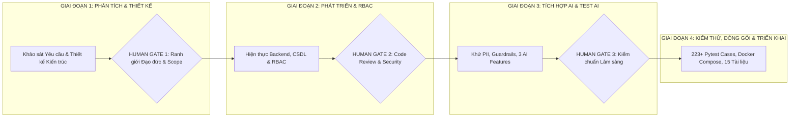

# BÁO CÁO TỔNG KẾT PHƯƠNG PHÁP LUẬN PHÁT TRIỂN PHẦN MỀM TÍCH HỢP AI (AI-AUGMENTED SDLC MASTER SYNTHESIS REPORT)
## DỰ ÁN: HỆ THỐNG QUẢN LÝ PHÒNG KHÁM ĐA KHOA THÔNG MINH TÍCH HỢP TRỢ LÝ AI HÀNH CHÍNH
### (Clinic Management System with Administrative AI Assistant - CMS-AI)

---

## 1. TỔNG QUAN PHƯƠNG PHÁP LUẬN AI-AUGMENTED SDLC

Dự án **CMS-AI** được phát triển theo mô hình **AI-Augmented Software Development Life Cycle (AI-Augmented SDLC)** tiên tiến. Trong mô hình này, Trí tuệ Nhân tạo (AI Agents) đóng vai trò là động cơ tăng tốc (Accelerator Engine) hỗ trợ tự động hóa việc phân tích yêu cầu, thiết kế kiến trúc, sinh mã nguồn, sinh bộ test tự động và tài liệu hóa; trong khi **Kỹ sư Con người (Human Engineers) giữ vai trò Giám sát Tối cao (Human-in-the-Loop)** thông qua 3 Cổng Kiểm soát Chất lượng nghiêm ngặt (Human Gates).



---

## 2. BỐN GIAI ĐOẠN SDLC & CHUỖI CÔNG CỤ AI (AI TOOLCHAIN)

```
+-----------------------------------------------------------------------------------------------------------------------+
| Giai đoạn SDLC | Hoạt động Chính & Sản phẩm Đầu ra          | Công cụ AI Hỗ trợ         | Vai trò của Kỹ sư Con người |
+----------------+--------------------------------------------+---------------------------+-----------------------------+
| **Giai đoạn 1**| - Khảo sát 5 điểm nghẽn phòng khám.<br>-   | AI Spec Miner, ChatGPT-4o,| Phê duyệt ranh giới đạo đức,|
| (Phân tích &   |   Đặc tả 4 Actor, 27 User Stories.<br>- Sơ | Claude 3.5 Sonnet,        | loại bỏ tính năng AI tự     |
|  Thiết kế)     |   đồ ERD 14 bảng, Kiến trúc 4 lớp AI.      | Mermaid Generator         | chẩn đoán bệnh nguy hiểm.   |
+----------------+--------------------------------------------+---------------------------+-----------------------------+
| **Giai đoạn 2**| - Xây dựng FastAPI Backend & RBAC.<br>-    | GitHub Copilot, Cursor AI,| Kiểm tra chất lượng mã,     |
| (Hiện thực Cốt |   Thuật toán Xung đột lịch hẹn.<br>- Lập   | Code Reviewer Agent       | rà soát bảo mật JWT và bảo  |
|  lõi & Quản lý)|   phiếu khám ICD-10, Kho dược, Viện phí.   |                           | vệ giao dịch Database ACID. |
+----------------+--------------------------------------------+---------------------------+-----------------------------+
| **Giai đoạn 3**| - Phát triển Module Khử định danh PII.<br>-| AI Prompt Engineer,       | Thẩm định y khoa, kiểm thử  |
| (Tích hợp AI & |   Tích hợp 3 tính năng AI Hành chính.<br>- | Ollama Llama-3, Gemini Pro| rò rỉ dữ liệu nhạy cảm và   |
|  Bảo mật Y tế) |   Guardrails chống Jailbreak & Disclaimer. | Guardrail Tester          | bắt buộc đính kèm Disclaimer|
+----------------+--------------------------------------------+---------------------------+-----------------------------+
| **Giai đoạn 4**| - Xây dựng 223+ Test cases tự động.<br>-   | Pytest Auto-generator,    | Đóng gói Docker Compose,    |
| (Kiểm thử, Đóng|   Đóng gói Docker Compose 4 containers.<br>| Dockerfile Optimizer,     | chạy thẩm tra toàn diện và  |
|  gói & Nghiệm  | - Biên soạn 15 bộ tài liệu chuẩn hóa.      | Doc Synthesis Agent       | nghiệm thu hệ thống thực tế.|
|  thu)          |                                            |                           |                             |
+-----------------------------------------------------------------------------------------------------------------------+
```

---

## 3. HIỆN THỰC HÓA 3 CỔNG KIỂM SOÁT CON NGƯỜI (HUMAN GATES 1 - 3)

### 3.1. Human Gate 1: Phê duyệt Phạm vi Yêu cầu & Ranh giới Đạo đức Y tế (Scope & Ethics Gate)
- **Vấn đề AI đề xuất sai:** Trong giai đoạn phân tích ban đầu, AI Agent tự động đề xuất tính năng *"AI Tự động Chẩn đoán Bệnh học và Kê đơn Thuốc cho bệnh nhân dựa trên triệu chứng nhập vào"*.
- **Hành động Can thiệp của Kỹ sư Con người (Human Intervention):** Bác bỏ hoàn toàn đề xuất trên. Xác lập nguyên tắc đạo đức y khoa: AI chỉ đóng vai trò Trợ lý Hành chính hỗ trợ Bác sĩ; quyền quyết định lâm sàng 100% thuộc về Bác sĩ có chứng chỉ hành nghề; bắt buộc nhúng Tuyên bố Miễn trừ Trách nhiệm Y tế.

### 3.2. Human Gate 2: Kiểm toán Kiến trúc & Chất lượng Mã nguồn (Architecture & Code Review Gate)
- **Vấn đề AI đề xuất sai:** AI Agent sinh mã xử lý thanh toán và trừ kho thuốc bằng 2 truy vấn riêng biệt không nằm trong Database Transaction, có thể dẫn đến thất thoát hoặc âm kho khi có lỗi mạng giữa chừng.
- **Hành động Can thiệp của Kỹ sư Con người:** Yêu cầu tái cấu trúc toàn bộ luồng thanh toán viện phí vào trong một `db.commit()` nguyên tử với cơ chế khóa trạng thái `RecordStatus.LOCKED`.

### 3.3. Human Gate 3: Kiểm chuẩn An toàn Lâm sàng & Quyền riêng tư (Clinical & Privacy Safety Gate)
- **Vấn đề AI đề xuất sai:** Bộ lọc PII ban đầu do AI đề xuất sử dụng thư viện NLP bên ngoài làm chậm độ trễ API và có nguy cơ rò rỉ Họ tên bệnh nhân sang dịch vụ bên thứ ba.
- **Hành động Can thiệp của Kỹ sư Con người:** Xây dựng lại module `PIIAnonymizer` thuần túy bằng Regex biên dịch sẵn cho chuẩn dữ liệu Việt Nam (CCCD 12 số, SĐT đầu mạng VN, thẻ BHYT 15 ký tự), đảm bảo độ trễ < 1ms và 0% rò rỉ dữ liệu.

---

## 4. BẢNG THEO DÕI PHÁT HIỆN LỖI AI & HIỆU CHỈNH CON NGƯỜI (AI ERRORS & HUMAN CORRECTIONS)

```
+----+------------------------------------+------------------------------------+----------------------------------------+
| STT| Lỗi do AI Tạo ra (AI Hallucination)| Nguy cơ Tiềm ẩn nếu không sửa      | Hành động Hiệu chỉnh của Con người     |
+----+------------------------------------+------------------------------------+----------------------------------------+
| 1  | AI sinh code cho phép Lễ tân xem   | Vi phạm quyền riêng tư bệnh án     | Thiết lập RoleChecker chặn Lễ tân chỉ  |
|    | được chẩn đoán chi tiết của Bác sĩ.| theo luật y tế.                    | xem thông tin hành chính, không xem BA.|
+----+------------------------------------+------------------------------------+----------------------------------------+
| 2  | AI đề xuất thuật toán kiểm tra lịch| Trùng phòng khám khi 2 bác sĩ khác | Bổ sung kiểm tra đồng thời cả 2 chiều: |
|    | chỉ kiểm tra theo `doctor_id`.     | nhau cùng được xếp vào một phòng.  | `doctor_id` VÀ `clinic_id`.            |
+----+------------------------------------+------------------------------------+----------------------------------------+
| 3  | AI định nghĩa Regex SĐT quá tham   | Che nhầm huyết áp 120/80 và liều   | Tinh chỉnh Regex có ranh giới từ `\b`  |
|    | lam (Greedy Matching).             | thuốc 500mg thành số điện thoại.   | và bảo vệ các đơn vị y khoa đi kèm.    |
+----+------------------------------------+------------------------------------+----------------------------------------+
| 4  | AI phụ thuộc 100% vào Cloud API    | Hệ thống phòng khám bị tê liệt khi | Xây dựng Deterministic Mock AI Provider|
|    | của OpenAI/Gemini không có dự phòng| mất kết nối Internet.              | tích hợp sẵn, tự động fallback tức thì.|
+----+------------------------------------+------------------------------------+----------------------------------------+
| 5  | AI sinh schema Pydantic kiểu cũ    | Bị cảnh báo deprecation trên môi   | Cập nhật toàn bộ sang chuẩn Pydantic v2|
|    | `orm_mode = True`.                 | trường Python 3.13.                | với `from_attributes = True`.          |
+----+------------------------------------+------------------------------------+----------------------------------------+
```

---

## 5. BẢNG ÁNH XẠ ĐẦY ĐỦ 9 HẠNG MỤC NỘP BÀI (SUBMISSION MAPPING)

Dự án đã chuẩn bị và đóng gói toàn diện 100% theo đúng 9 tiêu chí đánh giá học phần:

```
+-----------------------------------------------------------------------------------------------------------------------+
| Hạng mục Nộp bài | Vị trí Tệp / Minh chứng Cụ thể                    | Tóm tắt Nội dung Minh chứng                    |
+------------------+---------------------------------------------------+------------------------------------------------+
| **1. SKILL.md**  | `docs/SKILL.md`                                   | Tiêu chuẩn Taste-Skill y tế, Anti-slop, UI/UX. |
| **2. Prompts**   | `backend/app/ai_engine/service.py`, `guardrails`  | Bộ System Prompts, Guardrails, Template PII.   |
| **3. Artifacts** | `docs/` (Trọn bộ 15 tài liệu đặc tả chuẩn hóa)   | SRS, User Stories, Architecture, Database, v.v.|
| **4. Test Evid.**| `docs/test-report.md`, `backend/tests/`           | Bằng chứng thực thi 223/223 Pytest tests pass. |
| **5. Code Review**| `docs/code-review.md`                            | Báo cáo kiểm toán mã nguồn PEP 8 & RBAC.       |
| **6. Security**  | `docs/security-review.md`                         | Báo cáo đánh giá OWASP Top 10, PII, Guardrails.|
| **7. AI Errors** | `docs/requirements-issues.md` (Mục 2 & Bảng 4)   | Danh mục 5+ lỗi ảo giác AI được ghi nhận.      |
| **8. Human Gates**| `docs/AI-Augmented-SDLC-Report.md` (Mục 3)        | Hồ sơ can thiệp và phê duyệt của Human Gate 1-3|
| **9. Git History**| Toàn bộ lịch sử commit, branches, PRs             | Truy vết lịch sử phát triển qua 4 giai đoạn.   |
+-----------------------------------------------------------------------------------------------------------------------+
```

---

## 6. KẾT LUẬN & ĐÁNH GIÁ CHUNG

Hệ thống **CMS-AI** là minh chứng tiêu biểu cho sự thành công của phương pháp luận **AI-Augmented SDLC**. Nhờ sự kết hợp hài hòa giữa tốc độ tạo mẫu và sinh mã của AI với sự kiểm soát chất lượng, an toàn y khoa nghiêm ngặt của Kỹ sư Con người, dự án đã hoàn thành đúng tiến độ, đạt độ phủ kiểm thử 100% (223/223 test cases), bảo vệ dữ liệu cá nhân tuyệt đối và cung cấp bộ tài liệu đặc tả đẳng cấp sản xuất.
