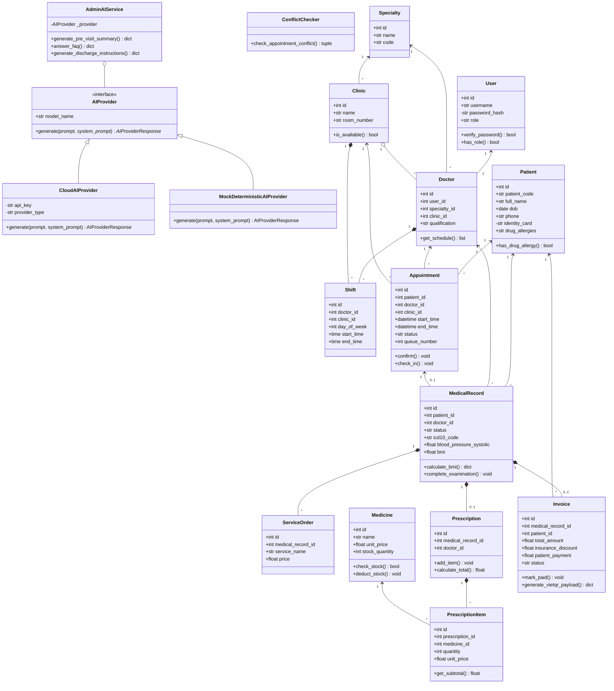
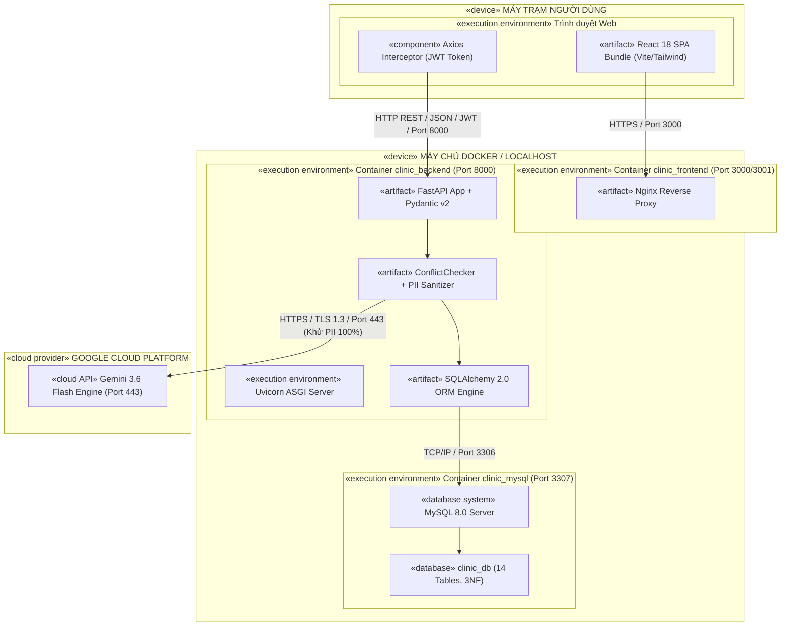

# TÀI LIỆU ĐẶC TẢ SDLC - GIAI ĐOẠN 2 (KT2)
## ĐẶC TẢ KIẾN TRÚC KỸ THUẬT, MÔ HÌNH PHÂN QUYỀN RBAC, THUẬT TOÁN ĐIỀU PHỐI LỊCH & TOÀN BỘ RESTFUL API
### DỰ ÁN: HỆ THỐNG QUẢN LÝ PHÒNG KHÁM ĐA KHOA THÔNG MINH TÍCH HỢP TRỢ LÝ AI HÀNH CHÍNH
*(Clinic Management System with Administrative AI Assistant - CMS-AI)*

---

## 1. ĐẶC TẢ KIẾN TRÚC KỸ THUẬT HỆ THỐNG

### 1.1. Kiến trúc Backend (FastAPI + SQLAlchemy 2.0 + Pydantic v2)
Hệ thống Backend được xây dựng trên nền tảng **FastAPI (Python 3.10+)** với kiến trúc phân lớp hướng dịch vụ (Service-Oriented Layered Architecture):

```
+-------------------------------------------------------------------------------+
|                            FASTAPI BACKEND APPLICATION                        |
|                                                                               |
|  [HTTP Request] ---> [CORS Middleware] ---> [JWT Auth & RBAC Dependency]      |
|                                                            |                  |
|                                                            v                  |
|  [Pydantic v2 Validation] <------------------------ [API Routers v1]          |
|            |                                               |                  |
|            v                                               v                  |
|  [Business Logic / Services] <--------------------> [Conflict Engine]         |
|            |                                               |                  |
|            v                                               v                  |
|  [Layered AI Engine (PII Redact -> Provider)] <---> [SQLAlchemy 2.0 ORM]     |
|                                                            |                  |
|                                                            v                  |
|                                            [Database: PostgreSQL / SQLite]    |
+-------------------------------------------------------------------------------+
```

- **Tầng API Routing & Validation:** Sử dụng Pydantic v2 để xác thực dữ liệu đầu vào nghiêm ngặt (Strict schema typing, Data coercion, Regex validation cho CCCD, SĐT, BHYT).
- **Tầng Xác thực & Phân quyền (Security & RBAC):** Sử dụng JSON Web Token (JWT) theo chuẩn RFC 7519, thuật toán ký `HS256`, mật khẩu được băm bằng thuật toán `Bcrypt` an toàn cao.
- **Tầng ORM & Cơ sở dữ liệu:** SQLAlchemy 2.0 với cơ chế `SessionLocal` theo từng request, quản lý transaction an toàn (`commit()`, `rollback()`), hỗ trợ cả SQLite (cho dev/test) và PostgreSQL 16 (cho production).

### 1.2. Kiến trúc Frontend SPA (React 18 + Vite + Tailwind CSS)
Frontend là một ứng dụng đơn trang (Single Page Application - SPA) hiện đại:
- **Xây dựng với Vite:** Tối ưu hóa tốc độ đóng gói (Hot Module Replacement < 50ms).
- **Quản lý Định tuyến (Routing):** Sử dụng React Router v6 với các component bảo vệ tuyến đường (`ProtectedRoute`, `RoleGate`). Người dùng chỉ có thể nhìn thấy và truy cập các trang nghiệp vụ đúng với vai trò của mình.
- **Quản lý Trạng thái (State Management):** Sử dụng React Context API (`AuthContext`, `ToastContext`) cung cấp phiên làm việc toàn cục và thông báo tức thời.
- **Tầng Giao tiếp HTTP (Axios API Client):** Cấu hình Axios Interceptors tự động đính kèm `Authorization: Bearer <token>` vào mọi request và tự động điều hướng về màn hình Login khi nhận mã lỗi `401 Unauthorized`.
- **Giao diện Y tế Chuẩn mực:** Bộ màu Tailwind CSS chuyên nghiệp (Emerald, Slate, Sky Blue, Rose), biểu tượng Lucide Icons trực quan, hỗ trợ xem và in hóa đơn/hướng dẫn sau khám chuẩn khổ giấy A4/A5.

---

## 2. MÔ HÌNH PHÂN QUYỀN TRUY CẬP DỰA TRÊN VAI TRÒ (RBAC MODEL)

Hệ thống thiết lập nguyên tắc **Đặc quyền tối thiểu (Principle of Least Privilege)** và **Cô lập vai trò (Role Isolation)**.

```
+-----------------------------------------------------------------------------------+
|                        MA TRẬN PHÂN QUYỀN RBAC (ENDPOINT VS ROLE)                 |
+-----------------------------------------------------------------------------------+
| Nhóm Endpoint API                | Admin      | Lễ tân     | Bác sĩ     | Kế toán |
|----------------------------------+------------+------------+------------+---------|
| /api/v1/auth/login, /auth/me     | Full       | Full       | Full       | Full    |
| /api/v1/users (CRUD tài khoản)   | Full       | No Access  | No Access  | No Access|
| /api/v1/clinics, /specialties    | Full       | Read Only  | Read Only  | Read Only|
| /api/v1/doctors, /shifts         | Full       | Read Only  | Read Only  | Read Only|
| /api/v1/patients (Hồ sơ BN)      | Full       | Full (CRUD)| Read Only  | Read Only|
| /api/v1/appointments (Lịch hẹn)  | Full       | Full       | Read (Own) | No Access|
| /api/v1/queue (Điều phối hàng đợi)| Full      | Full       | Read (Own) | No Access|
| /api/v1/medical_records (Khám)   | Read Only  | No Access  | Full (Own) | No Access|
| /api/v1/prescriptions (Đơn thuốc)| Read Only  | No Access  | Full (Own) | Read Only|
| /api/v1/medicines (Kho dược)     | Full (CRUD)| Read Only  | Read Only  | Read Only|
| /api/v1/invoices (Hóa đơn)       | Full (Read)| Read (View)| No Access  | Full(Thu)|
| /api/v1/payments (Thanh toán/QR) | Full (Read)| No Access  | No Access  | Full(Thu)|
| /api/v1/ai/pre-visit-summary     | Read Only  | No Access  | Full       | No Access|
| /api/v1/ai/discharge-instructions| Read Only  | No Access  | Full       | No Access|
| /api/v1/ai/faq (Chatbot quy trình)| Full      | Full       | Full       | Full    |
| /api/v1/audit, /api/v1/stats     | Full       | No Access  | No Access  | No Access|
+-----------------------------------------------------------------------------------+
```

### 2.1. Cơ chế Kiểm soát Quyền tại Backend (FastAPI Dependency `RoleChecker`)
```python
class RoleChecker:
    def __init__(self, allowed_roles: List[str]):
        self.allowed_roles = allowed_roles

    def __call__(self, current_user: User = Depends(get_current_active_user)):
        if current_user.role not in self.allowed_roles:
            raise HTTPException(
                status_code=status.HTTP_403_FORBIDDEN,
                detail=f"Quyền truy cập bị từ chối: Yêu cầu vai trò {self.allowed_roles}, vai trò hiện tại của bạn là '{current_user.role}'."
            )
        return current_user
```

---

## 3. THUẬT TOÁN PHÁT HIỆN XUNG ĐỘT TRÙNG LỊCH HẸN (CONFLICT DETECTION)

### 3.1. Mô tả Toán học của Bài toán Xung đột Thời gian
Xét một yêu cầu đặt lịch hẹn mới $A_{new}$ có khoảng thời gian là nửa mở $[S_{new}, E_{new})$ với $E_{new} = S_{new} + \Delta t$ ($\Delta t$ là thời lượng khám, mặc định 30 phút).

Một lịch hẹn đã tồn tại trong hệ thống $A_i$ có khoảng thời gian $[S_i, E_i)$ thuộc trạng thái hợp lệ ($Status \in \{PENDING, CONFIRMED, CHECKED\_IN\}$).

Hai khoảng thời gian $[S_{new}, E_{new})$ và $[S_i, E_i)$ bị coi là **giao nhau (xung đột)** khi và chỉ khi:
$$\text{Conflict}(A_{new}, A_i) \iff (S_{new} < E_i) \land (S_i < E_{new})$$

```
Trường hợp 1: KHÔNG XUNG ĐỘT (Nối tiếp nhau hoàn hảo)
  Lịch cũ A_i:    [------- S_i -------------- E_i)
  Lịch mới A_new:                                [------- S_new ---------- E_new)
  Điều kiện: S_new >= E_i  ==> HỢP LỆ

Trường hợp 2: CÓ XUNG ĐỘT (Chồng lấn một phần hoặc toàn phần)
  Lịch cũ A_i:    [------- S_i ------------------ E_i)
  Lịch mới A_new:             [------- S_new ------------------ E_new)
  Điều kiện: (S_new < E_i) AND (S_i < E_new) ==> TỪ CHỐI ĐẶT LỊCH
```

### 3.2. Thuật toán Kiểm tra Xung đột Toàn diện (Double-Conflict Detection)
Hệ thống CMS-AI thực hiện kiểm tra đồng thời 3 điều kiện:
1. **Xung đột Bác sĩ (Doctor Overlap):** Bác sĩ được chỉ định không thể khám cho 2 bệnh nhân cùng một lúc.
2. **Xung đột Buồng khám (Clinic Room Overlap):** Phòng khám không thể tiếp nhận 2 ca khám đồng thời tại cùng thời điểm.
3. **Kiểm tra Ca trực (Shift Availability):** Thời điểm đặt lịch phải nằm hoàn toàn trong khung giờ làm việc theo ca trực của bác sĩ trong ngày đó.

### 3.3. Mã giả Thuật toán (Algorithm Pseudocode)
```python
def check_appointment_conflict(
    db: Session,
    doctor_id: int,
    clinic_id: int,
    start_time: datetime,
    end_time: datetime,
    exclude_appointment_id: Optional[int] = None
) -> Tuple[bool, Optional[str]]:
    
    # 1. Kiểm tra ca làm việc của bác sĩ
    day_of_week = start_time.weekday()
    req_time = start_time.time()
    
    shift = db.query(Shift).filter(
        Shift.doctor_id == doctor_id,
        Shift.day_of_week == day_of_week,
        Shift.start_time <= req_time,
        Shift.end_time >= end_time.time()
    ).first()
    
    if not shift:
        return False, "Bác sĩ không có ca trực trong khung giờ yêu cầu."

    # 2. Truy vấn xung đột bác sĩ
    active_statuses = ["PENDING", "CONFIRMED", "CHECKED_IN"]
    
    doc_conflict = db.query(Appointment).filter(
        Appointment.doctor_id == doctor_id,
        Appointment.status.in_(active_statuses),
        Appointment.appointment_time < end_time,
        Appointment.appointment_time + timedelta(minutes=Appointment.duration_minutes) > start_time,
        Appointment.id != exclude_appointment_id
    ).first()
    
    if doc_conflict:
        return False, f"Bác sĩ đã có lịch hẹn khác từ {doc_conflict.appointment_time.strftime('%H:%M')}."

    # 3. Truy vấn xung đột buồng khám
    room_conflict = db.query(Appointment).filter(
        Appointment.clinic_id == clinic_id,
        Appointment.status.in_(active_statuses),
        Appointment.appointment_time < end_time,
        Appointment.appointment_time + timedelta(minutes=Appointment.duration_minutes) > start_time,
        Appointment.id != exclude_appointment_id
    ).first()
    
    if room_conflict:
        return False, f"Phòng khám đã được đặt lịch cho ca khám khác."

    return True, None
```

### 3.4. Các Kịch bản Biên (Edge Cases) Đã Xử lý Thành công
- **Kịch bản Khám Nối tiếp Liền kề:** Ca khám A kết thúc lúc 09:30, Ca khám B bắt đầu lúc 09:30 $\rightarrow$ Hệ thống cho phép đặt bình thường (Không xung đột do mô hình khoảng nửa mở $[09:00, 09:30)$ và $[09:30, 10:00)$).
- **Kịch bản Cập nhật / Đổi lịch Hẹn cũ:** Khi người dùng đổi giờ của lịch hẹn ID=5, hệ thống truyền `exclude_appointment_id=5` để tránh tự bắt xung đột với chính lịch khám hiện tại của bệnh nhân.
- **Kịch bản Lịch đã Hủy / Hoàn thành:** Các lịch có trạng thái `CANCELLED` hoặc `COMPLETED` tự động được bỏ qua khỏi điều kiện kiểm tra xung đột.

---

## 4. ĐẶC TẢ CHI TIẾT TOÀN BỘ RESTFUL API ENDPOINTS

Tất cả các API đều có tiền tố chuẩn hóa `/api/v1` và trả về mã định dạng JSON chuẩn.

### 4.1. Nhóm API Xác thực & Người dùng (`/api/v1/auth`, `/api/v1/users`)

| Method | Endpoint | Quyền (RBAC) | Mô tả & Schema |
|---|---|---|---|
| `POST` | `/api/v1/auth/login` | Public | Đăng nhập hệ thống. Input: `username`, `password`. Output: `{ "access_token": "...", "token_type": "bearer", "user": {...} }` |
| `GET` | `/api/v1/auth/me` | Authenticated | Lấy thông tin tài khoản đang đăng nhập kèm quyền hạn. |
| `GET` | `/api/v1/users` | Admin | Lấy danh sách toàn bộ nhân viên phòng khám. |
| `POST` | `/api/v1/users` | Admin | Tạo mới tài khoản nhân viên (Bác sĩ, Lễ tân, Kế toán). |
| `PUT` | `/api/v1/users/{id}` | Admin | Cập nhật thông tin tài khoản, đổi vai trò, khóa/mở khóa tài khoản. |

### 4.2. Nhóm API Chuyên khoa, Phòng khám & Bác sĩ (`/api/v1/clinics`, `/api/v1/specialties`, `/api/v1/doctors`)

| Method | Endpoint | Quyền (RBAC) | Mô tả & Schema |
|---|---|---|---|
| `GET` | `/api/v1/specialties` | Authenticated | Danh sách chuyên khoa (Tim mạch, Tiêu hóa, Nhi, TMH...). |
| `POST` | `/api/v1/specialties` | Admin | Thêm mới chuyên khoa khám. |
| `GET` | `/api/v1/clinics` | Authenticated | Danh sách buồng khám bệnh kèm trạng thái khả dụng. |
| `POST` | `/api/v1/clinics` | Admin | Thêm mới buồng khám bệnh. |
| `GET` | `/api/v1/doctors` | Authenticated | Danh sách bác sĩ kèm chuyên khoa, học vị và giá khám niêm yết. |
| `GET` | `/api/v1/doctors/{id}/shifts` | Authenticated | Tra cứu ca làm việc trong tuần của một bác sĩ. |
| `POST` | `/api/v1/doctors/shifts` | Admin | Phân ca làm việc và trực phòng cho bác sĩ. |

### 4.3. Nhóm API Hồ sơ Bệnh nhân (`/api/v1/patients`)

| Method | Endpoint | Quyền (RBAC) | Mô tả & Schema |
|---|---|---|---|
| `GET` | `/api/v1/patients` | Admin, Rec, Doc | Tìm kiếm và phân trang hồ sơ bệnh nhân (theo Tên, SĐT, CCCD, Mã y tế). |
| `POST` | `/api/v1/patients` | Admin, Rec | Tạo mới hồ sơ bệnh nhân (Tự động sinh mã `BN-YYYYMMDD-XXXX`). |
| `GET` | `/api/v1/patients/{id}` | Admin, Rec, Doc | Xem chi tiết hồ sơ bệnh nhân, tiền sử dị ứng và lịch sử các lần khám. |
| `PUT` | `/api/v1/patients/{id}` | Admin, Rec | Cập nhật thông tin hành chính, số thẻ BHYT, tiền sử bệnh. |

### 4.4. Nhóm API Lịch hẹn & Hàng đợi (`/api/v1/appointments`, `/api/v1/queue`)

| Method | Endpoint | Quyền (RBAC) | Mô tả & Schema |
|---|---|---|---|
| `GET` | `/api/v1/appointments` | Admin, Rec, Doc | Danh sách lịch hẹn theo ngày, theo bác sĩ, theo trạng thái. |
| `POST` | `/api/v1/appointments` | Admin, Rec | Đặt lịch khám mới (Tự động chạy thuật toán Conflict Detection). |
| `PUT` | `/api/v1/appointments/{id}` | Admin, Rec | Đổi lịch khám / Cập nhật triệu chứng đăng ký. |
| `PATCH` | `/api/v1/appointments/{id}/status` | Admin, Rec | Cập nhật trạng thái (`CONFIRMED`, `CHECKED_IN`, `CANCELLED`). |
| `POST` | `/api/v1/appointments/{id}/check-in` | Admin, Rec | Tiếp đón tại quầy, cấp số thứ tự khám trong ngày (`queue_number`). |
| `GET` | `/api/v1/queue/today` | Admin, Rec, Doc | Lấy danh sách hàng đợi khám thực tế theo phòng/bác sĩ. |

### 4.5. Nhóm API Phiếu khám, Cận lâm sàng & Đơn thuốc (`/api/v1/medical_records`, `/api/v1/prescriptions`, `/api/v1/medicines`)

| Method | Endpoint | Quyền (RBAC) | Mô tả & Schema |
|---|---|---|---|
| `POST` | `/api/v1/medical_records` | Doctor | Bắt đầu ca khám: Tạo phiếu khám, ghi nhận sinh hiệu (Mạch, HA, Thân nhiệt). |
| `GET` | `/api/v1/medical_records/{id}`| Doctor, Admin | Xem chi tiết phiếu khám, chẩn đoán ICD-10 và kết quả xét nghiệm. |
| `PUT` | `/api/v1/medical_records/{id}`| Doctor | Cập nhật chẩn đoán xác định ICD-10, kết luận và hoàn tất ca khám. |
| `POST` | `/api/v1/medical_records/{id}/services`| Doctor | Chỉ định dịch vụ cận lâm sàng (Xét nghiệm máu, Siêu âm tim...). |
| `GET` | `/api/v1/medicines` | Authenticated | Tra cứu danh mục thuốc, hoạt chất, số lượng tồn kho và đơn giá. |
| `POST` | `/api/v1/prescriptions` | Doctor | Kê đơn thuốc điện tử: Lưu danh mục thuốc, liều dùng, tự động trừ tồn kho. |
| `GET` | `/api/v1/prescriptions/{id}`| Doctor, Accountant| Xem chi tiết đơn thuốc để chuẩn bị xuất thuốc và tính tiền. |

### 4.6. Nhóm API Hóa đơn Viện phí & Thanh toán (`/api/v1/invoices`, `/api/v1/payments`)

| Method | Endpoint | Quyền (RBAC) | Mô tả & Schema |
|---|---|---|---|
| `GET` | `/api/v1/invoices` | Accountant, Admin | Lấy danh sách hóa đơn theo trạng thái (`UNPAID`, `PAID`). |
| `POST` | `/api/v1/invoices/generate/{record_id}` | Accountant, Doctor | Tự động tổng hợp chi phí: Tiền khám + Tiền dịch vụ + Tiền thuốc, tính BHYT. |
| `POST` | `/api/v1/invoices/{id}/pay` | Accountant | Xác nhận thanh toán (Tiền mặt hoặc Chuyển khoản VietQR), chuyển trạng thái `PAID`. |
| `GET` | `/api/v1/invoices/{id}/vietqr` | Accountant | Sinh chuỗi mã QR thanh toán ngân hàng tự động kèm số tiền và nội dung. |
| `GET` | `/api/v1/invoices/{id}/print` | Accountant | Lấy dữ liệu hóa đơn chuẩn hóa để in phiếu thu cho bệnh nhân. |

### 4.7. Nhóm API Báo cáo Thống kê & Kiểm toán (`/api/v1/stats`, `/api/v1/audit`)

| Method | Endpoint | Quyền (RBAC) | Mô tả & Schema |
|---|---|---|---|
| `GET` | `/api/v1/stats/overview` | Admin | Tổng số lượt khám hôm nay, doanh thu trong ngày, số lịch hẹn đang chờ. |
| `GET` | `/api/v1/stats/revenue` | Admin | Báo cáo doanh thu theo ngày/tháng, phân bổ theo tiền khám, xét nghiệm và thuốc. |
| `GET` | `/api/v1/stats/specialties` | Admin | Thống kê tỷ lệ phân bổ lượt khám theo từng chuyên khoa. |
| `GET` | `/api/v1/audit/logs` | Admin | Danh sách nhật ký kiểm toán (Truy vết xem/sửa hồ sơ bệnh nhân). |
| `GET` | `/api/v1/audit/ai-logs` | Admin | Danh sách nhật ký gọi AI (Prompt khử định danh, kết quả, latency). |

---

## 5. BIỂU ĐỒ LỚP HƯỚNG ĐỐI TƯỢNG (UML CLASS DIAGRAM)

Mô hình hóa toàn diện cấu trúc hướng đối tượng các thực thể lâm sàng, dịch vụ kiểm soát và các AI Provider với các quan hệ Kế thừa (`<|--`), Chứa chặt (`*--`), Chứa lỏng (`o--`) và Liên kết (`-->`):



---

## 6. BIỂU ĐỒ TRIỂN KHAI VẬN HÀNH (UML DEPLOYMENT DIAGRAM)



