# TÀI LIỆU ĐẶC TẢ SDLC - GIAI ĐOẠN 1 (KT1)
## KHẢO SÁT BÀI TOÁN, PHÂN TÍCH YÊU CẦU & THIẾT KẾ KIẾN TRÚC HỆ THỐNG
### DỰ ÁN: HỆ THỐNG QUẢN LÝ PHÒNG KHÁM ĐA KHOA THÔNG MINH TÍCH HỢP TRỢ LÝ AI HÀNH CHÍNH
*(Clinic Management System with Administrative AI Assistant - CMS-AI)*

---

## 1. KHẢO SÁT BÀI TOÁN & MỤC TIÊU DỰ ÁN

### 1.1. Bối cảnh & Thực trạng Quản lý Phòng khám Đa khoa
Tại các phòng khám đa khoa quy mô vừa và lớn tại Việt Nam hiện nay, công tác vận hành thường gặp phải các điểm nghẽn nghiêm trọng sau:
1. **Ùn tắc khâu tiếp đón & Đặt lịch trùng lặp:** Việc ghi nhận lịch hẹn qua sổ sách hoặc bảng tính phân tán dẫn đến xung đột khung giờ của bác sĩ, chồng chéo phòng khám và kéo dài thời gian chờ đợi của người bệnh.
2. **Quá tải tài liệu & Đọc bệnh sử thủ công:** Bác sĩ mất từ 3 - 5 phút cho mỗi lượt khám chỉ để lật giở và tra cứu tiền sử bệnh, dị ứng thuốc từ các hồ sơ cũ, làm giảm thời lượng tư vấn chuyên môn trực tiếp.
3. **Sai sót trong kê đơn & Hướng dẫn sau khám:** Việc truyền đạt hướng dẫn uống thuốc, kiêng cữ dinh dưỡng sau khám bằng lời nói hoặc chữ viết tay dễ gây hiểu nhầm, bệnh nhân không tuân thủ phác đồ điều trị.
4. **Thất thoát viện phí & Chậm trễ thanh toán:** Sự thiếu đồng bộ dữ liệu giữa phòng khám và quầy thu ngân gây chậm trễ trong việc tổng hợp chi phí khám, xét nghiệm và tiền thuốc, tính toán sai tỷ lệ chi trả BHYT.
5. **Rủi ro rò rỉ dữ liệu nhạy cảm:** Thông tin định danh cá nhân (PII - Personally Identifiable Information) và bệnh án chưa được bảo vệ theo các tiêu chuẩn bảo mật y tế nghiêm ngặt.

### 1.2. Mục tiêu của Hệ thống CMS-AI
Hệ thống **CMS-AI** được xây dựng nhằm giải quyết triệt để các vấn đề trên thông qua:
- **Chuẩn hóa quy trình nghiệp vụ y tế khép kín:** Vận hành mạch lạc theo luồng: Đặt lịch -> Tiếp đón/Phát số -> Khám bệnh & Cận lâm sàng -> Kê đơn thuốc điện tử -> Trợ lý AI hỗ trợ -> Thu ngân & Xuất hóa đơn/VietQR.
- **Kiểm soát phân quyền nghiêm ngặt (RBAC):** Thiết lập 4 nhóm vai trò (*Quản trị viên, Lễ tân, Bác sĩ, Kế toán*) đảm bảo nguyên tắc đặc quyền tối thiểu (Least Privilege).
- **Tích hợp Trợ lý AI Hành chính phân tầng bảo mật:** Tự động hóa tóm tắt bệnh án (*Pre-visit Briefing*), giải đáp quy trình thủ tục (*FAQ Chatbot*) và sinh hướng dẫn sau khám (*Discharge Instructions*) mà **hoàn toàn không can thiệp vào chẩn đoán chuyên môn** của bác sĩ.
- **Bảo mật dữ liệu y tế & Khử định danh PII (De-identification):** Loại bỏ 100% thông tin cá nhân trước khi truyền dữ liệu qua lớp AI.

---

## 2. PHÂN TÍCH CÁC ACTOR & YÊU CẦU HỆ THỐNG

```
                             +--------------------------------------------------+
                             |           ACTORS IN CMS-AI SYSTEM                |
                             +--------------------------------------------------+
                               /              |               \              \
                              /               |                \              \
                             v                v                 v              v
                     +---------------+ +---------------+ +---------------+ +---------------+
                     | Quản trị viên | |     Lễ tân    | |     Bác sĩ    | |    Kế toán    |
                     |    (Admin)    | | (Receptionist)| |    (Doctor)   | |  (Accountant) |
                     +---------------+ +---------------+ +---------------+ +---------------+
```

### 2.1. Phân tích 4 Nhóm Vai trò (Actors)

| STT | Actor | Vai trò & Trách nhiệm chính trong hệ thống | Phạm vi quyền hạn nghiệp vụ |
|:---:|:---|:---|:---|
| **1** | **Quản trị viên (Admin)** | Quản trị toàn bộ hạ tầng phần mềm, phân quyền tài khoản, cấu hình danh mục y tế, giám sát bảo mật và theo dõi thống kê toàn viện. | - Quản lý tài khoản người dùng (CRUD, Reset pass, Phân quyền).<br>- Quản lý danh mục chuyên khoa, phòng khám, hồ sơ bác sĩ, ca làm việc.<br>- Quản lý danh mục thuốc và kho dược.<br>- Xem nhật ký kiểm toán (Audit Log) & Nhật ký gọi AI (AI Log).<br>- Xem báo cáo doanh thu, lưu lượng khám toàn diện. |
| **2** | **Lễ tân (Receptionist)** | Tiếp nhận người bệnh, điều phối luồng vào, quản lý lịch hẹn, cấp phát số thứ tự và giải đáp thắc mắc hành chính. | - Đăng ký hồ sơ bệnh nhân mới, tra cứu mã định danh y tế.<br>- Đặt lịch hẹn, đổi lịch, hủy lịch khám.<br>- Tiếp đón bệnh nhân, kiểm tra bảo hiểm y tế, phát số vào hàng đợi khám.<br>- Sử dụng Chatbot AI để tra cứu thủ tục, bảng giá, quy định phòng khám. |
| **3** | **Bác sĩ (Doctor)** | Tiếp nhận bệnh nhân theo hàng đợi, thăm khám lâm sàng, chỉ định cận lâm sàng, chẩn đoán ICD-10, kê đơn thuốc và dặn dò sau khám. | - Tiếp nhận danh sách chờ khám tại phòng của mình.<br>- Xem tóm tắt bệnh án do AI sinh (*Pre-visit Briefing*).<br>- Ghi nhận sinh hiệu, triệu chứng, chẩn đoán bệnh theo mã ICD-10.<br>- Chỉ định dịch vụ cận lâm sàng (xét nghiệm, siêu âm, X-quang).<br>- Kê đơn thuốc điện tử và sinh hướng dẫn điều trị xuất viện bằng AI. |
| **4** | **Kế toán / Thu ngân (Accountant)** | Tiếp nhận chỉ định thanh toán từ bác sĩ, tổng hợp chi phí, áp dụng chính sách BHYT, thực hiện thu viện phí và xuất biên lai. | - Tiếp nhận danh sách chờ thanh toán theo thời gian thực.<br>- Tính toán tổng chi phí (Khám + Cận lâm sàng + Đơn thuốc).<br>- Khấu trừ tỷ lệ chi trả của BHYT (80%, 100%).<br>- Xác nhận thanh toán qua Tiền mặt hoặc Mã VietQR tự động.<br>- In hóa đơn/phiếu thu viện phí chuẩn hóa. |

---

## 3. BIỂU ĐỒ USE CASE, ĐẶC TẢ USE CASE & BIỂU ĐỒ HOẠT ĐỘNG (UML)

```mermaid
graph TD
    %% Tác nhân (Actors)
    subgraph ACTORS [TÁC NHÂN HỆ THỐNG]
        A_ADMIN["👤 Quản trị viên (Admin)"]
        A_RECEP["👩‍💼 Lễ tân (Receptionist)"]
        A_DOC["👨‍⚕️ Bác sĩ (Doctor)"]
        A_ACC["💰 Kế toán / Thu ngân"]
        A_PAT["🧑 Bệnh nhân (Khách hàng)"]
        A_AI["🤖 Google Gemini API (External)"]
    end

    %% Ranh giới hệ thống
    subgraph SYSTEM_BOUNDARY ["🏥 HỆ THỐNG QUẢN LÝ PHÒNG KHÁM THÔNG MINH (CMS-AI)"]
        %% Core Use Cases
        UC_LOGIN(["UC-00: Đăng nhập & Xác thực JWT"]):::coreUC
        
        %% Receptionist Use Cases
        UC_REG_PAT(["UC-01: Đăng ký & Tra cứu Bệnh nhân"]):::recepUC
        UC_BOOK_APPT(["UC-02: Đặt & Điều phối Lịch hẹn"]):::recepUC
        UC_CONFLICT(["UC-03: Kiểm tra Xung đột Lịch khám"]):::coreUC
        UC_CHECKIN(["UC-04: Tiếp đón & Cấp số Hàng đợi"]):::recepUC
        UC_FAQ(["UC-05: Tra cứu Thủ tục qua AI Chatbot"]):::aiUC
        
        %% Doctor Use Cases
        UC_VIEW_QUEUE(["UC-06: Xem Hàng đợi Phòng khám"]):::docUC
        UC_PRE_VISIT(["UC-07: Xem Tóm tắt Bệnh sử AI Pre-visit"]):::aiUC
        UC_EXAM(["UC-08: Khám lâm sàng & Chẩn đoán ICD-10"]):::docUC
        UC_ORDER_TEST(["UC-09: Chỉ định Dịch vụ Cận lâm sàng"]):::docUC
        UC_PRESCRIBE(["UC-10: Kê đơn thuốc điện tử"]):::docUC
        UC_ALLERGY_WARN(["UC-11: Cảnh báo Tương tác & Dị ứng"]):::coreUC
        UC_DISCHARGE(["UC-12: Sinh Hướng dẫn Dặn dò AI Discharge"]):::aiUC
        
        %% Accountant Use Cases
        UC_GEN_INV(["UC-13: Tổng hợp Hóa đơn Viện phí"]):::accUC
        UC_CALC_BHYT(["UC-14: Tính toán Khấu trừ BHYT"]):::coreUC
        UC_PAY_VIETQR(["UC-15: Thanh toán & Sinh mã VietQR"]):::accUC
        UC_PRINT_INV(["UC-16: In Biên lai / Hóa đơn A4-A5"]):::accUC
        
        %% Admin Use Cases
        UC_MAN_USER(["UC-17: Quản lý Người dùng & RBAC"]):::adminUC
        UC_MAN_CLINIC(["UC-18: Quản lý Chuyên khoa, Phòng & Ca"]):::adminUC
        UC_MAN_DRUG(["UC-19: Quản lý Kho Dược & Giá thuốc"]):::adminUC
        UC_AUDIT(["UC-20: Giám sát Audit Logs & AI Logs"]):::adminUC
        UC_STATS(["UC-21: Xem Báo cáo Doanh thu & Lượt khám"]):::adminUC
        
        %% AI Core Processing (Backend)
        UC_PII_REDACT(["UC-22: Khử định danh PII 2 chiều"]):::aiUC
        UC_GUARDRAIL(["UC-23: Kiểm tra Guardrails Y tế & Disclaimer"]):::aiUC
    end

    %% Liên kết Actor -> Primary Use Cases
    A_ADMIN --> UC_LOGIN
    A_ADMIN --> UC_MAN_USER
    A_ADMIN --> UC_MAN_CLINIC
    A_ADMIN --> UC_MAN_DRUG
    A_ADMIN --> UC_AUDIT
    A_ADMIN --> UC_STATS

    A_RECEP --> UC_LOGIN
    A_RECEP --> UC_REG_PAT
    A_RECEP --> UC_BOOK_APPT
    A_RECEP --> UC_CHECKIN
    A_RECEP --> UC_FAQ

    A_DOC --> UC_LOGIN
    A_DOC --> UC_VIEW_QUEUE
    A_DOC --> UC_EXAM
    A_DOC --> UC_ORDER_TEST
    A_DOC --> UC_PRESCRIBE

    A_ACC --> UC_LOGIN
    A_ACC --> UC_GEN_INV
    A_ACC --> UC_PAY_VIETQR

    A_PAT -.->|Tương tác gián tiếp / Đặt hẹn| UC_BOOK_APPT
    A_PAT -.->|Hỏi thông tin hành chính| UC_FAQ

    %% Quan hệ <<include>> (Bắt buộc phải thực hiện)
    UC_BOOK_APPT -.->|"<<include>>"| UC_CONFLICT
    UC_BOOK_APPT -.->|"<<include>>"| UC_LOGIN
    UC_CHECKIN -.->|"<<include>>"| UC_REG_PAT
    UC_EXAM -.->|"<<include>>"| UC_LOGIN
    UC_PRESCRIBE -.->|"<<include>>"| UC_EXAM
    UC_GEN_INV -.->|"<<include>>"| UC_CALC_BHYT
    UC_GEN_INV -.->|"<<include>>"| UC_LOGIN
    UC_FAQ -.->|"<<include>>"| UC_PII_REDACT
    UC_PRE_VISIT -.->|"<<include>>"| UC_PII_REDACT
    UC_DISCHARGE -.->|"<<include>>"| UC_PII_REDACT
    UC_PII_REDACT -.->|"<<include>>"| UC_GUARDRAIL
    UC_GUARDRAIL -.->|Gửi Prompt ẩn danh| A_AI

    %% Quan hệ <<extend>> (Mở rộng tùy chọn / Có điều kiện)
    UC_ALLERGY_WARN -.->|"<<extend>> (Khi phát hiện dị ứng)"| UC_PRESCRIBE
    UC_PRE_VISIT -.->|"<<extend>> (Khi mở ca khám)"| UC_EXAM
    UC_DISCHARGE -.->|"<<extend>> (Khi hoàn tất đơn thuốc)"| UC_EXAM
    UC_ORDER_TEST -.->|"<<extend>> (Khi cần cận lâm sàng)"| UC_EXAM
    UC_PAY_VIETQR -.->|"<<extend>> (Chọn CK Ngân hàng)"| UC_GEN_INV
    UC_PRINT_INV -.->|"<<extend>> (Sau khi thanh toán xong)"| UC_GEN_INV

    %% Class styling
    classDef coreUC fill:#f1f5f9,stroke:#64748b,stroke-width:1px,color:#0f172a;
    classDef recepUC fill:#ecfdf5,stroke:#10b981,stroke-width:1.5px,color:#065f46;
    classDef docUC fill:#eff6ff,stroke:#3b82f6,stroke-width:1.5px,color:#1e40af;
    classDef accUC fill:#fffbeb,stroke:#f59e0b,stroke-width:1.5px,color:#92400e;
    classDef adminUC fill:#faf5ff,stroke:#a855f7,stroke-width:1.5px,color:#6b21a8;
    classDef aiUC fill:#fdf2f8,stroke:#ec4899,stroke-width:1.5px,color:#831843;
```

### 3.1. Sơ đồ Use Case Hệ thống Chuẩn hóa (Use Case Diagram with <<include>> & <<extend>>)

Sơ đồ Use Case dưới đây mô hình hóa tường minh ranh giới hệ thống (System Boundary), 4 nhóm tác nhân nội bộ (Admin, Lễ tân, Bác sĩ, Kế toán), tác nhân bên ngoài (Bệnh nhân, Google Gemini AI) và phân định rõ mối quan hệ phụ thuộc bắt buộc (`<<include>>`) cùng mối quan hệ mở rộng có điều kiện (`<<extend>>`):



---

### 3.2. Bảng Đặc tả Use Case Chi tiết (Use Case Specifications)

Để phục vụ công tác kiểm thử và nghiệm thu phần mềm chính xác, 3 Use Case nghiệp vụ quan trọng nhất được đặc tả theo biểu mẫu chuẩn IEEE 830:

#### BẢNG ĐẶC TẢ UC-02: ĐẶT LỊCH HẸN & KIỂM TRA XUNG ĐỘT LỊCH KHÁM
| Thuộc tính | Chi tiết đặc tả |
| :--- | :--- |
| **Mã Use Case / Tên** | **UC-02: Đặt lịch hẹn khám bệnh (Appointment Booking & Conflict Detection)** |
| **Tác nhân chính (Actor)**| Lễ tân phòng khám (Receptionist) / Bệnh nhân (qua tổng đài/cổng trực tuyến) |
| **Tác nhân hỗ trợ** | Bác sĩ chuyên khoa, Hệ thống kiểm tra xung đột thời gian (Conflict Engine) |
| **Mục tiêu (Goal)** | Đặt hẹn khung giờ khám cho bệnh nhân, đảm bảo không trùng bác sĩ và không trùng phòng khám. |
| **Tiền điều kiện (Pre-conditions)** | 1. Lễ tân đã đăng nhập vào hệ thống với vai trò `Receptionist`.<br>2. Bệnh nhân đã có mã hồ sơ định danh (`medical_code`) trên hệ thống.<br>3. Bác sĩ có lịch phân ca trực (`Shift`) hoạt động trong ngày được chọn. |
| **Hậu điều kiện (Post-conditions)** | 1. Lịch hẹn mới được ghi nhận vào CSDL với trạng thái `PENDING` hoặc `CONFIRMED`.<br>2. Khung giờ của Bác sĩ và Buồng khám được đánh dấu đã giữ chỗ.<br>3. Hệ thống sinh số thứ tự dự kiến và gửi thông tin xác nhận. |
| **Luồng sự kiện chính (Happy Path)** | 1. Lễ tân nhập Số điện thoại / CCCD để tra cứu bệnh nhân. Hệ thống hiển thị thông tin bệnh nhân.<br>2. Lễ tân chọn Chuyên khoa khám, Bác sĩ phụ trách và Ngày khám mong muốn.<br>3. Hệ thống tự động truy vấn ca trực của bác sĩ và hiển thị danh sách các khung giờ còn trống (mỗi slot 30 phút).<br>4. Lễ tân chọn khung giờ (ví dụ: `09:00 - 09:30`), nhập lý do khám bệnh.<br>5. Lễ tân nhấn **"Xác nhận đặt lịch"**.<br>6. Hệ thống thực thi `<<include>> UC-03: Kiểm tra xung đột lịch` trên 2 chiều (Bác sĩ & Phòng).<br>7. Hệ thống xác nhận không có xung đột, lưu bản ghi vào CSDL, sinh số thứ tự khám và hiển thị thông báo thành công. |
| **Luồng rẽ nhánh (Alternative Flows)** | **A1. Bệnh nhân chưa có hồ sơ trên hệ thống:** Tại Bước 1, hệ thống không tìm thấy kết quả. Lễ tân thực thi `<<include>> UC-01: Đăng ký bệnh nhân mới`, nhập thông tin cá nhân và tiếp tục quay lại Bước 2.<br>**A2. Bệnh nhân yêu cầu chọn bác sĩ bất kỳ còn trống:** Tại Bước 2, lễ tân chọn chức năng *"Tìm bác sĩ có lịch trống sớm nhất"* theo chuyên khoa. |
| **Luồng ngoại lệ (Exception Flows)** | **E1. Xung đột lịch bác sĩ:** Tại Bước 6, bác sĩ đã có lịch hẹn khác giao thoa thời gian (`Start_A < End_B AND End_A > Start_B`). Hệ thống từ chối lưu, hiển thị cảnh báo đỏ: *"Bác sĩ đã có lịch hẹn từ [giờ]. Vui lòng chọn khung giờ khác."* và đề xuất các khung giờ kế tiếp.<br>**E2. Buồng khám đã kín chỗ:** Phòng khám được chọn đang tiếp nhận ca khác. Hệ thống thông báo xung đột buồng khám và gợi ý chuyển sang phòng khám dự phòng cùng chuyên khoa.<br>**E3. Khung giờ nằm ngoài ca trực:** Bác sĩ không có ca trực trong khung giờ yêu cầu. Hệ thống cảnh báo và ngăn chặn gửi yêu cầu. |

---

#### BẢNG ĐẶC TẢ UC-08: KHÁM BỆNH LÂM SÀNG, KÊ ĐƠN & TRỢ LÝ AI
| Thuộc tính | Chi tiết đặc tả |
| :--- | :--- |
| **Mã Use Case / Tên** | **UC-08: Khám bệnh lâm sàng, Kê đơn điện tử & Sinh dặn dò sau khám (Clinical Consultation & AI)** |
| **Tác nhân chính (Actor)**| Bác sĩ chuyên khoa (Doctor) |
| **Tác nhân hỗ trợ** | Trợ lý AI Hành chính (Google Gemini Live), Kho dược phòng khám |
| **Mục tiêu (Goal)** | Ghi nhận sinh hiệu, chẩn đoán bệnh theo mã ICD-10, kê đơn thuốc an toàn và tự động tạo phiếu dặn dò sau khám. |
| **Tiền điều kiện (Pre-conditions)** | 1. Bác sĩ đã đăng nhập tài khoản có vai trò `Doctor`.<br>2. Bệnh nhân đã được tiếp đón và đang nằm trong danh sách hàng đợi (`CHECKED_IN`). |
| **Hậu điều kiện (Post-conditions)** | 1. Phiếu khám được lưu với trạng thái `COMPLETED`.<br>2. Đơn thuốc điện tử được tạo, số lượng tồn kho dược được cập nhật/khóa giữ chỗ.<br>3. Hướng dẫn dặn dò sau khám được đính kèm vào bệnh án.<br>4. Tự động chuyển giao hồ sơ sang bộ phận Thu ngân với trạng thái `PENDING_PAYMENT`. |
| **Luồng sự kiện chính (Happy Path)** | 1. Bác sĩ chọn bệnh nhân kế tiếp từ hàng đợi phòng khám.<br>2. Hệ thống kích hoạt `<<extend>> UC-07: Tóm tắt bệnh sử AI Pre-visit`, hiển thị nhanh lịch sử điều trị cũ, cảnh báo dị ứng thuốc và bệnh mạn tính trong 10 giây.<br>3. Bác sĩ thăm khám, nhập các chỉ số sinh hiệu (Huyết áp, Mạch, Thân nhiệt, Chiều cao, Cân nặng). Hệ thống tự động tính chỉ số BMI và cảnh báo tình trạng thể trạng.<br>4. Bác sĩ tìm kiếm và chọn Mã chẩn đoán quốc tế ICD-10 (ví dụ `J06.9`).<br>5. Bác sĩ tìm kiếm thuốc trong danh mục kho dược, nhập liều dùng, số lượng, cách dùng.<br>6. Bác sĩ nhấn nút **"Sinh hướng dẫn sau khám bằng AI"** (`<<extend>> UC-12`). Hệ thống gửi dữ liệu đã khử PII đến Google Gemini và hiển thị lịch uống thuốc chi tiết kèm dặn dò chế độ ăn uống, dấu hiệu cấp cứu.<br>7. Bác sĩ xem xét, chỉnh sửa nếu cần và nhấn **"Hoàn tất ca khám"**.<br>8. Hệ thống lưu toàn bộ bệnh án, trừ tồn kho thuốc và tự động chuyển hóa đơn sang phân hệ Kế toán. |
| **Luồng rẽ nhánh (Alternative Flows)** | **A1. Bác sĩ chỉ định cận lâm sàng:** Tại Bước 4, bác sĩ chọn dịch vụ siêu âm/xét nghiệm máu (`<<extend>> UC-09`). Ca khám tạm dừng ở trạng thái `WAITING_RESULTS`. Sau khi có kết quả từ phòng xét nghiệm, bác sĩ mở lại ca khám để tiếp tục Bước 5. |
| **Luồng ngoại lệ (Exception Flows)** | **E1. Cảnh báo dị ứng thuốc nghiêm trọng (`<<extend>> UC-11`):** Tại Bước 5, bác sĩ chọn thuốc nhóm Penicillin trong khi hồ sơ bệnh nhân ghi nhận có dị ứng thuốc này. Hệ thống hiển thị hộp thoại cảnh báo nguy hiểm màu đỏ: *"CẢNH BÁO DỊ ỨNG: Bệnh nhân có tiền sử dị ứng với [Tên thuốc]!"* và yêu cầu bác sĩ xác nhận hoặc đổi thuốc an toàn.<br>**E2. Hết tồn kho dược:** Số lượng kê đơn vượt quá tồn kho khả dụng. Hệ thống thông báo không đủ thuốc và hiển thị số lượng tồn tối đa hiện có.<br>**E3. Lỗi kết nối AI Engine:** Mạng chập chờn hoặc API Gemini bận. Hệ thống tự động kích hoạt **Deterministic Mock Fallback** đảm bảo sinh hướng dẫn mẫu ngoại tuyến trong 1 giây, không làm gián đoạn buổi khám. |

---

#### BẢNG ĐẶC TẢ UC-13: TỔNG HỢP VIỆN PHÍ, KHẤU TRỪ BHYT & THANH TOÁN VIETQR
| Thuộc tính | Chi tiết đặc tả |
| :--- | :--- |
| **Mã Use Case / Tên** | **UC-13: Quản lý viện phí, Khấu trừ BHYT & Thanh toán VietQR (Medical Billing & VietQR Payment)** |
| **Tác nhân chính (Actor)**| Kế toán / Thu ngân (Accountant) |
| **Tác nhân hỗ trợ** | Cổng thanh toán Ngân hàng (VietQR / Napas), Hệ thống giám định BHYT |
| **Mục tiêu (Goal)** | Tổng hợp toàn bộ chi phí khám chữa bệnh, áp dụng chính sách giảm trừ bảo hiểm và thực hiện thu tiền nhanh chóng. |
| **Tiền điều kiện (Pre-conditions)** | 1. Bác sĩ đã hoàn tất ca khám (`MedicalRecord.status = COMPLETED`).<br>2. Kế toán đăng nhập hệ thống với vai trò `Accountant`. |
| **Hậu điều kiện (Post-conditions)** | 1. Hóa đơn chuyển trạng thái thành `PAID`.<br>2. Bản ghi giao dịch thanh toán được ghi nhận vào sổ cái CSDL.<br>3. In biên lai tài chính cho bệnh nhân để làm thủ tục lĩnh thuốc. |
| **Luồng sự kiện chính (Happy Path)** | 1. Kế toán mở danh sách chờ thanh toán trên giao diện Thu ngân. Hệ thống hiển thị danh sách hóa đơn `PENDING` theo thời gian thực.<br>2. Kế toán chọn bệnh nhân. Hệ thống tự động tổng hợp chi tiết: Tiền khám chuyên khoa + Tiền xét nghiệm + Tiền thuốc kê đơn.<br>3. Hệ thống thực thi `<<include>> UC-14: Tính toán BHYT`, tự động đối soát loại thẻ BHYT (đúng tuyến hưởng 80% - 100%) và tính ra số tiền bảo hiểm chi trả cùng số tiền bệnh nhân đồng chi trả.<br>4. Bệnh nhân chọn hình thức chuyển khoản ngân hàng. Kế toán nhấn **"Tạo mã VietQR"** (`<<extend>> UC-15`).<br>5. Hệ thống hiển thị mã QR động chuẩn Napas247 chứa chính xác số tiền cần trả và nội dung chuyển khoản.<br>6. Bệnh nhân quét mã thanh toán thành công. Kế toán nhấn **"Xác nhận đã nhận tiền"**.<br>7. Hệ thống cập nhật hóa đơn sang `PAID`, giải phóng đơn thuốc để dược sĩ phát thuốc và tự động mở cửa sổ in hóa đơn tài chính chuẩn A4/A5 (`<<extend>> UC-16`). |
| **Luồng rẽ nhánh (Alternative Flows)** | **A1. Bệnh nhân thanh toán bằng tiền mặt:** Tại Bước 4, bệnh nhân chọn tiền mặt. Kế toán nhập số tiền nhận, hệ thống tính tiền thừa cần trả lại và xuất hóa đơn ngay. |
| **Luồng ngoại lệ (Exception Flows)** | **E1. Thẻ BHYT hết hạn hoặc sai tuyến:** Tại Bước 3, thẻ BHYT không hợp lệ trên cổng dữ liệu. Hệ thống cảnh báo và chuyển sang áp dụng 100% viện phí tự chi trả.<br>**E2. Hủy yêu cầu khám:** Bệnh nhân từ chối thực hiện xét nghiệm đã chỉ định. Kế toán thực hiện yêu cầu điều chỉnh hóa đơn, hệ thống ghi nhận lý do và cập nhật lại số tiền chính xác. |

---

### 3.3. Biểu đồ Hoạt động Nghiệp vụ Chuẩn UML có Làn bơi (Activity Diagram with Swimlanes)

Biểu đồ mô hình hóa tiến trình vận hành khép kín liên phòng ban, phân tách rạch ròi trách nhiệm của 5 làn bơi (Swimlanes), thể hiện đầy đủ các điểm bắt đầu, rẽ nhánh điều kiện (Decision Nodes), hợp nhất luồng (Merge Nodes) và kết thúc (Final Activity Node):

```mermaid
flowchart TD
    %% Định nghĩa các Làn bơi (Swimlanes)
    subgraph LANE_PATIENT ["🧑 BỆNH NHÂN (PATIENT)"]
        START((● Bắt đầu))
        PAT_ARRIVE["1. Đến phòng khám / Đăng ký trực tuyến"]
        PAT_CONFIRM["2. Xác nhận thông tin & Khai báo y tế"]
        PAT_WAIT["3. Chờ tại sảnh theo số thứ tự"]
        PAT_ENTER_ROOM["4. Vào phòng khám gặp Bác sĩ"]
        PAT_DO_LAB["5. Đi làm xét nghiệm / Siêu âm"]
        PAT_SCAN_QR["6. Quét mã VietQR / Trả tiền mặt"]
        PAT_RECEIVE_MED["7. Nhận thuốc, hóa đơn & phiếu dặn dò"]
        END_NODE(((◉ Kết thúc ca khám)))
    end

    subgraph LANE_RECEP ["👩‍💼 LỄ TÂN (RECEPTIONIST)"]
        REC_SEARCH{"Kiểm tra bệnh nhân cũ hay mới?"}
        REC_NEW_PAT["Đăng ký hồ sơ & Cấp mã BN"]
        REC_GET_PAT["Tra cứu hồ sơ theo CCCD/SĐT"]
        REC_CHECK_TIME{"Kiểm tra xung đột lịch khám?"}
        REC_SELECT_SLOT["Chọn lại khung giờ / Bác sĩ khác"]
        REC_DISPATCH["Tiếp đón, gán phòng & Cấp số hàng đợi"]
    end

    subgraph LANE_DOC ["👨‍⚕️ BÁC SĨ (DOCTOR)"]
        DOC_CALL["Gọi bệnh nhân vào phòng khám"]
        DOC_READ_SUMMARY["Đọc AI Pre-visit (tiền sử, dị ứng)"]
        DOC_EXAM["Thăm khám lâm sàng & Đo sinh hiệu BMI"]
        DOC_NEED_LAB{"Có cần cận lâm sàng?"}
        DOC_ORDER["Chỉ định xét nghiệm / CĐHA"]
        DOC_DIAGNOSE["Chẩn đoán bệnh theo mã ICD-10"]
        DOC_PRESCRIBE["Kê đơn thuốc điện tử"]
        DOC_ALLERGY_CHECK{"Kiểm tra cảnh báo dị ứng thuốc?"}
        DOC_CHANGE_DRUG["Đổi loại thuốc an toàn khác"]
        DOC_COMPLETE["Ký xác nhận & Hoàn tất ca khám"]
    end

    subgraph LANE_AI ["🤖 TRỢ LÝ AI HÀNH CHÍNH (AI ENGINE)"]
        AI_ANON["Khử định danh PII (Ẩn tên, CCCD, SĐT, BHYT)"]
        AI_GEN_PRE["Sinh tóm tắt tiền sử bệnh án cho Bác sĩ"]
        AI_GEN_DISCHARGE["Sinh hướng dẫn uống thuốc & dặn dò sau khám"]
        AI_ATTACH_DISCLAIMER["Đính kèm Tuyên bố miễn trừ trách nhiệm y tế"]
    end

    subgraph LANE_ACC ["💰 KẾ TOÁN / THU NGÂN (ACCOUNTANT)"]
        ACC_RECV["Nhận hồ sơ hoàn tất từ phòng khám"]
        ACC_CALC["Tổng hợp viện phí & Khấu trừ BHYT"]
        ACC_QR["Tạo mã VietQR động / Nhận tiền mặt"]
        ACC_CONFIRM["Xác nhận thanh toán PAID & In hóa đơn"]
    end

    %% Luồng điều khiển liên làn bơi
    START --> PAT_ARRIVE
    PAT_ARRIVE --> REC_SEARCH
    
    REC_SEARCH -->|Bệnh nhân mới| REC_NEW_PAT
    REC_SEARCH -->|Đã có hồ sơ| REC_GET_PAT
    REC_NEW_PAT --> REC_CHECK_TIME
    REC_GET_PAT --> REC_CHECK_TIME

    REC_CHECK_TIME -->|Có xung đột| REC_SELECT_SLOT
    REC_SELECT_SLOT --> REC_CHECK_TIME
    REC_CHECK_TIME -->|Hợp lệ - Không xung đột| REC_DISPATCH
    
    REC_DISPATCH --> PAT_WAIT
    PAT_WAIT --> DOC_CALL
    DOC_CALL --> PAT_ENTER_ROOM

    PAT_ENTER_ROOM --> AI_ANON
    AI_ANON --> AI_GEN_PRE
    AI_GEN_PRE --> DOC_READ_SUMMARY
    
    DOC_READ_SUMMARY --> DOC_EXAM
    DOC_EXAM --> DOC_NEED_LAB
    
    DOC_NEED_LAB -->|Có chỉ định| DOC_ORDER
    DOC_ORDER --> PAT_DO_LAB
    PAT_DO_LAB --> DOC_DIAGNOSE
    DOC_NEED_LAB -->|Không cần| DOC_DIAGNOSE

    DOC_DIAGNOSE --> DOC_PRESCRIBE
    DOC_PRESCRIBE --> DOC_ALLERGY_CHECK

    DOC_ALLERGY_CHECK -->|Phát hiện dị ứng!| DOC_CHANGE_DRUG
    DOC_CHANGE_DRUG --> DOC_PRESCRIBE
    DOC_ALLERGY_CHECK -->|An toàn| AI_GEN_DISCHARGE

    AI_GEN_DISCHARGE --> AI_ATTACH_DISCLAIMER
    AI_ATTACH_DISCLAIMER --> DOC_COMPLETE

    DOC_COMPLETE --> ACC_RECV
    ACC_RECV --> ACC_CALC
    ACC_CALC --> ACC_QR
    ACC_QR --> PAT_SCAN_QR
    PAT_SCAN_QR --> ACC_CONFIRM

    ACC_CONFIRM --> PAT_RECEIVE_MED
    PAT_RECEIVE_MED --> END_NODE

    %% Định dạng trực quan
    classDef startEnd fill:#0f172a,stroke:#334155,stroke-width:2px,color:#ffffff;
    classDef decision fill:#fef3c7,stroke:#f59e0b,stroke-width:2px,color:#78350f;
    classDef action fill:#ffffff,stroke:#cbd5e1,stroke-width:1.5px,color:#1e293b;
    
    class START,END_NODE startEnd;
    class REC_SEARCH,REC_CHECK_TIME,DOC_NEED_LAB,DOC_ALLERGY_CHECK decision;
    class PAT_ARRIVE,PAT_CONFIRM,PAT_WAIT,PAT_ENTER_ROOM,PAT_DO_LAB,PAT_SCAN_QR,PAT_RECEIVE_MED,REC_NEW_PAT,REC_GET_PAT,REC_SELECT_SLOT,REC_DISPATCH,DOC_CALL,DOC_READ_SUMMARY,DOC_EXAM,DOC_ORDER,DOC_DIAGNOSE,DOC_PRESCRIBE,DOC_CHANGE_DRUG,DOC_COMPLETE,AI_ANON,AI_GEN_PRE,AI_GEN_DISCHARGE,AI_ATTACH_DISCLAIMER,ACC_RECV,ACC_CALC,ACC_QR,ACC_CONFIRM action;
```



---

---

## 4. THIẾT KẾ CƠ SỞ DỮ LIỆU QUAN HỆ (RELATIONAL DATABASE DESIGN)

Hệ thống được thiết kế chuẩn hóa bậc 3 (3NF) với **14 bảng quan hệ** quản lý toàn diện mọi mặt hoạt động của phòng khám.

### 4.1. Sơ đồ Quan hệ Thực thể (Entity Relationship Diagram - ERD)

```
  +------------------+          +------------------+          +------------------+
  |   specialties    | 1      N |     clinics      | 1      N |  doctor_shifts   |
  |------------------|<---------|------------------|<---------|------------------|
  | id (PK)          |          | id (PK)          |          | id (PK)          |
  | code, name, desc |          | specialty_id(FK) |          | doctor_id (FK)   |
  +------------------+          | room_number, name|          | clinic_id (FK)   |
          ^                     +------------------+          | day_of_week, time|
          | 1                            ^                    +------------------+
          |                              | 1                           |
          | N                            | N                           |
  +------------------+          +------------------+                   |
  |     doctors      | 1      N |   appointments   |                   |
  |------------------|<---------|------------------|                   |
  | id (PK)          |          | id (PK)          |                   |
  | user_id (FK)     |          | patient_id (FK)  |                   |
  | specialty_id(FK) |          | doctor_id (FK)   |                   |
  | license_number   |          | clinic_id (FK)   |                   |
  +------------------+          | appointment_time |                   |
          | 1                   | status           |                   |
          |                     +------------------+                   |
          | 1                            ^                             |
  +------------------+                   | 1                           |
  |      users       |                   |                             |
  |------------------|                   |                             |
  | id (PK)          |                   | N                           |
  | username, email  |          +------------------+                   |
  | hashed_password  |          |     patients     |                   |
  | role, is_active  |          |------------------|                   |
  +------------------+          | id (PK)          |                   |
          | 1                   | medical_code(UQ) |                   |
          |                     | full_name, dob   |                   |
          | N                   | phone, cccd, bhyt|                   |
  +------------------+          | allergies, history|                  |
  |    audit_logs    |          +------------------+                   |
  |------------------|                   ^                             |
  | id (PK)          |                   | 1                           |
  | user_id (FK)     |                   |                             |
  | action, entity   |                   | N                           |
  | ip_address, time |          +------------------+                   |
  +------------------+          | medical_records  | 1       N         |
                                |------------------|-------------------+
                                | id (PK)          |
                                | patient_id (FK)  |
                                | doctor_id (FK)   |
                                | appointment_id   |
                                | icd10_code, diag |
                                | pulse, bp, temp  |
                                | ai_summary, note |
                                +------------------+
                                    | 1         | 1
                                    |           +----------------------+
                                    | N                                | 1
                          +--------------------+             +--------------------+
                          |   service_orders   |             |   prescriptions    |
                          |--------------------|             |--------------------|
                          | id (PK)            |             | id (PK)            |
                          | record_id (FK)     |             | record_id (FK)     |
                          | service_name, price|             | doctor_id (FK)     |
                          +--------------------+             | patient_id (FK)    |
                                    |                        | ai_instructions    |
                                    |                        +--------------------+
                                    |                                  | 1
                                    |                                  | N
                                    |                        +--------------------+
                                    |                        | prescription_items |
                                    |                        |--------------------|
                                    |                        | id (PK)            |
                                    |                        | prescription_id(FK)|
                                    |                        | medicine_id (FK)   |
                                    |                        | quantity, dosage   |
                                    |                        +--------------------+
                                    |                                  | N
                                    |                                  | 1
                                    |                        +--------------------+
                                    |                        |     medicines      |
                                    |                        |--------------------|
                                    |                        | id (PK)            |
                                    |                        | code, name, unit   |
                                    |                        | stock_quantity     |
                                    |                        | unit_price         |
                                    |                        +--------------------+
                                    |                                  |
                                    v N                                v N
                                +------------------------------------------+
                                |                 invoices                 |
                                |------------------------------------------|
                                | id (PK)                                  |
                                | record_id (FK, UQ)                       |
                                | patient_id (FK)                          |
                                | total_amount, bhyt_discount              |
                                | final_amount, status, payment_method     |
                                +------------------------------------------+
```

---

### 4.2. Từ điển Dữ liệu Chi tiết (Data Dictionary)

#### 1. Bảng `users` (Tài khoản người dùng hệ thống)
| Tên trường | Kiểu dữ liệu | Ràng buộc | Mô tả |
|---|---|---|---|
| `id` | INTEGER | PK, Auto Increment | Khóa chính |
| `username` | VARCHAR(50) | UNIQUE, NOT NULL | Tên đăng nhập |
| `email` | VARCHAR(100) | UNIQUE, NOT NULL | Email liên lạc |
| `hashed_password` | VARCHAR(255) | NOT NULL | Mật khẩu băm (Bcrypt) |
| `full_name` | VARCHAR(100) | NOT NULL | Họ và tên nhân viên |
| `role` | VARCHAR(20) | NOT NULL | Vai trò: `admin`, `receptionist`, `doctor`, `accountant` |
| `is_active` | BOOLEAN | DEFAULT TRUE | Trạng thái hoạt động |
| `created_at` | TIMESTAMP | DEFAULT CURRENT_TIMESTAMP | Thời gian tạo tài khoản |

#### 2. Bảng `specialties` (Chuyên khoa khám bệnh)
| Tên trường | Kiểu dữ liệu | Ràng buộc | Mô tả |
|---|---|---|---|
| `id` | INTEGER | PK, Auto Increment | Khóa chính |
| `code` | VARCHAR(20) | UNIQUE, NOT NULL | Mã chuyên khoa (ví dụ: `NOI`, `TIM`, `NHI`) |
| `name` | VARCHAR(100) | NOT NULL | Tên chuyên khoa (Tim mạch, Nhi khoa, v.v.) |
| `description` | TEXT | NULL | Mô tả chi tiết chuyên khoa |

#### 3. Bảng `clinics` (Phòng khám / Buồng khám)
| Tên trường | Kiểu dữ liệu | Ràng buộc | Mô tả |
|---|---|---|---|
| `id` | INTEGER | PK, Auto Increment | Khóa chính |
| `room_number` | VARCHAR(20) | UNIQUE, NOT NULL | Số phòng khám (ví dụ: `P.101`, `P.202`) |
| `name` | VARCHAR(100) | NOT NULL | Tên buồng khám |
| `specialty_id` | INTEGER | FK -> `specialties.id` | Thuộc chuyên khoa nào |
| `is_active` | BOOLEAN | DEFAULT TRUE | Trạng thái phòng khả dụng |

#### 4. Bảng `doctors` (Thông tin hồ sơ bác sĩ)
| Tên trường | Kiểu dữ liệu | Ràng buộc | Mô tả |
|---|---|---|---|
| `id` | INTEGER | PK, Auto Increment | Khóa chính |
| `user_id` | INTEGER | FK -> `users.id`, UNIQUE | Liên kết tài khoản đăng nhập |
| `specialty_id` | INTEGER | FK -> `specialties.id` | Chuyên khoa chuyên trách |
| `license_number` | VARCHAR(50) | UNIQUE, NOT NULL | Số chứng chỉ hành nghề y |
| `title` | VARCHAR(50) | NOT NULL | Học hàm/học vị (BS, ThS.BS, BS.CKII) |
| `consultation_fee` | NUMERIC(12,2)| NOT NULL | Giá khám niêm yết của bác sĩ (VNĐ) |

#### 5. Bảng `doctor_shifts` (Ca làm việc & Lịch trực)
| Tên trường | Kiểu dữ liệu | Ràng buộc | Mô tả |
|---|---|---|---|
| `id` | INTEGER | PK, Auto Increment | Khóa chính |
| `doctor_id` | INTEGER | FK -> `doctors.id` | Bác sĩ trực |
| `clinic_id` | INTEGER | FK -> `clinics.id` | Buồng khám trực |
| `day_of_week` | INTEGER | NOT NULL (0-6) | Thứ trong tuần (0: Thứ 2 ... 6: Chủ nhật) |
| `start_time` | TIME | NOT NULL | Giờ bắt đầu ca trực |
| `end_time` | TIME | NOT NULL | Giờ kết thúc ca trực |

#### 6. Bảng `patients` (Hồ sơ bệnh nhân)
| Tên trường | Kiểu dữ liệu | Ràng buộc | Mô tả |
|---|---|---|---|
| `id` | INTEGER | PK, Auto Increment | Khóa chính |
| `medical_code` | VARCHAR(30) | UNIQUE, NOT NULL | Mã y tế định danh (`BN-YYYYMMDD-XXXX`) |
| `full_name` | VARCHAR(100) | NOT NULL | Họ và tên bệnh nhân |
| `date_of_birth` | DATE | NOT NULL | Ngày tháng năm sinh |
| `gender` | VARCHAR(10) | NOT NULL | Giới tính (`Nam`, `Nữ`, `Khác`) |
| `phone_number` | VARCHAR(20) | NOT NULL | Số điện thoại liên lạc |
| `cccd_number` | VARCHAR(20) | NULL | Số CCCD/CMND 12 chữ số |
| `bhyt_number` | VARCHAR(25) | NULL | Mã thẻ BHYT (15 ký tự) |
| `address` | VARCHAR(255) | NULL | Địa chỉ cư trú |
| `drug_allergies` | TEXT | NULL | Tiền sử dị ứng thuốc nghiêm trọng |
| `medical_history`| TEXT | NULL | Bệnh sử gia đình & bệnh mạn tính |

#### 7. Bảng `appointments` (Lịch hẹn khám bệnh)
| Tên trường | Kiểu dữ liệu | Ràng buộc | Mô tả |
|---|---|---|---|
| `id` | INTEGER | PK, Auto Increment | Khóa chính |
| `patient_id` | INTEGER | FK -> `patients.id` | Bệnh nhân đặt khám |
| `doctor_id` | INTEGER | FK -> `doctors.id` | Bác sĩ được chỉ định khám |
| `clinic_id` | INTEGER | FK -> `clinics.id` | Phòng khám tiếp nhận |
| `appointment_time`| TIMESTAMP | NOT NULL | Thời điểm khám |
| `duration_minutes`| INTEGER | DEFAULT 30 | Thời lượng dự kiến ca khám |
| `symptoms` | TEXT | NULL | Triệu chứng ban đầu khi đăng ký |
| `status` | VARCHAR(20) | NOT NULL | `PENDING`, `CONFIRMED`, `CHECKED_IN`, `COMPLETED`, `CANCELLED` |
| `queue_number` | INTEGER | NULL | Số thứ tự phát trong ngày |

#### 8. Bảng `medical_records` (Phiếu khám bệnh / Lượt khám)
| Tên trường | Kiểu dữ liệu | Ràng buộc | Mô tả |
|---|---|---|---|
| `id` | INTEGER | PK, Auto Increment | Khóa chính |
| `patient_id` | INTEGER | FK -> `patients.id` | Bệnh nhân |
| `doctor_id` | INTEGER | FK -> `doctors.id` | Bác sĩ phụ trách |
| `appointment_id` | INTEGER | FK -> `appointments.id`, NULL | Lịch hẹn liên quan (nếu có) |
| `pulse` | INTEGER | NULL | Mạch (lần/phút) |
| `blood_pressure` | VARCHAR(20) | NULL | Huyết áp (mmHg, ví dụ `120/80`) |
| `temperature` | NUMERIC(4,1) | NULL | Thân nhiệt (°C) |
| `respiratory_rate`| INTEGER | NULL | Nhịp thở (lần/phút) |
| `weight` | NUMERIC(5,2) | NULL | Cân nặng (kg) |
| `height` | NUMERIC(5,2) | NULL | Chiều cao (cm) |
| `symptoms` | TEXT | NOT NULL | Triệu chứng thực thể |
| `icd10_code` | VARCHAR(10) | NOT NULL | Mã bệnh theo chuẩn ICD-10 (ví dụ `I10`) |
| `diagnosis` | TEXT | NOT NULL | Chẩn đoán xác định của bác sĩ |
| `doctor_notes` | TEXT | NULL | Ghi chú dặn dò của bác sĩ |
| `ai_pre_summary` | TEXT | NULL | Tóm tắt hồ sơ do AI sinh trước khám |
| `status` | VARCHAR(20) | NOT NULL | `IN_PROGRESS`, `WAITING_TESTS`, `COMPLETED`, `CANCELLED` |

#### 9. Bảng `service_orders` (Chỉ định dịch vụ / Cận lâm sàng)
| Tên trường | Kiểu dữ liệu | Ràng buộc | Mô tả |
|---|---|---|---|
| `id` | INTEGER | PK, Auto Increment | Khóa chính |
| `record_id` | INTEGER | FK -> `medical_records.id` | Thuộc phiếu khám nào |
| `service_name` | VARCHAR(100) | NOT NULL | Tên dịch vụ (Xét nghiệm máu, Siêu âm, v.v.) |
| `price` | NUMERIC(12,2)| NOT NULL | Đơn giá niêm yết (VNĐ) |
| `results` | TEXT | NULL | Kết quả cận lâm sàng trả về |
| `status` | VARCHAR(20) | NOT NULL | `PENDING`, `COMPLETED`, `CANCELLED` |

#### 10. Bảng `medicines` (Danh mục thuốc & Kho dược)
| Tên trường | Kiểu dữ liệu | Ràng buộc | Mô tả |
|---|---|---|---|
| `id` | INTEGER | PK, Auto Increment | Khóa chính |
| `code` | VARCHAR(30) | UNIQUE, NOT NULL | Mã thuốc quốc gia |
| `name` | VARCHAR(100) | NOT NULL | Tên thương mại / Hoạt chất |
| `active_ingredient`| VARCHAR(100)| NULL | Hoạt chất chính |
| `dosage_form` | VARCHAR(50) | NOT NULL | Dạng bào chế (Viên nén, Dung dịch, v.v.) |
| `unit` | VARCHAR(20) | NOT NULL | Đơn vị tính (Viên, Hộp, Chai, Vỉ) |
| `unit_price` | NUMERIC(12,2)| NOT NULL | Đơn giá bán lẻ (VNĐ) |
| `stock_quantity` | INTEGER | NOT NULL, >= 0 | Số lượng khả dụng trong kho |

#### 11. Bảng `prescriptions` (Đơn thuốc điện tử)
| Tên trường | Kiểu dữ liệu | Ràng buộc | Mô tả |
|---|---|---|---|
| `id` | INTEGER | PK, Auto Increment | Khóa chính |
| `record_id` | INTEGER | FK -> `medical_records.id`, UNIQUE | Thuộc phiếu khám nào |
| `doctor_id` | INTEGER | FK -> `doctors.id` | Bác sĩ kê đơn |
| `patient_id` | INTEGER | FK -> `patients.id` | Bệnh nhân nhận đơn |
| `notes` | TEXT | NULL | Lời dặn tổng quát của bác sĩ |
| `ai_discharge_instructions`| TEXT | NULL | Hướng dẫn xuất viện do AI tự động sinh |

#### 12. Bảng `prescription_items` (Chi tiết thuốc trong đơn)
| Tên trường | Kiểu dữ liệu | Ràng buộc | Mô tả |
|---|---|---|---|
| `id` | INTEGER | PK, Auto Increment | Khóa chính |
| `prescription_id`| INTEGER | FK -> `prescriptions.id` | Thuộc đơn thuốc nào |
| `medicine_id` | INTEGER | FK -> `medicines.id` | Thuốc được kê |
| `quantity` | INTEGER | NOT NULL, > 0 | Số lượng cấp |
| `dosage` | VARCHAR(100) | NOT NULL | Liều dùng (ví dụ: `1 viên/lần, 2 lần/ngày`) |
| `instructions` | VARCHAR(255) | NOT NULL | Cách dùng (Uống sau ăn sáng/tối) |

#### 13. Bảng `invoices` (Hóa đơn & Viện phí)
| Tên trường | Kiểu dữ liệu | Ràng buộc | Mô tả |
|---|---|---|---|
| `id` | INTEGER | PK, Auto Increment | Khóa chính |
| `record_id` | INTEGER | FK -> `medical_records.id`, UNIQUE | Thuộc lượt khám nào |
| `patient_id` | INTEGER | FK -> `patients.id` | Người thanh toán |
| `consultation_amount`| NUMERIC(12,2)| NOT NULL | Tiền công khám bác sĩ |
| `services_amount`| NUMERIC(12,2)| NOT NULL | Tổng tiền xét nghiệm / cận lâm sàng |
| `medicines_amount`| NUMERIC(12,2)| NOT NULL | Tổng tiền thuốc |
| `total_amount` | NUMERIC(12,2)| NOT NULL | Tổng chi phí trước bảo hiểm |
| `bhyt_discount` | NUMERIC(12,2)| DEFAULT 0.00 | Số tiền BHYT chi trả |
| `final_amount` | NUMERIC(12,2)| NOT NULL | Số tiền bệnh nhân thực tế thanh toán |
| `status` | VARCHAR(20) | NOT NULL | `UNPAID`, `PAID`, `CANCELLED` |
| `payment_method`| VARCHAR(20) | NULL | `CASH`, `BANK_TRANSFER`, `CREDIT_CARD` |
| `paid_at` | TIMESTAMP | NULL | Thời điểm thanh toán thành công |

#### 14. Bảng `audit_logs` & `ai_invocation_logs` (Nhật ký kiểm toán & Giám sát AI)
| Tên trường | Kiểu dữ liệu | Ràng buộc | Mô tả |
|---|---|---|---|
| `id` | INTEGER | PK, Auto Increment | Khóa chính |
| `user_id` | INTEGER | FK -> `users.id`, NULL | Người thực hiện hành động |
| `action` | VARCHAR(50) | NOT NULL | Loại hành động: `CREATE_RECORD`, `VIEW_PATIENT`, `CALL_AI` |
| `entity_type` | VARCHAR(50) | NOT NULL | Thực thể bị tác động (`Patient`, `Prescription`, v.v.) |
| `entity_id` | INTEGER | NULL | ID thực thể |
| `ip_address` | VARCHAR(45) | NULL | Địa chỉ IP của client |
| `created_at` | TIMESTAMP | DEFAULT CURRENT_TIMESTAMP | Thời điểm ghi log |
| `prompt_redacted`| TEXT | NULL (AI log) | Nội dung prompt sau khi đã khử định danh PII |
| `ai_response` | TEXT | NULL (AI log) | Phản hồi từ mô hình AI |
| `model_used` | VARCHAR(50) | NULL (AI log) | Tên mô hình (`mock`, `llama3`, `gemini-1.5-flash`) |
| `latency_ms` | INTEGER | NULL (AI log) | Thời gian phản hồi tính bằng mili-giây |

---

## 5. RANH GIỚI ĐẠO ĐỨC AI & QUẢN TRỊ DỮ LIỆU Y TẾ

### 5.1. Phân tích Rủi ro Đạo đức Trí tuệ Nhân tạo trong Y tế
Việc tích hợp Trí tuệ nhân tạo (AI) vào môi trường chăm sóc sức khỏe mang lại hiệu quả vượt bậc nhưng cũng tiềm ẩn các rủi ro nguy hiểm:
1. **Rủi ro Ảo giác Y khoa (Medical Hallucination):** Mô hình ngôn ngữ lớn (LLM) có thể tự suy diễn ra các chẩn đoán sai lệch hoặc phác đồ điều trị nguy hiểm không có căn cứ y học thực nghiệm.
2. **Xâm phạm Quyền riêng tư & Rò rỉ Thông tin Cá nhân:** Dữ liệu bệnh án chứa thông tin định danh cá nhân nhạy cảm (CCCD, SĐT, Địa chỉ, Bệnh sử) có nguy cơ bị rò rỉ nếu truyền tải trực tiếp tới các máy chủ AI đám mây bên thứ ba.
3. **Đùn đẩy Trách nhiệm Pháp lý:** Nguy cơ nhân viên y tế phụ thuộc hoàn toàn vào gợi ý tự động của AI dẫn đến sai sót chuyên môn nghiêm trọng.

### 5.2. Các Nguyên tắc Quản trị & Hàng rào Bảo vệ (Guardrails) của CMS-AI
Nhằm đảm bảo an toàn tuyệt đối, hệ thống CMS-AI tuân thủ 4 nguyên tắc bất di bất dịch:

```
[DỮ LIỆU BỆNH NHÂN GỐC]
         |
         v
[LỚP 1: PII DE-IDENTIFICATION] --------> Loại bỏ Họ tên, CCCD, SĐT, Địa chỉ, BHYT bằng Regex/Token
         |
         v
[LỚP 2: SYSTEM GUARDRAILS] -----------> Chặn Prompt Injection, Chặn yêu cầu chẩn đoán bệnh học
         |
         v
[LỚP 3: AI PROVIDER] -----------------> Xử lý tóm tắt / dặn dò (Mock, Ollama, Gemini)
         |
         v
[LỚP 4: MEDICAL DISCLAIMER] ----------> Bắt buộc đính kèm Tuyên bố miễn trừ trách nhiệm y tế
```

1. **Khử định danh PII Tuyệt đối (Zero PII to AI):**
   Mọi thông tin định danh cá nhân đều được thay thế bằng các token ẩn danh (`[PATIENT_NAME_REDACTED]`, `[CCCD_REDACTED]`, `[PHONE_REDACTED]`) trước khi payload được chuyển tới bất kỳ mô hình AI nào.
2. **Ranh giới Phi chẩn đoán (Non-Diagnostic Guardrail):**
   AI chỉ đóng vai trò **Trợ lý Hành chính** (Tóm tắt bệnh sử có sẵn, Dặn dò chế độ ăn uống/uống thuốc theo y lệnh bác sĩ, Giải đáp quy trình đặt lịch). AI bị **nghiêm cấm tuyệt đối** việc đưa ra kết luận chẩn đoán bệnh học mới hoặc tự ý kê đơn thuốc.
3. **Bắt buộc Tuyên bố Miễn trừ Trách nhiệm Y tế (Mandatory Medical Disclaimer):**
   Mọi kết quả do AI sinh ra trên giao diện người dùng và phiếu in đều đính kèm thông báo pháp lý bắt buộc:
   > *"TUYÊN BỐ MIỄN TRỪ TRÁCH NHIỆM Y TẾ: Nội dung này được tạo tự động bởi Trợ lý AI Hành chính chỉ nhằm mục đích tham khảo và hỗ trợ thông tin. AI không có chức năng chẩn đoán, điều trị hay thay thế quyết định chuyên môn của Bác sĩ điều trị."*
4. **Trách nhiệm Quyết định Cuối cùng thuộc về Bác sĩ (Human-in-the-Loop):**
   Toàn bộ nội dung dặn dò sau khám do AI gợi ý đều phải được Bác sĩ trực tiếp đọc duyệt, chỉnh sửa (nếu cần) và ký xác nhận trước khi lưu vào hệ thống hoặc gửi cho bệnh nhân.
