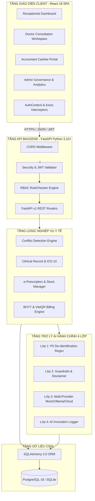
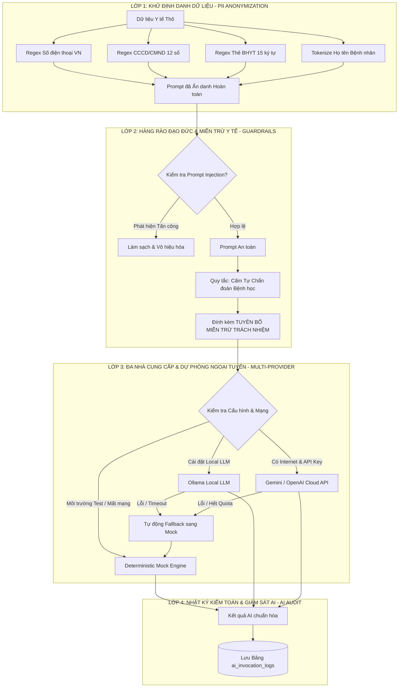
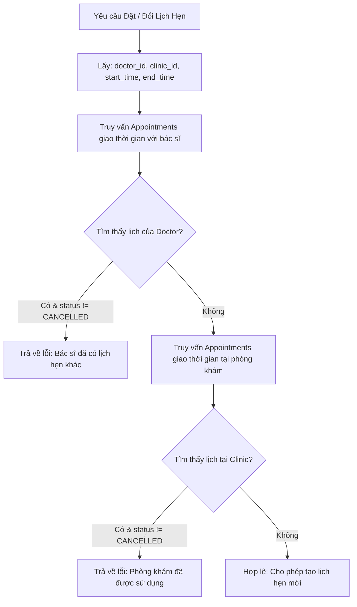
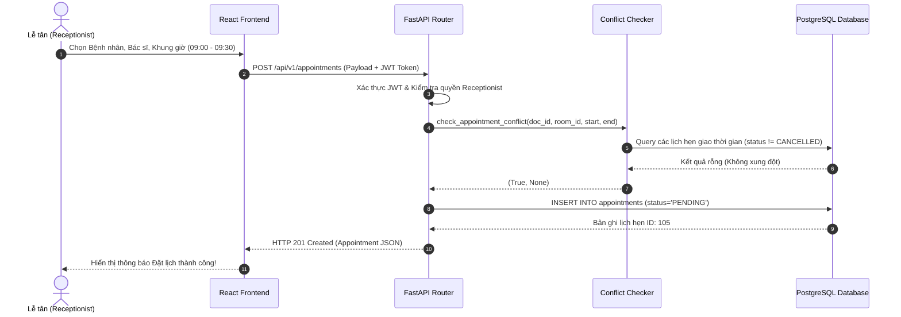
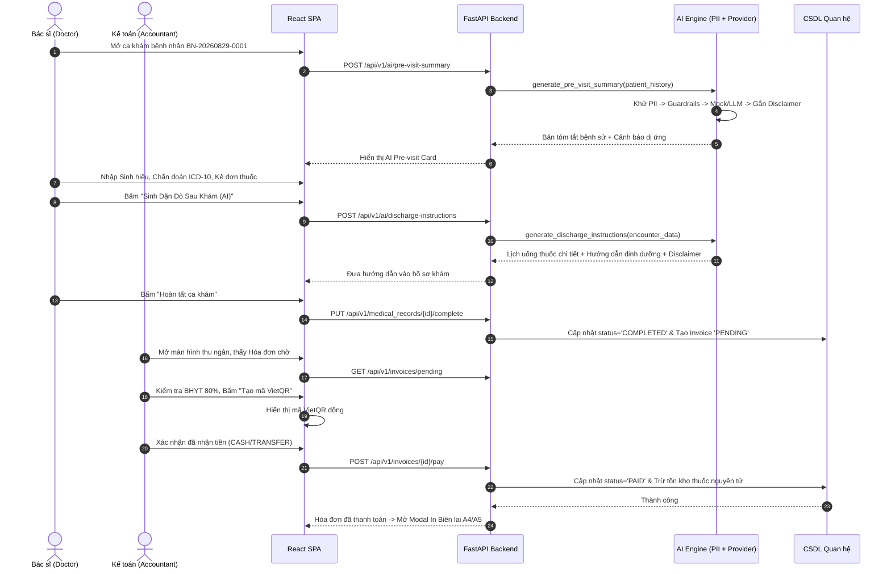
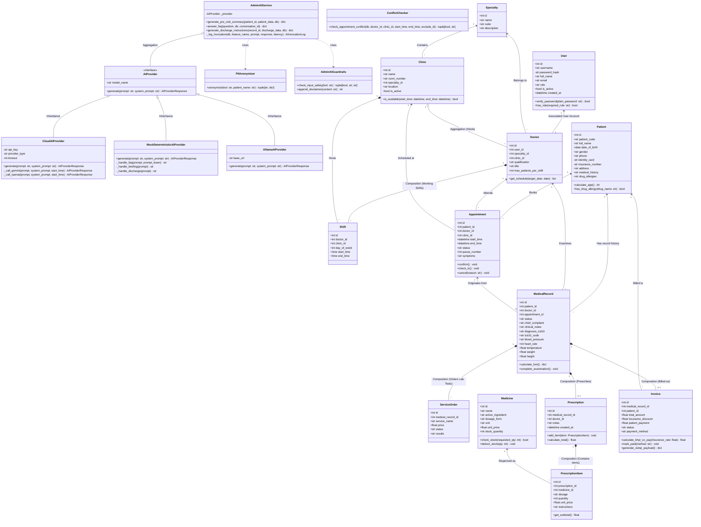
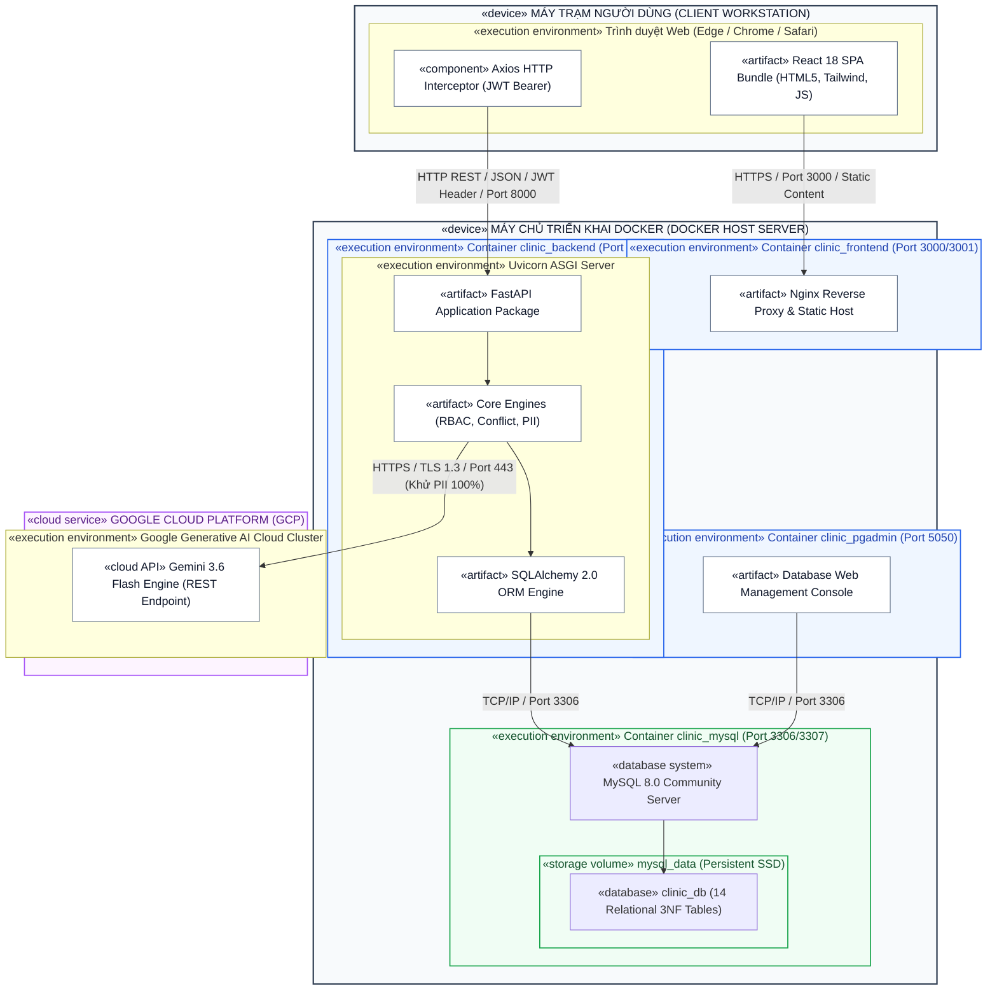

# ĐẶC TẢ KIẾN TRÚC KỸ THUẬT TOÀN DIỆN (SYSTEM ARCHITECTURE SPECIFICATION)
## DỰ ÁN: HỆ THỐNG QUẢN LÝ PHÒNG KHÁM ĐA KHOA THÔNG MINH TÍCH HỢP TRỢ LÝ AI HÀNH CHÍNH
### (Clinic Management System with Administrative AI Assistant - CMS-AI)

---

## 1. TỔNG QUAN KIẾN TRÚC TỔNG THỂ (SYSTEM OVERVIEW)

Hệ thống **CMS-AI** được xây dựng theo mô hình **Kiến trúc Phân tầng Hướng Dịch vụ (Service-Oriented Layered Architecture)** hiện đại, phân tách rõ ràng giữa Tầng Giao diện Người dùng (Presentation Layer), Tầng Dịch vụ API & Nghiệp vụ (Application & Business Logic Layer), Tầng Trợ lý AI Phân tầng Bảo mật (Administrative AI Engine), và Tầng Dữ liệu Quan hệ (Data Persistence Layer).



---

## 2. ĐẶC TẢ TẦNG BACKEND (FASTAPI + SQLALCHEMY 2.0 + PYDANTIC V2)

### 2.1. Thành phần Công nghệ Cốt lõi
- **Framework:** FastAPI (Python 3.10+) với kiến trúc bất đồng bộ (Asynchronous ASGI via Uvicorn), mang lại hiệu năng cao (> 20,000 req/sec) và tài liệu API tương tác tự động OpenAPI (Swagger UI tại `/docs`).
- **ORM & Database Toolkit:** SQLAlchemy 2.0 sử dụng cú pháp `select()` hiện đại, quản lý session an toàn qua `SessionLocal` theo từng request và hỗ trợ quản lý transaction nghiêm ngặt (`commit()`, `rollback()`).
- **Data Validation & Serializer:** Pydantic v2 với cơ chế kiểm tra kiểu dữ liệu tĩnh mạnh mẽ (Strict schema validation), chuẩn hóa định dạng ngày giờ ISO 8601, biểu thức chính quy cho CCCD (12 số), SĐT (10 số), BHYT (15 ký tự).
- **Authentication & Cryptography:** 
  - Mã hóa mật khẩu: `passlib[bcrypt]` với salt 12 vòng.
  - Cấp phát & giải mã Token: `PyJWT` (chuẩn RFC 7519, thuật toán ký mật mã `HS256`, thời hạn hết hạn 60 phút).

### 2.2. Cấu trúc Thư mục Backend Chuẩn Clean Architecture
```
backend/
├── app/
│   ├── main.py                  # Điểm khởi động ứng dụng, CORS middleware, gộp routers
│   ├── config.py                # Cấu hình Pydantic BaseSettings (.env loader)
│   ├── database.py              # Khởi tạo engine, SessionLocal, Base model
│   ├── models/                  # 14 SQLAlchemy ORM models (Entity definitions)
│   ├── schemas/                 # Pydantic v2 Request/Response Data Transfer Objects
│   ├── core/                    # Security, JWT handler, RBAC RoleChecker, Conflict Checker
│   ├── ai_engine/               # Module AI 4 lớp: Anonymizer, Guardrails, Providers, Services
│   ├── api/v1/                  # REST API Endpoints theo từng phân hệ nghiệp vụ
│   └── seed/                    # Script nạp dữ liệu mẫu y tế Việt Nam
└── tests/                       # 14 tệp test suite tự động với 223+ test cases
```

---

## 3. ĐẶC TẢ TẦNG FRONTEND (REACT 18 + VITE + TAILWIND CSS)

### 3.1. Thiết kế Giao diện Công thái học Y tế (Taste-Skill UI Standard)
- **Framework & Build Tool:** React 18 SPA đóng gói bằng Vite, đảm bảo thời gian Hot Module Replacement (HMR) < 50ms và kích thước bundle tối ưu.
- **Styling & Design System:** Tailwind CSS tuân thủ triết lý Taste-Skill chống "AI Slop":
  - Bảng màu lâm sàng chuẩn mực: Slate (Nền tảng & Văn bản), Emerald (Thành công & Khám bệnh), Sky Blue (Thông tin & Điều phối), Rose (Cảnh báo dị ứng & Khẩn cấp).
  - Phông chữ 3 tầng: *Plus Jakarta Sans* (Tiêu đề lớn), *Inter* (Giao diện & Văn bản), *JetBrains Mono* (Mã ICD-10, Sinh hiệu, Số tiền VNĐ với `tabular-nums font-mono`).
  - Viền xúc giác 1px (`border-slate-200/80`) thay thế bóng mờ lem nhem.
- **Biểu tượng:** `lucide-react` trực quan, nhất quán ngữ nghĩa y tế.

### 3.2. Quản lý Trạng thái & Bảo mật Định tuyến (Routing & State)
- **AuthContext & Token Storage:** Quản lý thông tin phiên làm việc của người dùng hiện tại, tự động phục hồi phiên từ `localStorage` khi F5 trang.
- **Axios HTTP Client Interceptor:** Tự động chèn header `Authorization: Bearer <token>` vào 100% request; tự động chuyển hướng về trang `/login` khi nhận mã lỗi `401 Unauthorized`.
- **RoleGate & ProtectedRoute:** Chặn hiển thị và ngăn truy cập trái phép các trang chức năng không thuộc quyền hạn của vai trò người dùng.

---

## 4. ĐẶC TẢ KIẾN TRÚC PHÂN TẦNG TRỢ LÝ AI HÀNH CHÍNH (4-LAYER AI ENGINE)



---

## 5. MÔ HÌNH PHÂN QUYỀN TRUY CẬP DỰA TRÊN VAI TRÒ (RBAC MODEL)

### 5.1. Ma trận Phân quyền Toàn diện (RBAC Endpoint Matrix)
| Nhóm Endpoint REST API | Admin | Lễ tân (Receptionist) | Bác sĩ (Doctor) | Kế toán (Accountant) |
|---|:---:|:---:|:---:|:---:|
| `POST /api/v1/auth/login`, `GET /me` | **Full** | **Full** | **Full** | **Full** |
| `CRUD /api/v1/users` (Tài khoản người dùng) | **Full** | ❌ Chặn (403) | ❌ Chặn (403) | ❌ Chặn (403) |
| `CRUD /api/v1/clinics`, `/specialties` | **Full** | Read-Only | Read-Only | Read-Only |
| `CRUD /api/v1/doctors`, `/shifts` | **Full** | Read-Only | Read-Only | Read-Only |
| `CRUD /api/v1/patients` (Hồ sơ bệnh nhân) | **Full** | **Full** | Read-Only | Read-Only |
| `POST/PUT /api/v1/appointments` (Lịch hẹn) | **Full** | **Full** | Read-Only (Lịch mình) | ❌ Chặn (403) |
| `GET/POST /api/v1/queue` (Hàng đợi phòng khám)| **Full** | **Full** | Read-Only (Phòng mình)| ❌ Chặn (403) |
| `CRUD /api/v1/medical_records` (Phiếu khám) | Read-Only | ❌ Chặn (403) | **Full** (Ca mình phụ trách)| ❌ Chặn (403) |
| `CRUD /api/v1/prescriptions` (Đơn thuốc) | Read-Only | ❌ Chặn (403) | **Full** (Kê đơn) | Read-Only |
| `CRUD /api/v1/medicines` (Danh mục kho dược) | **Full** | Read-Only | Read-Only | Read-Only |
| `CRUD /api/v1/invoices` (Hóa đơn viện phí) | Read-Only | Read-Only | ❌ Chặn (403) | **Full** (Thu tiền/In) |
| `POST /api/v1/ai/pre-visit-summary` | Read-Only | ❌ Chặn (403) | **Full** | ❌ Chặn (403) |
| `POST /api/v1/ai/discharge-instructions` | Read-Only | ❌ Chặn (403) | **Full** | ❌ Chặn (403) |
| `POST /api/v1/ai/faq` (Chatbot quy trình) | **Full** | **Full** | **Full** | **Full** |
| `GET /api/v1/audit`, `GET /api/v1/stats` | **Full** | ❌ Chặn (403) | ❌ Chặn (403) | ❌ Chặn (403) |

---

## 6. THUẬT TOÁN KIỂM TRA XUNG ĐỘT LỊCH HẸN (CONFLICT DETECTION ENGINE)

Thuật toán hoạt động dựa trên nguyên lý kiểm tra giao khoảng thời gian (Interval Intersection) kết hợp hai chiều không gian (Bác sĩ & Phòng khám):

$$\text{Overlap}(A, B) \iff (Start_A < End_B) \land (End_A > Start_B)$$



```python
# Code logic đặc tả tại backend/app/core/conflict_checker.py
def check_appointment_conflict(
    db: Session,
    doctor_id: int,
    clinic_id: int,
    start_time: datetime,
    end_time: datetime,
    exclude_appointment_id: Optional[int] = None
) -> Tuple[bool, Optional[str]]:
    # 1. Kiểm tra xung đột Bác sĩ
    doc_conflict = db.query(Appointment).filter(
        Appointment.doctor_id == doctor_id,
        Appointment.status != AppointmentStatus.CANCELLED,
        Appointment.start_time < end_time,
        Appointment.end_time > start_time
    )
    if exclude_appointment_id:
        doc_conflict = doc_conflict.filter(Appointment.id != exclude_appointment_id)
    if doc_conflict.first():
        return False, "Bác sĩ đã có lịch hẹn khác trong khoảng thời gian này."

    # 2. Kiểm tra xung đột Phòng khám
    room_conflict = db.query(Appointment).filter(
        Appointment.clinic_id == clinic_id,
        Appointment.status != AppointmentStatus.CANCELLED,
        Appointment.start_time < end_time,
        Appointment.end_time > start_time
    )
    if exclude_appointment_id:
        room_conflict = room_conflict.filter(Appointment.id != exclude_appointment_id)
    if room_conflict.first():
        return False, "Phòng khám đã được sử dụng trong khoảng thời gian này."

    return True, None
```

---

## 7. BIỂU ĐỒ TRÌNH TỰ NGHIỆP VỤ Y TẾ CHÍNH (SEQUENCE DIAGRAMS)

### 7.1. Trình tự Đặt lịch Khám & Kiểm tra Xung đột


### 7.2. Trình tự Khám bệnh, Gọi AI Dặn dò & Thanh toán Hóa đơn


---

## 8. BIỂU ĐỒ LỚP HƯỚNG ĐỐI TƯỢNG (UML CLASS DIAGRAM)

Biểu đồ lớp dưới đây mô hình hóa cấu trúc hướng đối tượng (OOP) toàn diện của hệ thống CMS-AI, phân định rõ các tầng thực thể (Domain Entities), tầng dịch vụ/kiểm soát (Service Layer), và tầng AI Providers. Biểu đồ chỉ rõ thuộc tính, phương thức, phạm vi truy cập (`+` public, `-` private, `#` protected) cùng các loại quan hệ chuẩn UML:
- **Kế thừa (Inheritance `<|--`):** Các AI Provider cụ thể kế thừa từ Abstract Interface `AIProvider`.
- **Chứa chặt (Composition `*--`):** Vòng đời đối tượng con phụ thuộc hoàn toàn vào đối tượng cha (ví dụ: Xóa `Prescription` sẽ tự động xóa các `PrescriptionItem`; Xóa `MedicalRecord` sẽ xóa các `ServiceOrder`).
- **Chứa lỏng (Aggregation `o--`):** Đối tượng con có thể tồn tại độc lập (ví dụ: `Clinic` tổng hợp `Doctor`; `AdminAIService` tổng hợp `AIProvider`).
- **Liên kết (Association `-->`):** Mối quan hệ tương tác logic giữa các thực thể độc lập.



---

## 9. BIỂU ĐỒ TRIỂN KHAI CHUẨN UML (UML DEPLOYMENT DIAGRAM)

Biểu đồ triển khai chuẩn UML mô hình hóa cấu trúc vật lý của hạ tầng vận hành hệ thống, bao gồm các nút thiết bị phần cứng (`«device»`), môi trường thực thi ảo hóa container (`«execution environment»`), các thành phần phần mềm được đóng gói (`«artifact»`), cơ sở dữ liệu (`«database»`), cổng kết nối (Ports) và giao thức mạng truyền thông (Protocols):



