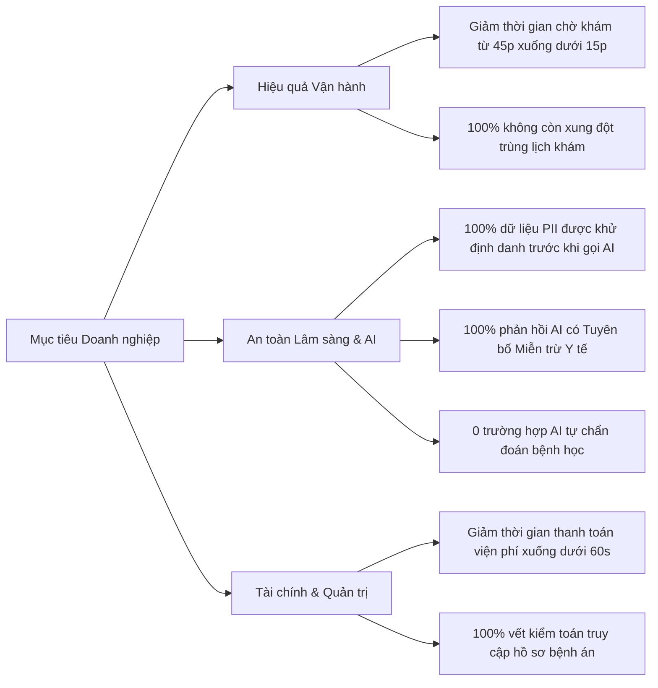
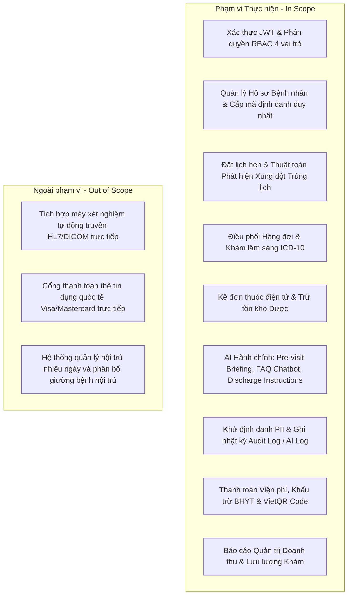

# YÊU CẦU KHÁCH HÀNG & BÀI TOÁN NGHIỆP VỤ (CUSTOMER REQUIREMENTS)
## DỰ ÁN: HỆ THỐNG QUẢN LÝ PHÒNG KHÁM ĐA KHOA THÔNG MINH TÍCH HỢP TRỢ LÝ AI HÀNH CHÍNH
### (Clinic Management System with Administrative AI Assistant - CMS-AI)

---

## 1. TỔNG QUAN DỰ ÁN & BỐI CẢNH DOANH NGHIỆP

### 1.1. Giới thiệu Phòng khám
Hệ thống phòng khám đa khoa tư nhân quy mô vừa (50-100 lượt khám/ngày, 10-15 bác sĩ, 4 chuyên khoa chính: Nội tổng quát, Tim mạch, Nhi khoa, Da liễu) đang đối mặt với sự quá tải trong quản lý hành chính, điều phối lịch hẹn và lưu trữ hồ sơ bệnh án. Ban Lãnh đạo Phòng khám đặt mục tiêu hiện đại hóa toàn diện quy trình vận hành bằng cách triển khai một nền tảng phần mềm quản trị tập trung (Clinic Management System - CMS) tích hợp Trợ lý Trí tuệ Nhân tạo Hành chính (Administrative AI Assistant) an toàn và bảo mật cao.

### 1.2. Hội đồng Các bên Liên quan (Stakeholder Board)
| Stakeholder | Chức danh / Vai trò | Trách nhiệm chính & Mối quan tâm |
|---|---|---|
| **BS.CKII Trần Văn Hùng** | Giám đốc Y khoa / Chủ tịch Hội đồng | Đảm bảo an toàn bệnh nhân, tuân thủ đạo đức y khoa, chất lượng chẩn đoán và tính chính xác của hồ sơ bệnh án. |
| **ThS. Lê Hoàng Yến** | Trưởng phòng Vận hành & Hành chính | Tối ưu hóa lưu lượng bệnh nhân, giảm thời gian chờ đợi, nâng cao năng suất của đội ngũ lễ tân và nhân viên. |
| **BS.CKI Nguyễn Văn Nam** | Đại diện Đội ngũ Bác sĩ lâm sàng | Tiết kiệm thời gian đọc bệnh sử cũ, thao tác kê đơn nhanh chóng, trợ lý dặn dò sau khám tiện lợi. |
| **Dược sĩ Phạm Thu Trang** | Trưởng khoa Dược | Quản lý kho thuốc chặt chẽ, kiểm soát định mức tồn kho, hạn chế thất thoát và sai sót liều lượng. |
| **Bà Đỗ Mỹ Linh** | Kế toán trưởng | Quản lý viện phí minh bạch, tự động hóa tính toán BHYT, hạn chế thất thoát tiền mặt, hỗ trợ VietQR. |
| **KS. Đặng Minh Tuấn** | Trưởng bộ phận CNTT | Bảo mật dữ liệu y tế, kiểm soát phân quyền RBAC, sẵn sàng triển khai Docker, khả năng chạy offline. |

---

## 2. KHẢO SÁT THỰC TRẠNG & CÁC ĐIỂM NGHẼN VẬN HÀNH (OPERATIONAL PAIN POINTS)

Qua các buổi phỏng vấn sâu (Deep Stakeholder Interviews) với Hội đồng phòng khám, 5 điểm nghẽn nghiêm trọng đã được xác định:

```
+---------------------------------------------------------------------------------------------------+
|                           5 ĐIỂM NGHẼN VẬN HÀNH CHÍNH CỦA PHÒNG KHÁM                              |
+---------------------------------------------------------------------------------------------------+
| 1. Xung đột lịch hẹn & Ùn tắc tiếp đón | Ghi sổ/Excel gây trùng khung giờ bác sĩ, quá tải phòng chờ|
| 2. Quá tải đọc bệnh án thủ công       | Mất 3-5 phút/ca để lật giở lịch sử, dễ bỏ sót dị ứng thuốc |
| 3. Sai sót kê đơn & Hướng dẫn sau khám| Viết tay khó đọc, dặn miệng bệnh nhân quên lịch uống thuốc|
| 4. Chậm trễ thu phí & Sai lệch BHYT    | Tính toán thủ công phức tạp, nhầm lẫn tỷ lệ đồng chi trả  |
| 5. Nguy cơ rò rỉ dữ liệu định danh PII| Hồ sơ y tế chưa được ẩn danh khi ứng dụng công nghệ mới    |
+---------------------------------------------------------------------------------------------------+
```

### 2.1. Điểm nghẽn 1: Xung đột lịch hẹn và ùn tắc tại quầy tiếp đón
- **Hiện trạng:** Lễ tân đặt lịch hẹn qua điện thoại và ghi chép vào bảng tính Excel phân tán hoặc sổ giấy.
- **Hậu quả:** 15-20% lượt khám bị trùng lịch vào các khung giờ cao điểm (8h30 - 10h00 sáng); hai bệnh nhân cùng được xếp vào một bác sĩ trong cùng một khung 30 phút; bệnh nhân phải chờ đợi trung bình 45-60 phút để được vào khám.
- **Yêu cầu khách hàng:** Thuật toán phát hiện xung đột thời gian thực (Time Conflict Detection), tự động chặn đặt lịch trùng lặp cho cùng một bác sĩ hoặc cùng một phòng khám.

### 2.2. Điểm nghẽn 2: Bác sĩ mất nhiều thời gian tra cứu bệnh sử cũ
- **Hiện trạng:** Bác sĩ phải mở nhiều tệp bệnh án giấy hoặc cuộn qua hàng chục trang báo cáo cũ để tìm thông tin tiền sử dị ứng thuốc và các phác đồ điều trị trước đây.
- **Hậu quả:** Mất 3-5 phút chỉ để tóm tắt thông tin; nguy cơ bỏ sót cảnh báo dị ứng thuốc (ví dụ dị ứng Penicillin, NSAIDs) dẫn đến sự cố y khoa.
- **Yêu cầu khách hàng:** Tính năng **AI Pre-visit Briefing** tự động tổng hợp tiền sử bệnh, dị ứng thuốc, sinh hiệu các lần khám trước thành bản tóm tắt súc tích hiển thị ngay khi bác sĩ mở ca khám.

### 2.3. Điểm nghẽn 3: Kê đơn thuốc thủ công và hướng dẫn sau khám thiếu chuẩn hóa
- **Hiện trạng:** Toa thuốc và lời dặn dò chế độ ăn uống, kiêng cữ được viết tay hoặc dặn miệng nhanh trong vòng 1-2 phút cuối ca khám.
- **Hậu quả:** Bệnh nhân không nhớ rõ liều lượng, cách uống (trước/sau ăn), không nắm được dấu hiệu cảnh báo cần tái khám khẩn cấp.
- **Yêu cầu khách hàng:** Kê đơn thuốc điện tử (e-Prescription) tích hợp trừ kho tự động; Tính năng **AI Discharge Instructions** tự động tạo hướng dẫn chăm sóc tại nhà, lịch uống thuốc theo bảng và ngày hẹn tái khám chuẩn mực.

### 2.4. Điểm nghẽn 4: Chậm trễ viện phí và sai sót khấu trừ BHYT
- **Hiện trạng:** Kế toán phải cộng tiền khám, từng xét nghiệm và từng loại thuốc bằng máy tính tay, sau đó tính tỷ lệ BHYT 80% hoặc 100%.
- **Hậu quả:** Ùn tắc tại quầy thu ngân sau giờ khám; sai lệch số tiền BHYT chi trả và bệnh nhân cùng chi trả (co-pay); thiếu phương thức thanh toán không dùng tiền mặt.
- **Yêu cầu khách hàng:** Tự động tạo hóa đơn chi tiết ngay khi bác sĩ hoàn thành ca khám, tự động khấu trừ BHYT, hiển thị mã VietQR động để chuyển khoản nhanh và in phiếu thu chuẩn A4/A5.

### 2.5. Điểm nghẽn 5: Rủi ro vi phạm an toàn thông tin và quyền riêng tư y tế
- **Hiện trạng:** Thông tin cá nhân của người bệnh (CCCD, SĐT, Địa chỉ, Mã thẻ BHYT) dễ bị lộ lọt khi truyền qua các hệ thống bên thứ ba hoặc lưu trữ không mã hóa.
- **Hậu quả:** Vi phạm Nghị định 13/2023/NĐ-CP về Bảo vệ dữ liệu cá nhân và các quy định của Bộ Y tế.
- **Yêu cầu khách hàng:** Hệ thống phải có **Module Khử định danh (PII De-identification Engine)** che 100% dữ liệu nhạy cảm trước khi gửi tới bất kỳ mô hình AI nào; nhật ký kiểm toán (Audit Log) ghi nhận toàn bộ truy vết.

---

## 3. MỤC TIÊU VÀ CHỈ SỐ ĐO LƯỜNG THÀNH CÔNG (KPIS & SUCCESS METRICS)



### 3.1. Bảng Chỉ số Đo lường Hiệu quả (KPIs Target)
| Nhóm chỉ số | Chỉ số cụ thể | Hiện trạng (Baseline) | Mục tiêu hệ thống CMS-AI |
|---|---|---|---|
| **Vận hành tiếp đón** | Tỷ lệ xung đột trùng lịch hẹn | 15 - 20% | **0.0%** (Chặn chủ động 100%) |
| **Vận hành tiếp đón** | Thời gian làm thủ tục tiếp đón | 5 - 7 phút/bệnh nhân | **< 60 giây/bệnh nhân** |
| **Lâm sàng** | Thời gian bác sĩ chuẩn bị hồ sơ trước khám | 3 - 5 phút | **< 5 giây** (Nhờ AI Pre-visit Briefing) |
| **Dược & Kê đơn** | Tỷ lệ thất thoát tồn kho thuốc | 3 - 5% | **< 0.1%** (Tự động trừ tồn kho theo đơn) |
| **Kế toán - Viện phí**| Thời gian tổng hợp & xuất hóa đơn BHYT | 4 - 6 phút | **< 30 giây** (Tự động tính & sinh VietQR) |
| **An toàn & Bảo mật** | Tỷ lệ rò rỉ dữ liệu PII sang AI Provider | Không kiểm soát | **0.0%** (100% ẩn danh qua Regex/Tokens) |
| **Hiệu năng hệ thống**| Thời gian phản hồi API (Latency) | Không xác định | **< 20ms** (với 95% request) |

---

## 4. RANH GIỚI ĐẠO ĐỨC & NGUYÊN TẮC QUẢN TRỊ AI (AI ETHICAL GOVERNANCE)

Hội đồng Y khoa phòng khám đặc biệt nhấn mạnh nguyên tắc an toàn cao nhất trong việc ứng dụng AI:

1. **AI là Trợ lý Hành chính - KHÔNG PHẢI BÁC SĨ:**
   - AI tuyệt đối **không đưa ra kết luận chẩn đoán bệnh học, không chỉ định điều trị y khoa, không thay đổi liều lượng thuốc**.
   - Quyền quyết định chẩn đoán và điều trị 100% thuộc về Bác sĩ có chứng chỉ hành nghề.
2. **Bắt buộc gắn Nhãn Cảnh báo Miễn trừ Trách nhiệm Y tế:**
   - 100% văn bản, thẻ tóm tắt, tin nhắn chatbot và phiếu dặn dò sinh bởi AI phải đi kèm dòng thông báo:
   > *"TUYÊN BỐ MIỄN TRỪ TRÁCH NHIỆM Y TẾ: Nội dung do Trợ lý AI Hành chính hỗ trợ tổng hợp thông tin, không thay thế cho chẩn đoán y khoa chuyên môn của bác sĩ. Vui lòng tham vấn bác sĩ điều trị trước khi áp dụng."*
3. **Phòng thủ Đa tầng chống Prompt Injection & Chẩn đoán trái phép:**
   - Hệ thống phát hiện và chặn đứng mọi câu hỏi yêu cầu chẩn đoán bệnh (ví dụ: *"Tôi đau ngực trái có phải nhồi máu cơ tim không?"*) hoặc phá vỡ chỉ dẫn hệ thống (Jailbreak), chuyển hướng người dùng đến đặt lịch khám trực tiếp với bác sĩ chuyên khoa hoặc gọi cấp cứu 115.
4. **Khả năng Vận hành Ngoại tuyến (Offline Deterministic Fallback):**
   - Đảm bảo hệ thống không bị tê liệt khi mất kết nối Internet hoặc lỗi dịch vụ AI đám mây; tự động kích hoạt Rule-based Mock Engine cục bộ với độ trễ 0ms.

---

## 5. PHẠM VI NGHIỆP VỤ (SYSTEM SCOPE & BOUNDARIES)



Tài liệu này là cơ sở chính thức để xây dựng Đặc tả Yêu cầu Phần mềm (SRS - Software Requirements Specification) và thiết kế hệ thống chi tiết trong các giai đoạn tiếp theo.
