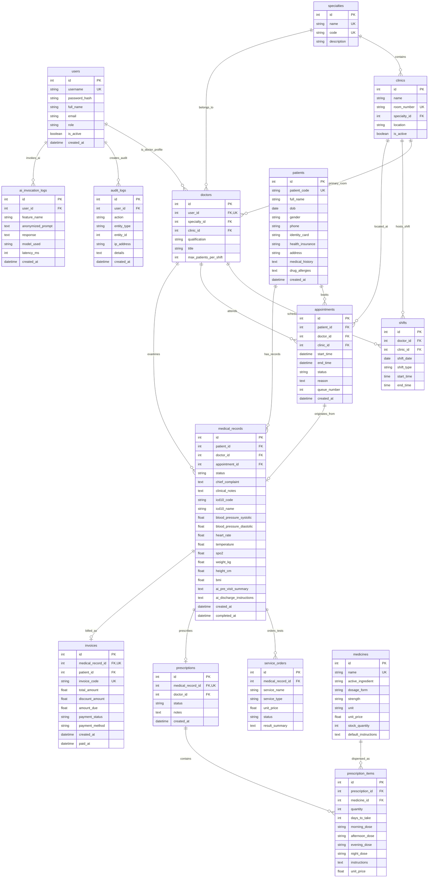

# THIẾT KẾ CƠ SỞ DỮ LIỆU TOÀN DIỆN (DATABASE DESIGN SPECIFICATION)
## DỰ ÁN: HỆ THỐNG QUẢN LÝ PHÒNG KHÁM ĐA KHOA THÔNG MINH TÍCH HỢP TRỢ LÝ AI HÀNH CHÍNH
### (Clinic Management System with Administrative AI Assistant - CMS-AI)

---

## 1. TỔNG QUAN THIẾT KẾ & SƠ ĐỒ THỰC THỂ LIÊN KẾT (ERD)

Cơ sở dữ liệu của hệ thống **CMS-AI** gồm **14 bảng quan hệ** được thiết kế chuẩn hóa theo dạng **Chuẩn 3 (3NF - Third Normal Form)**, đảm bảo tính toàn vẹn dữ liệu lâm sàng, ngăn ngừa trùng lặp và tối ưu hóa hiệu năng truy vấn cho cả SQLite và PostgreSQL 16.

---

## 2. TỪ ĐIỂN DỮ LIỆU CHI TIẾT (DATA DICTIONARY)

### 2.1. Bảng `users` (Tài khoản & Phân quyền)
| Cột (Column) | Kiểu dữ liệu | Ràng buộc | Mô tả |
|---|---|---|---|
| `id` | `INTEGER` | `PRIMARY KEY, AUTO_INCREMENT` | Định danh người dùng |
| `username` | `VARCHAR(50)` | `NOT NULL, UNIQUE, INDEX` | Tên đăng nhập duy nhất |
| `password_hash`| `VARCHAR(255)`| `NOT NULL` | Mật khẩu băm một chiều Bcrypt |
| `full_name` | `VARCHAR(100)`| `NOT NULL` | Họ và tên đầy đủ |
| `email` | `VARCHAR(100)`| `NULL` | Thư điện tử |
| `role` | `VARCHAR(20)` | `NOT NULL` | Vai trò: `admin`, `receptionist`, `doctor`, `accountant` |
| `is_active` | `BOOLEAN` | `DEFAULT TRUE` | Trạng thái kích hoạt tài khoản |
| `created_at` | `DATETIME` | `DEFAULT CURRENT_TIMESTAMP` | Thời điểm tạo tài khoản |

### 2.2. Bảng `specialties` (Danh mục Chuyên khoa)
| Cột | Kiểu dữ liệu | Ràng buộc | Mô tả |
|---|---|---|---|
| `id` | `INTEGER` | `PRIMARY KEY, AUTO_INCREMENT` | Mã định danh chuyên khoa |
| `name` | `VARCHAR(100)`| `NOT NULL, UNIQUE` | Tên chuyên khoa (Nội khoa, Tim mạch...) |
| `code` | `VARCHAR(20)` | `NOT NULL, UNIQUE` | Mã viết tắt (NOI, TIM, NHI, DA) |
| `description` | `TEXT` | `NULL` | Mô tả phạm vi khám chữa bệnh |

### 2.3. Bảng `clinics` (Phòng khám chức năng)
| Cột | Kiểu dữ liệu | Ràng buộc | Mô tả |
|---|---|---|---|
| `id` | `INTEGER` | `PRIMARY KEY, AUTO_INCREMENT` | Mã định danh phòng khám |
| `name` | `VARCHAR(100)`| `NOT NULL` | Tên phòng (Phòng khám Tim mạch 1) |
| `room_number` | `VARCHAR(20)` | `NOT NULL, UNIQUE` | Số hiệu phòng (P101, P102, P201) |
| `specialty_id`| `INTEGER` | `FOREIGN KEY (specialties.id)` | Thuộc chuyên khoa nào |
| `location` | `VARCHAR(100)`| `NULL` | Vị trí: Tầng 1, Nhà A |
| `is_active` | `BOOLEAN` | `DEFAULT TRUE` | Trạng thái phòng sẵn sàng |

### 2.4. Bảng `doctors` (Hồ sơ Bác sĩ)
| Cột | Kiểu dữ liệu | Ràng buộc | Mô tả |
|---|---|---|---|
| `id` | `INTEGER` | `PRIMARY KEY, AUTO_INCREMENT` | Mã định danh bác sĩ |
| `user_id` | `INTEGER` | `FK(users.id), UNIQUE` | Liên kết tài khoản đăng nhập |
| `specialty_id`| `INTEGER` | `FK(specialties.id)` | Chuyên khoa phụ trách |
| `clinic_id` | `INTEGER` | `FK(clinics.id), NULL` | Phòng khám chỉ định chính |
| `qualification`|`VARCHAR(100)`| `NOT NULL` | Học vị (BS.CKI, BS.CKII, ThS, TS) |
| `title` | `VARCHAR(100)`| `NULL` | Chức vụ (Trưởng khoa, Bác sĩ điều trị) |
| `max_patients_per_shift` | `INTEGER` | `DEFAULT 30` | Định mức khám tối đa mỗi ca |

### 2.5. Bảng `shifts` (Ca trực Bác sĩ)
| Cột | Kiểu dữ liệu | Ràng buộc | Mô tả |
|---|---|---|---|
| `id` | `INTEGER` | `PRIMARY KEY, AUTO_INCREMENT` | Mã ca làm việc |
| `doctor_id` | `INTEGER` | `FK(doctors.id)` | Bác sĩ trực |
| `clinic_id` | `INTEGER` | `FK(clinics.id)` | Phòng khám trực |
| `shift_date` | `DATE` | `NOT NULL, INDEX` | Ngày trực |
| `shift_type` | `VARCHAR(20)` | `NOT NULL` | `MORNING`, `AFTERNOON`, `EVENING` |
| `start_time` | `TIME` | `NOT NULL` | Giờ bắt đầu (07:30) |
| `end_time` | `TIME` | `NOT NULL` | Giờ kết thúc (11:30) |

### 2.6. Bảng `patients` (Hồ sơ Bệnh nhân)
| Cột | Kiểu dữ liệu | Ràng buộc | Mô tả |
|---|---|---|---|
| `id` | `INTEGER` | `PRIMARY KEY, AUTO_INCREMENT` | ID bệnh nhân |
| `patient_code`| `VARCHAR(30)` | `NOT NULL, UNIQUE, INDEX` | Mã y tế duy nhất `BN-YYYYMMDD-XXXX` |
| `full_name` | `VARCHAR(100)`| `NOT NULL, INDEX` | Họ và tên bệnh nhân |
| `dob` | `DATE` | `NOT NULL` | Ngày tháng năm sinh |
| `gender` | `VARCHAR(10)` | `NOT NULL` | Giới tính: `MALE`, `FEMALE`, `OTHER` |
| `phone` | `VARCHAR(15)` | `NOT NULL, INDEX` | Số điện thoại liên lạc (10 số) |
| `identity_card`|`VARCHAR(20)` | `NOT NULL, INDEX` | Số CMND (9 số) / CCCD (12 số) |
| `health_insurance`|`VARCHAR(20)`| `NULL` | Mã thẻ BHYT (15 ký tự) |
| `address` | `VARCHAR(255)`| `NOT NULL` | Địa chỉ cư trú chi tiết |
| `medical_history`|`TEXT` | `NULL` | Tiền sử bệnh lý bản thân/gia đình |
| `drug_allergies`|`TEXT` | `NULL` | Danh sách tiền sử dị ứng thuốc |
| `created_at` | `DATETIME` | `DEFAULT CURRENT_TIMESTAMP` | Thời điểm mở hồ sơ |

### 2.7. Bảng `appointments` (Lịch hẹn Khám)
| Cột | Kiểu dữ liệu | Ràng buộc | Mô tả |
|---|---|---|---|
| `id` | `INTEGER` | `PRIMARY KEY, AUTO_INCREMENT` | ID lịch hẹn |
| `patient_id` | `INTEGER` | `FK(patients.id)` | Bệnh nhân đặt lịch |
| `doctor_id` | `INTEGER` | `FK(doctors.id), INDEX` | Bác sĩ tiếp nhận |
| `clinic_id` | `INTEGER` | `FK(clinics.id), INDEX` | Phòng khám chỉ định |
| `start_time` | `DATETIME` | `NOT NULL, INDEX` | Thời gian bắt đầu hẹn |
| `end_time` | `DATETIME` | `NOT NULL, INDEX` | Thời gian kết thúc hẹn |
| `status` | `VARCHAR(20)` | `DEFAULT 'PENDING'` | `PENDING`, `CONFIRMED`, `CHECKED_IN`, `COMPLETED`, `CANCELLED` |
| `reason` | `TEXT` | `NULL` | Lý do khám / Triệu chứng ban đầu |
| `queue_number`| `INTEGER` | `NULL` | Số thứ tự tiếp đón trong ngày |
| `created_at` | `DATETIME` | `DEFAULT CURRENT_TIMESTAMP` | Thời điểm đặt lịch |

### 2.8. Bảng `medical_records` (Phiếu khám Lâm sàng & Hồ sơ Bệnh án)
| Cột | Kiểu dữ liệu | Ràng buộc | Mô tả |
|---|---|---|---|
| `id` | `INTEGER` | `PRIMARY KEY, AUTO_INCREMENT` | ID phiếu khám |
| `patient_id` | `INTEGER` | `FK(patients.id)` | Bệnh nhân |
| `doctor_id` | `INTEGER` | `FK(doctors.id)` | Bác sĩ khám |
| `appointment_id`|`INTEGER` | `FK(appointments.id), NULL` | Lịch hẹn gốc (nếu có) |
| `status` | `VARCHAR(20)` | `DEFAULT 'IN_PROGRESS'` | `IN_PROGRESS`, `COMPLETED`, `LOCKED` |
| `chief_complaint`|`TEXT` | `NOT NULL` | Lý do vào khám |
| `clinical_notes`|`TEXT` | `NULL` | Khám lâm sàng cơ quan |
| `icd10_code` | `VARCHAR(10)` | `NOT NULL, INDEX` | Mã chẩn đoán ICD-10 (ví dụ: I10, E11) |
| `icd10_name` | `VARCHAR(255)`| `NOT NULL` | Tên chẩn đoán bệnh học |
| `blood_pressure_systolic`|`FLOAT`| `NULL` | Huyết áp tâm thu (mmHg) |
| `blood_pressure_diastolic`|`FLOAT`|`NULL` | Huyết áp tâm trương (mmHg) |
| `heart_rate` | `FLOAT` | `NULL` | Nhịp tim (lần/phút) |
| `temperature`| `FLOAT` | `NULL` | Thân nhiệt (°C) |
| `spo2` | `FLOAT` | `NULL` | Độ bão hòa oxy máu SpO2 (%) |
| `weight_kg` | `FLOAT` | `NULL` | Cân nặng (kg) |
| `height_cm` | `FLOAT` | `NULL` | Chiều cao (cm) |
| `bmi` | `FLOAT` | `NULL` | Chỉ số khối cơ thể (tự động tính) |
| `ai_pre_visit_summary`|`TEXT` | `NULL` | Tóm tắt AI bệnh sử trước khám |
| `ai_discharge_instructions`|`TEXT`|`NULL`| Dặn dò AI sau khám |
| `created_at` | `DATETIME` | `DEFAULT CURRENT_TIMESTAMP` | Giờ mở phiếu khám |
| `completed_at`|`DATETIME` | `NULL` | Giờ kết thúc khám |

### 2.9. Bảng `service_orders` (Chỉ định Dịch vụ Cận lâm sàng)
| Cột | Kiểu dữ liệu | Ràng buộc | Mô tả |
|---|---|---|---|
| `id` | `INTEGER` | `PRIMARY KEY, AUTO_INCREMENT` | ID chỉ định dịch vụ |
| `medical_record_id`|`INTEGER` | `FK(medical_records.id)` | Gắn với phiếu khám nào |
| `service_name`|`VARCHAR(150)`| `NOT NULL` | Tên dịch vụ (Siêu âm tim, X-quang phổi...) |
| `service_type`|`VARCHAR(50)` | `NOT NULL` | `LAB`, `IMAGING`, `PROCEDURE` |
| `unit_price` | `FLOAT` | `NOT NULL` | Đơn giá dịch vụ (VNĐ) |
| `status` | `VARCHAR(20)` | `DEFAULT 'PENDING'` | `PENDING`, `COMPLETED`, `CANCELLED` |
| `result_summary`|`TEXT` | `NULL` | Tóm tắt kết quả cận lâm sàng |

### 2.10. Bảng `medicines` (Kho Dược & Danh mục Thuốc)
| Cột | Kiểu dữ liệu | Ràng buộc | Mô tả |
|---|---|---|---|
| `id` | `INTEGER` | `PRIMARY KEY, AUTO_INCREMENT` | ID thuốc |
| `name` | `VARCHAR(150)`| `NOT NULL, UNIQUE, INDEX` | Tên thương mại / Biệt dược |
| `active_ingredient`|`VARCHAR(150)`|`NOT NULL` | Hoạt chất chính |
| `dosage_form` | `VARCHAR(50)`| `NOT NULL` | Dạng bào chế: viên nén, siro, tiêm |
| `strength` | `VARCHAR(50)` | `NOT NULL` | Hàm lượng (500mg, 20mg...) |
| `unit` | `VARCHAR(20)` | `NOT NULL` | Đơn vị tính: viên, gói, lọ, ống |
| `unit_price` | `FLOAT` | `NOT NULL` | Đơn giá bán lẻ (VNĐ) |
| `stock_quantity`|`INTEGER` | `NOT NULL, DEFAULT 0` | Số lượng tồn kho khả dụng |
| `default_instructions`|`TEXT`| `NULL` | Hướng dẫn uống chuẩn |

### 2.11. Bảng `prescriptions` (Toa thuốc Điện tử)
| Cột | Kiểu dữ liệu | Ràng buộc | Mô tả |
|---|---|---|---|
| `id` | `INTEGER` | `PRIMARY KEY, AUTO_INCREMENT` | ID đơn thuốc |
| `medical_record_id`|`INTEGER` | `FK(medical_records.id), UNIQUE` | Thuộc phiếu khám nào |
| `doctor_id` | `INTEGER` | `FK(doctors.id)` | Bác sĩ kê đơn |
| `status` | `VARCHAR(20)` | `DEFAULT 'ACTIVE'` | `ACTIVE`, `DISPENSED`, `CANCELLED` |
| `notes` | `TEXT` | `NULL` | Lời dặn chung của đơn thuốc |
| `created_at` | `DATETIME` | `DEFAULT CURRENT_TIMESTAMP` | Ngày kê đơn |

### 2.12. Bảng `prescription_items` (Chi tiết Đơn thuốc)
| Cột | Kiểu dữ liệu | Ràng buộc | Mô tả |
|---|---|---|---|
| `id` | `INTEGER` | `PRIMARY KEY, AUTO_INCREMENT` | ID chi tiết đơn thuốc |
| `prescription_id`|`INTEGER` | `FK(prescriptions.id)` | Thuộc đơn thuốc nào |
| `medicine_id` | `INTEGER` | `FK(medicines.id)` | Thuốc được kê |
| `quantity` | `INTEGER` | `NOT NULL` | Tổng số lượng cấp phát |
| `days_to_take`| `INTEGER` | `NOT NULL, DEFAULT 7` | Số ngày uống |
| `morning_dose`| `VARCHAR(20)` | `NULL` | Liều sáng (1 viên) |
| `afternoon_dose`|`VARCHAR(20)`| `NULL` | Liều trưa (1 viên) |
| `evening_dose`| `VARCHAR(20)` | `NULL` | Liều chiều (1 viên) |
| `night_dose` | `VARCHAR(20)` | `NULL` | Liều tối trước ngủ |
| `instructions`| `TEXT` | `NULL` | Hướng dẫn dùng (Uống sau ăn no) |
| `unit_price` | `FLOAT` | `NOT NULL` | Đơn giá tại thời điểm kê |

### 2.13. Bảng `invoices` (Hóa đơn Viện phí)
| Cột | Kiểu dữ liệu | Ràng buộc | Mô tả |
|---|---|---|---|
| `id` | `INTEGER` | `PRIMARY KEY, AUTO_INCREMENT` | ID hóa đơn |
| `medical_record_id`|`INTEGER` | `FK(medical_records.id), UNIQUE`| Liên kết phiếu khám |
| `patient_id` | `INTEGER` | `FK(patients.id)` | Người nộp viện phí |
| `invoice_code`| `VARCHAR(30)` | `NOT NULL, UNIQUE, INDEX` | Mã hóa đơn `HD-YYYYMMDD-XXXX` |
| `total_amount`| `FLOAT` | `NOT NULL` | Tổng chi phí gộp (Khám + CLS + Thuốc) |
| `discount_amount`|`FLOAT` | `NOT NULL, DEFAULT 0.0` | Số tiền BHYT chi trả |
| `amount_due` | `FLOAT` | `NOT NULL` | Số tiền thực thu từ bệnh nhân |
| `payment_status`|`VARCHAR(20)`| `DEFAULT 'PENDING'` | `PENDING`, `PAID`, `CANCELLED` |
| `payment_method`|`VARCHAR(20)`| `NULL` | `CASH`, `TRANSFER`, `INSURANCE` |
| `created_at` | `DATETIME` | `DEFAULT CURRENT_TIMESTAMP` | Thời điểm lập hóa đơn |
| `paid_at` | `DATETIME` | `NULL` | Thời điểm xác nhận thu tiền |

### 2.14. Bảng `audit_logs` & `ai_invocation_logs` (Nhật ký Kiểm toán & AI)
| Bảng / Cột | Kiểu dữ liệu | Ràng buộc | Mô tả |
|---|---|---|---|
| **audit_logs.id** | `INTEGER` | `PK` | ID log kiểm toán |
| `user_id` | `INTEGER` | `FK(users.id)` | Người thực hiện hành động |
| `action` | `VARCHAR(50)` | `NOT NULL` | `CREATE_PATIENT`, `VIEW_RECORD`, `PAY_INVOICE` |
| `entity_type` | `VARCHAR(50)` | `NOT NULL` | `Patient`, `MedicalRecord`, `Invoice` |
| `entity_id` | `INTEGER` | `NULL` | ID của đối tượng bị tác động |
| `ip_address` | `VARCHAR(50)` | `NULL` | Địa chỉ IP máy trạm |
| `details` | `TEXT` | `NULL` | Chi tiết nội dung thay đổi |
| `created_at` | `DATETIME` | `DEFAULT CURRENT_TIMESTAMP` | Dấu thời gian kiểm toán |
| **ai_invocation_logs.id**|`INTEGER`|`PK`| ID log gọi AI |
| `user_id` | `INTEGER` | `FK(users.id)` | Người gọi AI |
| `feature_name`| `VARCHAR(50)` | `NOT NULL` | `PRE_VISIT_SUMMARY`, `FAQ_CHATBOT`, `DISCHARGE` |
| `anonymized_prompt`|`TEXT` | `NOT NULL` | **Prompt sau khi đã khử định danh PII** |
| `response` | `TEXT` | `NOT NULL` | Câu trả lời kèm Disclaimer từ AI |
| `model_used` | `VARCHAR(50)` | `NOT NULL` | `mock-deterministic`, `ollama-llama3`, `gemini-1.5-pro` |
| `latency_ms` | `INTEGER` | `NOT NULL` | Thời gian xử lý (mili-giây) |
| `created_at` | `DATETIME` | `DEFAULT CURRENT_TIMESTAMP` | Thời điểm gọi AI |

---

## 3. CHIẾN LƯỢC TỐI ƯU HÓA CHỈ MỤC (INDEXING STRATEGY)

Để đảm bảo hiệu năng truy vấn **< 20ms** ngay cả khi hệ thống mở rộng lên hàng trăm nghìn bản ghi, các chỉ mục (B-Tree Indexes) sau đã được thiết lập:
1. `idx_patients_patient_code`: Tìm kiếm nhanh mã định danh y tế.
2. `idx_patients_identity_card` & `idx_patients_phone`: Tra cứu hồ sơ tiếp đón nhanh.
3. `idx_appointments_doctor_time`: Tối ưu hóa truy vấn thuật toán kiểm tra xung đột trùng lịch (`doctor_id`, `start_time`, `end_time`).
4. `idx_appointments_clinic_time`: Tối ưu hóa truy vấn xung đột phòng khám (`clinic_id`, `start_time`, `end_time`).
5. `idx_medical_records_icd10`: Phục vụ báo cáo thống kê mô hình bệnh tật theo mã ICD-10.
6. `idx_invoices_created_paid`: Phục vụ truy vấn tổng hợp báo cáo tài chính theo khoảng thời gian.
7. `idx_audit_logs_created_at`: Phục vụ phân trang và điều tra nhật ký an ninh.
