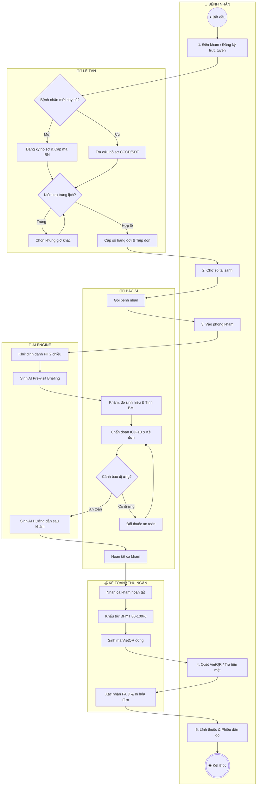

# ĐẶC TẢ YÊU CẦU PHẦN MỀM (SOFTWARE REQUIREMENTS SPECIFICATION - SRS)
## DỰ ÁN: HỆ THỐNG QUẢN LÝ PHÒNG KHÁM ĐA KHOA THÔNG MINH TÍCH HỢP TRỢ LÝ AI HÀNH CHÍNH
### (Clinic Management System with Administrative AI Assistant - CMS-AI)

---

## 1. PHÂN LOẠI YÊU CẦU CHỨC NĂNG (FUNCTIONAL REQUIREMENTS - FR)

Hệ thống định nghĩa danh mục các Yêu cầu Chức năng chuẩn hóa theo mã hiệu phân cấp theo từng phân hệ:

```
+---------------------------------------------------------------------------------------------------+
|                           DANH MỤC PHÂN HỆ YÊU CẦU CHỨC NĂNG (FR)                                 |
+---------------------------------------------------------------------------------------------------+
| 1. Phân hệ Xác thực & Phân quyền (FR-AUTH, FR-RBAC)                                               |
| 2. Phân hệ Quản lý Danh mục & Bác sĩ (FR-CLINIC, FR-STAFF)                                       |
| 3. Phân hệ Hồ sơ Bệnh nhân (FR-PATIENT)                                                           |
| 4. Phân hệ Lịch hẹn & Thuật toán Xung đột (FR-SCHED)                                              |
| 5. Phân hệ Khám bệnh & Hàng đợi Lâm sàng (FR-EXAM)                                                |
| 6. Phân hệ Kê đơn Thuốc & Kho Dược (FR-RX)                                                        |
| 7. Phân hệ Trợ lý AI Hành chính & Bảo mật PII (FR-AI)                                             |
| 8. Phân hệ Viện phí, BHYT & VietQR (FR-BILL)                                                      |
| 9. Phân hệ Nhật ký Kiểm toán & Báo cáo Quản trị (FR-AUDIT, FR-STATS)                              |
+---------------------------------------------------------------------------------------------------+
```

---

### 1.1. Phân hệ Xác thực & Phân quyền Truy cập (Authentication & RBAC)

| Mã FR | Tên yêu cầu | Mô tả chi tiết | Vai trò áp dụng | Mức ưu tiên |
|---|---|---|---|---|
| **FR-AUTH-001** | Đăng nhập tài khoản | Hệ thống xác thực người dùng bằng `username` và `password`. Sử dụng thuật toán Bcrypt băm mật khẩu và cấp phát JWT Token (chuẩn RFC 7519, chữ ký HS256, thời hạn 60 phút). | Toàn bộ 4 vai trò | MUST |
| **FR-AUTH-002** | Lấy thông tin cá nhân | Endpoint `/api/v1/auth/me` giải mã token hiện tại và trả về ID, Họ tên, Username, Role của phiên làm việc. | Toàn bộ 4 vai trò | MUST |
| **FR-AUTH-003** | Đăng xuất an toàn | Hủy bỏ lưu trữ Token ở phía Client và vô hiệu hóa phiên làm việc của người dùng. | Toàn bộ 4 vai trò | MUST |
| **FR-RBAC-001** | Kiểm soát phân quyền 4 vai trò | Hệ thống thiết lập 4 vai trò: `Admin`, `Receptionist`, `Doctor`, `Accountant`. Áp dụng cơ chế phụ thuộc `RoleChecker` trên toàn bộ REST API. | Toàn bộ 4 vai trò | MUST |
| **FR-RBAC-002** | Ngăn chặn truy cập trái quyền | Trả về mã lỗi `403 Forbidden` khi tài khoản truy cập endpoint vượt ngoài quyền hạn nghiệp vụ quy định. | Toàn bộ 4 vai trò | MUST |
| **FR-RBAC-003** | Quản trị tài khoản người dùng | Cho phép Quản trị viên (Admin) tạo mới, cập nhật thông tin, thay đổi vai trò hoặc kích hoạt/khóa tài khoản người dùng. | Admin | MUST |

---

### 1.2. Phân hệ Quản lý Danh mục Cơ sở & Bác sĩ (Clinics & Doctors)

| Mã FR | Tên yêu cầu | Mô tả chi tiết | Vai trò áp dụng | Mức ưu tiên |
|---|---|---|---|---|
| **FR-CLINIC-001** | Quản lý Chuyên khoa | Admin tạo lập và quản lý danh mục chuyên khoa khám bệnh (Nội, Tim mạch, Nhi, Da liễu...). | Admin (CRUD), All (Read) | MUST |
| **FR-CLINIC-002** | Quản lý Phòng khám | Admin quản lý danh sách phòng khám chuyên môn, vị trí tầng, thiết bị và trạng thái hoạt động. | Admin (CRUD), All (Read) | MUST |
| **FR-STAFF-001** | Quản lý Hồ sơ Bác sĩ | Admin quản lý thông tin bác sĩ, học vị (BS.CKI, ThS, TS), chuyên khoa phụ trách, phòng khám chỉ định. | Admin (CRUD), All (Read) | MUST |
| **FR-STAFF-002** | Quản lý Ca làm việc (Shifts) | Admin cấu hình ca trực làm việc (Sáng: 07:30 - 11:30, Chiều: 13:30 - 17:30, Tối) của từng bác sĩ theo ngày. | Admin (CRUD), All (Read) | MUST |

---

### 1.3. Phân hệ Quản lý Hồ sơ Bệnh nhân (Patient Registry)

| Mã FR | Tên yêu cầu | Mô tả chi tiết | Vai trò áp dụng | Mức ưu tiên |
|---|---|---|---|---|
| **FR-PAT-001** | Đăng ký Bệnh nhân mới | Lễ tân nhập thông tin: Họ tên, Ngày sinh, Giới tính, Số điện thoại (10 số), Số CCCD (12 số), Địa chỉ, Mã thẻ BHYT (15 ký tự), Tiền sử bệnh lý, Tiền sử dị ứng thuốc. | Receptionist, Admin | MUST |
| **FR-PAT-002** | Sinh Mã Định danh Tự động | Hệ thống tự động sinh Mã Bệnh nhân duy nhất theo định dạng `BN-YYYYMMDD-XXXX` (ví dụ `BN-20260829-0001`) đảm bảo tính duy nhất tuyệt đối. | Hệ thống | MUST |
| **FR-PAT-003** | Tra cứu Hồ sơ Bệnh nhân | Cho phép tìm kiếm nhanh bệnh nhân theo Mã BN, Họ tên, Số điện thoại hoặc Số CCCD. | Lễ tân, Bác sĩ, Kế toán, Admin | MUST |
| **FR-PAT-004** | Cập nhật Hồ sơ Bệnh nhân | Cập nhật thông tin liên lạc, tiền sử bệnh, dị ứng thuốc và thẻ BHYT mới của bệnh nhân. | Lễ tân, Admin | MUST |

---

### 1.4. Phân hệ Lịch hẹn & Thuật toán Phát hiện Xung đột (Scheduling & Conflict Detection)

| Mã FR | Tên yêu cầu | Mô tả chi tiết | Vai trò áp dụng | Mức ưu tiên |
|---|---|---|---|---|
| **FR-SCHED-001** | Đặt lịch khám bệnh | Lễ tân hoặc Bệnh nhân đặt lịch khám theo Bác sĩ, Chuyên khoa, Phòng khám, Khung thời gian bắt đầu - kết thúc và lý do khám. | Lễ tân, Admin | MUST |
| **FR-SCHED-002** | Thuật toán Phát hiện Xung đột | Hệ thống tự động kiểm tra xung đột thời gian (Interval Overlap Detection): Chặn đặt lịch nếu Bác sĩ hoặc Phòng khám đã có lịch hẹn khác trùng giờ (trừ các lịch đã Hủy). | Hệ thống | MUST |
| **FR-SCHED-003** | Đổi lịch / Hủy lịch hẹn | Cho phép cập nhật thời gian hẹn (có kiểm tra xung đột tại thời điểm mới) hoặc hủy lịch hẹn kèm lý do. | Lễ tân, Admin | MUST |
| **FR-SCHED-004** | Vòng đời Trạng thái Lịch hẹn | Quản lý trạng thái lịch hẹn chuyển đổi hợp lệ: `PENDING` -> `CONFIRMED` -> `CHECKED_IN` -> `COMPLETED` / `CANCELLED`. | Lễ tân, Admin | MUST |

---

### 1.5. Phân hệ Khám bệnh & Hàng đợi Lâm sàng (Clinical Examination & Queue)

| Mã FR | Tên yêu cầu | Mô tả chi tiết | Vai trò áp dụng | Mức ưu tiên |
|---|---|---|---|---|
| **FR-EXAM-001** | Điều phối Hàng đợi Phòng khám | Lễ tân tiếp đón bệnh nhân đến khám, cấp số thứ tự hàng ngày (`queue_number`) và phân bổ vào danh sách chờ của Bác sĩ phụ trách. | Lễ tân, Admin | MUST |
| **FR-EXAM-002** | Hàng đợi Bệnh nhân theo Bác sĩ | Bác sĩ xem danh sách bệnh nhân đang chờ khám tại phòng của mình theo thứ tự ưu tiên số hàng đợi. | Bác sĩ | MUST |
| **FR-EXAM-003** | Ghi nhận Phiếu khám Lâm sàng | Bác sĩ ghi nhận: Lý do khám, Triệu chứng lâm sàng, Bộ chỉ số sinh hiệu (Huyết áp, Mạch, Nhiệt độ, SpO2, Chiều cao, Cân nặng, tính tự động BMI), Khám các cơ quan. | Bác sĩ | MUST |
| **FR-EXAM-004** | Chẩn đoán Bệnh chuẩn ICD-10 | Bác sĩ nhập chẩn đoán chính và chẩn đoán phụ kèm Mã ICD-10 (ví dụ `I10` - Tăng huyết áp vô căn, `E11` - Đái tháo đường type 2). | Bác sĩ | MUST |
| **FR-EXAM-005** | Chỉ định Dịch vụ Cận lâm sàng | Bác sĩ chỉ định các xét nghiệm máu, nước tiểu, siêu âm tổng quát, X-quang và tự động liên kết vào chi phí viện phí. | Bác sĩ | MUST |

---

### 1.6. Phân hệ Kê đơn Thuốc & Kho Dược (E-Prescription & Pharmacy)

| Mã FR | Tên yêu cầu | Mô tả chi tiết | Vai trò áp dụng | Mức ưu tiên |
|---|---|---|---|---|
| **FR-RX-001** | Quản lý Danh mục Thuốc | Admin quản lý danh mục thuốc: Tên biệt dược, Hoạt chất, Đơn vị tính (viên, gói, lọ), Hàm lượng, Đơn giá, Số lượng tồn kho và Hướng dẫn dùng chuẩn. | Admin (CRUD), All (Read) | MUST |
| **FR-RX-002** | Lập Đơn thuốc Điện tử | Bác sĩ chọn thuốc từ danh mục, nhập số lượng, số ngày uống, liều sáng/trưa/chiều/tối và ghi chú cách dùng (uống sau ăn no, uống nhiều nước). | Bác sĩ | MUST |
| **FR-RX-003** | Cảnh báo Tồn kho & Kiểm tra Hợp lệ | Hệ thống kiểm tra số lượng thuốc trong kho; cảnh báo và chặn kê đơn nếu số lượng kê vượt quá số lượng tồn khả dụng. | Bác sĩ, Hệ thống | MUST |
| **FR-RX-004** | Trừ Tồn kho Tự động | Sau khi đơn thuốc được xác nhận và thanh toán, số lượng thuốc trong kho tự động được khấu trừ tương ứng. | Hệ thống | MUST |

---

### 1.7. Phân hệ Trợ lý AI Hành chính & Bảo mật Dữ liệu Y tế (Administrative AI Engine)

| Mã FR | Tên yêu cầu | Mô tả chi tiết | Vai trò áp dụng | Mức ưu tiên |
|---|---|---|---|---|
| **FR-AI-001** | Khử Định danh PII (De-identification) | Tự động phân tích và che giấu 100% Họ tên, Số CCCD, Số điện thoại, Mã thẻ BHYT, Địa chỉ thành các token đại diện (`[PATIENT_01]`, `[CCCD_REDACTED]`, `[PHONE_REDACTED]`) trước khi gửi prompt đến AI. | Hệ thống AI | MUST |
| **FR-AI-002** | AI Tóm tắt Bệnh án (Pre-visit Briefing) | Trích xuất toàn bộ lịch sử các lần khám trước, các loại thuốc đã dùng, tiền sử dị ứng để sinh bản tóm tắt nhanh cho Bác sĩ trước khi vào ca khám. | Bác sĩ | MUST |
| **FR-AI-003** | Chatbot Tư vấn Quy trình (FAQ Chatbot) | Hỏi đáp thông minh về quy trình phòng khám, thủ tục BHYT, bảng giá dịch vụ, giờ làm việc. Kiên quyết từ chối yêu cầu tự chẩn đoán bệnh học. | Lễ tân, All | MUST |
| **FR-AI-004** | AI Sinh Hướng dẫn Sau khám (Discharge) | Tự động sinh bảng dặn dò uống thuốc chi tiết, chế độ dinh dưỡng sinh hoạt kiêng cữ, dấu hiệu cần tái khám ngay và lịch hẹn tái khám định kỳ. | Bác sĩ | MUST |
| **FR-AI-005** | Tuyên bố Miễn trừ Trách nhiệm Y tế | Tự động nhúng nhãn cảnh báo pháp lý và miễn trừ trách nhiệm y tế chuẩn mực trên 100% nội dung sinh ra từ AI. | Hệ thống AI | MUST |
| **FR-AI-006** | Cơ chế Dự phòng Ngoại tuyến (Offline Fallback) | Tự động kích hoạt Rule-Based Deterministic Mock AI Provider khi mất kết nối mạng hoặc không có API Key, đảm bảo test và vận hành 100% không gián đoạn. | Hệ thống AI | MUST |
| **FR-AI-007** | Hỗ trợ Đa nhà cung cấp AI | Cung cấp adapter kết nối linh hoạt giữa Mock Provider, Ollama Local LLM (`http://localhost:11434`) và Google Gemini / OpenAI Cloud API qua file cấu hình `.env`. | Hệ thống AI | MUST |

---

### 1.8. Phân hệ Viện phí, BHYT & Thanh toán VietQR (Billing & Invoicing)

| Mã FR | Tên yêu cầu | Mô tả chi tiết | Vai trò áp dụng | Mức ưu tiên |
|---|---|---|---|---|
| **FR-BILL-001** | Tạo Hóa đơn Tự động từ Hồ sơ Khám | Tổng hợp chi phí khám chuyên khoa + Chi phí dịch vụ cận lâm sàng + Chi phí đơn thuốc ngay khi Bác sĩ hoàn thành phiếu khám. | Kế toán, Hệ thống | MUST |
| **FR-BILL-002** | Tính toán Khấu trừ BHYT Chính xác | Tự động kiểm tra thẻ BHYT hợp lệ, áp dụng tỷ lệ chi trả của Bảo hiểm (80% hoặc 100%) và tính toán chính xác số tiền Người bệnh cùng chi trả (Co-pay). | Kế toán, Hệ thống | MUST |
| **FR-BILL-003** | Thanh toán Đa kênh & Mã VietQR | Hỗ trợ thanh toán bằng Tiền mặt (Cash), Chuyển khoản qua Mã VietQR động (chứa chính xác số tiền, STK và nội dung mã hóa đơn) hoặc BHYT. | Kế toán | MUST |
| **FR-BILL-004** | In Biên lai / Hóa đơn Viện phí | Xuất và in mẫu Hóa đơn dịch vụ y tế chuẩn có tiêu đề phòng khám, bảng kê chi tiết viện phí và chữ ký thu ngân. | Kế toán | MUST |

---

### 1.9. Phân hệ Nhật ký Kiểm toán & Báo cáo Thống kê (Audit & Analytics)

| Mã FR | Tên yêu cầu | Mô tả chi tiết | Vai trò áp dụng | Mức ưu tiên |
|---|---|---|---|---|
| **FR-AUDIT-001** | Ghi Nhật ký Truy cập Hồ sơ Bệnh án | Tự động ghi lại nhật ký mỗi khi người dùng xem hoặc cập nhật hồ sơ bệnh nhân/phiếu khám (`user_id`, `action`, `entity_type`, `ip_address`, `timestamp`). | Hệ thống | MUST |
| **FR-AUDIT-002** | Ghi Nhật ký Gọi Trợ lý AI (AI Logs) | Lưu trữ lịch sử toàn bộ các lần gọi AI (`user_id`, `prompt_sau_khi_ẩn_danh`, `response`, `model_used`, `latency_ms`, `created_at`). | Hệ thống | MUST |
| **FR-STATS-001** | Dashboard Thống kê Quản trị Toàn diện | Admin xem biểu đồ doanh thu theo ngày/tháng, số lượng bệnh nhân theo chuyên khoa, hiệu suất khám của từng bác sĩ và cơ cấu thu viện phí. | Admin | MUST |

---

## 2. PHÂN LOẠI YÊU CẦU PHI CHỨC NĂNG (NON-FUNCTIONAL REQUIREMENTS - NFR)

```
+---------------------------------------------------------------------------------------------------+
|                        DANH MỤC YÊU CẦU PHI CHỨC NĂNG (NFR)                                       |
+---------------------------------------------------------------------------------------------------+
| NFR-SEC: An toàn, Bảo mật & Quyền riêng tư Y tế (Security & Privacy)                              |
| NFR-PERF: Hiệu năng & Tốc độ Xử lý (Performance & Latency)                                       |
| NFR-AVAIL: Tính Sẵn sàng & Khả năng Chịu lỗi (Availability & Reliability)                         |
| NFR-USAB: Tính Tiện dụng & Công thái học Giao diện (Usability & Medical Ergonomics)               |
| NFR-MAINT: Khả năng Bảo trì & Kiểm thử Độc lập (Maintainability & Testability)                     |
+---------------------------------------------------------------------------------------------------+
```

### 2.1. An toàn, Bảo mật & Quyền riêng tư (Security & Privacy)
- **NFR-SEC-001:** Mật khẩu người dùng bắt buộc được mã hóa bằng thuật toán `Bcrypt` với độ phức tạp tối thiểu `rounds=12`.
- **NFR-SEC-002:** Token JWT sử dụng chữ ký điện tử `HS256`, chứa thông tin vai trò hợp lệ và thời gian hết hạn không quá 60 phút.
- **NFR-SEC-003:** Không một ký tự thông tin cá nhân định danh (PII) nào của bệnh nhân được phép xuất hiện trong dữ liệu gửi đến AI Provider bên ngoài hoặc trong bảng `ai_invocation_logs`.
- **NFR-SEC-004:** Mọi truy vấn cơ sở dữ liệu đều sử dụng Parameterized Query thông qua SQLAlchemy 2.0 ORM để triệt tiêu hoàn toàn lỗ hổng SQL Injection.
- **NFR-SEC-005:** Toàn bộ API endpoint đều áp dụng kiểm tra quyền truy cập nghiêm ngặt; không cho phép hiện tượng rò rỉ dữ liệu ngoài quyền hạn (IDOR - Insecure Direct Object References).

### 2.2. Hiệu năng & Tốc độ Xử lý (Performance & Latency)
- **NFR-PERF-001:** 95% các yêu cầu API nghiệp vụ cốt lõi (Xem lịch, Lập phiếu khám, Kê đơn, Tạo hóa đơn) có thời gian phản hồi (Response Latency) **< 50ms** trên môi trường tiêu chuẩn.
- **NFR-PERF-002:** Thuật toán phát hiện xung đột lịch hẹn thực thi trong thời gian **< 5ms**.
- **NFR-PERF-003:** Chế độ Mock AI Provider hoàn thành phản hồi trong thời gian **< 10ms**.
- **NFR-PERF-004:** Cơ sở dữ liệu thiết lập chỉ mục (Indexes) trên các trường tìm kiếm thường xuyên: `patient_code`, `appointment_date`, `doctor_id`, `created_at`.

### 2.3. Tính Sẵn sàng & Khả năng Chịu lỗi (Availability & Reliability)
- **NFR-AVAIL-001:** Hệ thống sẵn sàng vận hành liên tục 24/7 với độ sẵn sàng (Uptime) đạt tối thiểu **99.9%**.
- **NFR-AVAIL-002:** Tính năng AI có cơ chế tự động Fallback về Deterministic Rule-Based Mock Engine khi kết nối Ollama/Gemini bị ngắt quãng, đảm bảo hệ thống không bao giờ bị crash hoặc gián đoạn luồng khám bệnh.
- **NFR-AVAIL-003:** Cơ chế toàn vẹn dữ liệu Database Transaction (`ACID`): Các thao tác liên hoàn (Khám bệnh -> Kê đơn -> Trừ kho -> Tạo hóa đơn) được thực hiện trong một Transaction; tự động Rollback hoàn toàn nếu có bất kỳ bước nào thất bại.

### 2.4. Tính Tiện dụng & Công thái học Giao diện (Usability & Medical Ergonomics)
- **NFR-USAB-001:** Giao diện tuân thủ tiêu chuẩn thiết kế y tế chuyên nghiệp (Medical Precision Taste-Skill): Bộ màu Slate, Emerald, Blue, Rose dịu mắt, độ tương phản văn bản đạt chuẩn WCAG 2.1 AA (> 4.5:1).
- **NFR-USAB-002:** Số liệu y tế và viện phí (Huyết áp, Nhịp tim, Mã ICD-10, Giá tiền VNĐ) luôn được định dạng bằng phông chữ Monospace với số học bảng (`tabular-nums font-mono`).
- **NFR-USAB-003:** Hỗ trợ phím tắt và thao tác chuột nhanh: Bác sĩ và Thu ngân có thể hoàn thành một tác vụ chỉ trong vòng tối đa 3 lần nhấp chuột.
- **NFR-USAB-004:** Mẫu in Hóa đơn và Hướng dẫn sau khám hiển thị tự động trên modal và sẵn sàng xuất lệnh in trình duyệt chuẩn xác không vỡ khung.

### 2.5. Khả năng Bảo trì & Kiểm thử Tự động (Maintainability & Testability)
- **NFR-MAINT-001:** Mã nguồn tuân thủ Clean Architecture, PEP 8 (Backend Python) và ESLint/Prettier (Frontend React).
- **NFR-MAINT-002:** Bộ kiểm thử tự động (Automated Test Suite) đạt tỷ lệ vượt qua **100% (223/223 test cases)** mà không phụ thuộc vào kết nối Internet bên ngoài.
- **NFR-MAINT-003:** Đóng gói toàn bộ hệ thống bằng Docker Compose chuẩn hóa gồm 4 Container (`backend`, `frontend`, `postgres`, `pgadmin`), dễ dàng triển khai chỉ với một câu lệnh.

---

## 3. MA TRẬN TRUY XUẤT NGUỒN GỐC YÊU CẦU (REQUIREMENTS TRACEABILITY MATRIX - RTM)

```
+-----------------------------------------------------------------------------------------------------------------------+
| Mã Yêu cầu     | Nhóm Nghiệp vụ     | Actor Chính     | Bảng CSDL Liên quan         | API Endpoint Tương ứng          |
|----------------+--------------------+-----------------+-----------------------------+---------------------------------|
| FR-AUTH-001..3 | Xác thực JWT       | All Roles       | users                       | POST /api/v1/auth/login, /me    |
| FR-RBAC-001..3 | Phân quyền RBAC    | Admin           | users                       | GET/POST/PUT /api/v1/users      |
| FR-CLINIC-001  | Quản lý Khoa/Phòng | Admin           | specialties, clinics        | GET/POST /api/v1/clinics        |
| FR-STAFF-001..2| Bác sĩ & Ca trực   | Admin           | doctors, shifts             | GET/POST /api/v1/doctors        |
| FR-PAT-001..4  | Hồ sơ Bệnh nhân    | Receptionist    | patients                    | GET/POST/PUT /api/v1/patients   |
| FR-SCHED-001..4| Lịch hẹn & Xung đột| Receptionist    | appointments                | GET/POST/PUT /api/v1/appoint... |
| FR-EXAM-001..5 | Khám bệnh & ICD-10 | Doctor          | medical_records, serv_orders| GET/POST /api/v1/medical_records|
| FR-RX-001..4   | Kê đơn & Kho dược  | Doctor / Admin  | prescriptions, medicines    | GET/POST /api/v1/prescriptions  |
| FR-AI-001..7   | Trợ lý AI Hành ch. | Doctor / Recept | ai_invocation_logs          | POST /api/v1/ai/*               |
| FR-BILL-001..4 | Viện phí & VietQR  | Accountant      | invoices                    | GET/POST /api/v1/invoices       |
| FR-AUDIT-001..2| Nhật ký Kiểm toán  | Admin           | audit_logs, ai_invoc_logs   | GET /api/v1/audit, /api/v1/ai   |
| FR-STATS-001   | Thống kê Báo cáo   | Admin           | (Tổng hợp toàn bộ)          | GET /api/v1/stats/*             |
+-----------------------------------------------------------------------------------------------------------------------+
```

---

## 4. MÔ HÌNH HÓA YÊU CẦU BẰNG UML (USE CASE & ACTIVITY DIAGRAM)

```mermaid
graph TD
    subgraph ACTORS [TÁC NHÂN HỆ THỐNG]
        A_ADMIN["👤 Admin"]
        A_RECEP["👩‍💼 Lễ tân"]
        A_DOC["👨‍⚕️ Bác sĩ"]
        A_ACC["💰 Kế toán"]
        A_PAT["🧑 Bệnh nhân"]
        A_AI["🤖 Google Gemini"]
    end

    subgraph SYSTEM_BOUNDARY ["🏥 HỆ THỐNG PHÒNG KHÁM CMS-AI"]
        UC_LOGIN(["UC-00: Đăng nhập JWT"]):::coreUC
        UC_PAT(["UC-01: Đăng ký / Tra cứu Hồ sơ"]):::recepUC
        UC_APPT(["UC-02: Đặt lịch hẹn"]):::recepUC
        UC_CONFLICT(["UC-03: Kiểm tra Xung đột"]):::coreUC
        UC_CHECKIN(["UC-04: Tiếp đón & Cấp số"]):::recepUC
        UC_FAQ(["UC-05: AI FAQ Chatbot"]):::aiUC
        
        UC_EXAM(["UC-08: Khám bệnh & ICD-10"]):::docUC
        UC_PRE_VISIT(["UC-07: Tóm tắt AI Pre-visit"]):::aiUC
        UC_ORDER_TEST(["UC-09: Chỉ định Xét nghiệm"]):::docUC
        UC_PRESCRIBE(["UC-10: Kê đơn thuốc"]):::docUC
        UC_ALLERGY(["UC-11: Cảnh báo Dị ứng"]):::coreUC
        UC_DISCHARGE(["UC-12: AI Hướng dẫn sau khám"]):::aiUC
        
        UC_BILL(["UC-13: Tổng hợp Hóa đơn"]):::accUC
        UC_BHYT(["UC-14: Khấu trừ BHYT"]):::coreUC
        UC_VIETQR(["UC-15: Thanh toán VietQR"]):::accUC
        UC_PRINT(["UC-16: In Biên lai A4-A5"]):::accUC
        
        UC_PII(["UC-22: Khử định danh PII"]):::aiUC
        UC_GUARD(["UC-23: Medical Guardrails"]):::aiUC
    end

    A_ADMIN --> UC_LOGIN
    A_RECEP --> UC_LOGIN
    A_RECEP --> UC_PAT
    A_RECEP --> UC_APPT
    A_RECEP --> UC_CHECKIN
    A_RECEP --> UC_FAQ
    
    A_DOC --> UC_LOGIN
    A_DOC --> UC_EXAM
    A_DOC --> UC_PRESCRIBE
    
    A_ACC --> UC_LOGIN
    A_ACC --> UC_BILL
    A_ACC --> UC_VIETQR
    
    A_PAT -.-> UC_APPT
    A_PAT -.-> UC_FAQ

    %% <<include>>
    UC_APPT -.->|"<<include>>"| UC_CONFLICT
    UC_APPT -.->|"<<include>>"| UC_LOGIN
    UC_CHECKIN -.->|"<<include>>"| UC_PAT
    UC_EXAM -.->|"<<include>>"| UC_LOGIN
    UC_PRESCRIBE -.->|"<<include>>"| UC_EXAM
    UC_BILL -.->|"<<include>>"| UC_BHYT
    UC_BILL -.->|"<<include>>"| UC_LOGIN
    UC_FAQ -.->|"<<include>>"| UC_PII
    UC_PRE_VISIT -.->|"<<include>>"| UC_PII
    UC_DISCHARGE -.->|"<<include>>"| UC_PII
    UC_PII -.->|"<<include>>"| UC_GUARD
    UC_GUARD -.-> A_AI

    %% <<extend>>
    UC_ALLERGY -.->|"<<extend>>"| UC_PRESCRIBE
    UC_PRE_VISIT -.->|"<<extend>>"| UC_EXAM
    UC_DISCHARGE -.->|"<<extend>>"| UC_EXAM
    UC_ORDER_TEST -.->|"<<extend>>"| UC_EXAM
    UC_VIETQR -.->|"<<extend>>"| UC_BILL
    UC_PRINT -.->|"<<extend>>"| UC_BILL

    classDef coreUC fill:#f1f5f9,stroke:#64748b,stroke-width:1px,color:#0f172a;
    classDef recepUC fill:#ecfdf5,stroke:#10b981,stroke-width:1.5px,color:#065f46;
    classDef docUC fill:#eff6ff,stroke:#3b82f6,stroke-width:1.5px,color:#1e40af;
    classDef accUC fill:#fffbeb,stroke:#f59e0b,stroke-width:1.5px,color:#92400e;
    classDef aiUC fill:#fdf2f8,stroke:#ec4899,stroke-width:1.5px,color:#831843;
```

### 4.1. Sơ đồ Use Case Tổng thể với Quan hệ Phụ thuộc `<<include>>` và `<<extend>>`



---

### 4.2. Sơ đồ Hoạt động Liên phòng ban (Activity Diagram with Swimlanes)



