# TÀI LIỆU THIẾT KẾ HƯỚNG ĐỐI TƯỢNG (OBJECT-ORIENTED DESIGN SPECIFICATION)
## HỆ THỐNG QUẢN LÝ PHÒNG KHÁM ĐA KHOA THÔNG MINH (CMS-AI)

---

## 1. MÔ HÌNH LỚP (CLASS DIAGRAM)

Biểu đồ lớp UML (Class Diagram) dưới đây mô hình hóa toàn bộ cấu trúc hệ thống quản lý phòng khám đa khoa CMS-AI, bao gồm các thực thể dữ liệu nghiệp vụ (Domain Entities), dịch vụ điều phối nghiệp vụ (Core Services) và hệ sinh thái Trợ lý AI Hành chính 3 lớp:

```mermaid
classDiagram
    direction TB

    %% ==========================================
    %% 1. NHÓM THỰC THỂ NGƯỜI DÙNG & VAI TRÒ
    %% ==========================================
    class User {
        +int id
        +string username
        +string email
        +string full_name
        +string hashed_password
        +string role
        +bool is_active
        +datetime created_at
        +verify_password(string plain_password) bool
        +has_permission(string required_role) bool
        +deactivate() void
    }

    class Doctor {
        +int id
        +int user_id
        +int specialty_id
        +int clinic_id
        +string title
        +string bio
        +string phone
        +get_schedule(date query_date) list
        +is_available(datetime start_time, datetime end_time) bool
    }

    class Specialty {
        +int id
        +string name
        +string code
        +string description
        +get_active_doctors() list
    }

    class Clinic {
        +int id
        +string room_number
        +string name
        +int specialty_id
        +bool is_active
        +check_room_availability(datetime start_time, datetime end_time) bool
    }

    class Shift {
        +int id
        +int doctor_id
        +int day_of_week
        +time start_time
        +time end_time
        +int max_patients
        +is_within_shift(time check_time) bool
    }

    %% ==========================================
    %% 2. NHÓM TIẾP ĐÓN, BỆNH NHÂN & LỊCH HẸN
    %% ==========================================
    class Patient {
        +int id
        +string medical_code
        +string full_name
        +date date_of_birth
        +string gender
        +string phone
        +string identity_card
        +string address
        +string insurance_number
        +string medical_history
        +string drug_allergies
        +string emergency_contact
        +datetime created_at
        +calculate_age() int
        +check_drug_allergy(string medicine_name) bool
        +update_contact(string new_phone, string new_address) void
    }

    class Appointment {
        +int id
        +string appointment_code
        +int patient_id
        +int doctor_id
        +int clinic_id
        +date appointment_date
        +time start_time
        +time end_time
        +string status
        +string reason
        +string notes
        +datetime created_at
        +confirm_booking() void
        +check_in() void
        +cancel_appointment(string cancel_reason) void
        +reschedule(date new_date, time new_start, time new_end) bool
    }

    %% ==========================================
    %% 3. NHÓM KHÁM BỆNH, CẬN LÂM SÀNG & ĐƠN THUỐC
    %% ==========================================
    class MedicalRecord {
        +int id
        +string record_code
        +int patient_id
        +int doctor_id
        +int appointment_id
        +datetime exam_date
        +string chief_complaint
        +string blood_pressure
        +int heart_rate
        +float temperature
        +int respiratory_rate
        +float weight
        +float height
        +float bmi
        +string physical_exam
        +string diagnosis_icd10
        +string icd10_code
        +string doctor_notes
        +string status
        +datetime created_at
        +calculate_bmi() float
        +add_service_order(string service_code, string service_name, float price) ServiceOrder
        +create_prescription(string advice) Prescription
        +complete_examination() void
    }

    class ServiceOrder {
        +int id
        +int medical_record_id
        +string service_name
        +string service_code
        +float price
        +string notes
        +string result
        +datetime created_at
        +update_result(string test_result) void
    }

    class Prescription {
        +int id
        +string prescription_code
        +int medical_record_id
        +int doctor_id
        +int patient_id
        +string diagnosis
        +string advice
        +datetime created_at
        +add_item(int medicine_id, int quantity, string dosage, string frequency, int duration_days, string instructions) PrescriptionItem
        +calculate_total_medicine_cost() float
    }

    class PrescriptionItem {
        +int id
        +int prescription_id
        +int medicine_id
        +int quantity
        +string dosage
        +string frequency
        +int duration_days
        +string instructions
        +get_subtotal_price() float
    }

    class Medicine {
        +int id
        +string code
        +string name
        +string active_ingredient
        +string dosage_form
        +string unit
        +float unit_price
        +int stock_quantity
        +string usage_instructions
        +bool is_active
        +deduct_stock(int qty) bool
        +restock(int qty) void
        +is_in_stock(int required_qty) bool
    }

    %% ==========================================
    %% 4. NHÓM TÀI CHÍNH & VIỆN PHÍ
    %% ==========================================
    class Invoice {
        +int id
        +string invoice_code
        +int medical_record_id
        +int patient_id
        +float consultation_fee
        +float service_fee
        +float medicine_fee
        +float total_amount
        +float insurance_discount
        +float patient_pay_amount
        +string payment_status
        +string payment_method
        +string transaction_code
        +int cashier_id
        +datetime paid_at
        +string notes
        +datetime created_at
        +calculate_total_bill(float bhyt_rate) void
        +generate_vietqr_payload() dict
        +process_payment(string method, string tx_code, int cashier_user_id) bool
    }

    %% ==========================================
    %% 5. NHÓM DỊCH VỤ CỐT LÕI & AI ENGINE
    %% ==========================================
    class ConflictChecker {
        +check_appointment_conflict(int doctor_id, int clinic_id, date apt_date, time start_time, time end_time, int exclude_id) tuple
        +check_shift_alignment(int doctor_id, date apt_date, time start_time, time end_time) bool
    }

    class PIIAnonymizer {
        +anonymize(string text) tuple
        +deanonymize(string text, dict mask_mapping) string
    }

    class AdminAIGuardrails {
        +validate_input(string prompt) tuple
        +format_output(string response_text) string
        +is_medical_diagnosis_query(string prompt) bool
    }

    class AdminAIService {
        -PIIAnonymizer anonymizer
        -AdminAIGuardrails guardrails
        +generate_pre_visit_summary(int patient_id) dict
        +answer_clinic_faq(string question) dict
        +generate_discharge_instructions(int medical_record_id) dict
    }

    %% ==========================================
    %% QUAN HỆ GIỮA CÁC LỚP (RELATIONSHIPS)
    %% ==========================================
    User "1" *-- "0..1" Doctor : doctor_profile
    Specialty "1" o-- "0..*" Doctor : belongs_to
    Specialty "1" o-- "0..*" Clinic : specializes
    Clinic "1" o-- "0..*" Doctor : operates_in
    Doctor "1" *-- "0..*" Shift : schedules

    Patient "1" --> "0..*" Appointment : books
    Doctor "1" --> "0..*" Appointment : attends
    Clinic "1" --> "0..*" Appointment : hosts

    Appointment "1" --> "0..1" MedicalRecord : leads_to
    Patient "1" --> "0..*" MedicalRecord : has_records
    Doctor "1" --> "0..*" MedicalRecord : examines

    MedicalRecord "1" *-- "0..*" ServiceOrder : orders
    MedicalRecord "1" *-- "0..1" Prescription : prescribes
    Prescription "1" *-- "1..*" PrescriptionItem : includes
    Medicine "1" <-- "0..*" PrescriptionItem : refers_to

    MedicalRecord "1" --> "0..1" Invoice : generates
    Patient "1" --> "0..*" Invoice : billed_to

    ConflictChecker ..> Appointment : validates
    ConflictChecker ..> Shift : verifies

    AdminAIService ..> PIIAnonymizer : uses
    AdminAIService ..> AdminAIGuardrails : uses
    AdminAIService ..> Patient : analyzes
    AdminAIService ..> MedicalRecord : summarizes
    AdminAIService ..> Prescription : formats
```

---

## 2. ĐẶC TẢ CHI TIẾT CÁC LỚP (CLASS SPECIFICATION)

Sau đây là đặc tả chi tiết toàn bộ các lớp nghiệp vụ cốt lõi, dịch vụ thuật toán và trợ lý AI của hệ thống.

---

### 2.1. LỚP `User` (Người dùng & Xác thực Phân quyền RBAC)
* **Mô tả:** Đại diện cho tài khoản nhân sự phòng khám (Admin, Receptionist, Doctor, Accountant), chịu trách nhiệm định danh, bảo mật mật khẩu bcrypt và kiểm soát quyền truy cập hệ thống.

#### A. Các thuộc tính
| Tên thuộc tính | Kiểu dữ liệu | Kích thước / Ràng buộc | Mô tả ý nghĩa |
| :--- | :--- | :--- | :--- |
| `id` | `Integer` | 4 bytes, PK, Auto Increment | Định danh duy nhất của người dùng |
| `username` | `String(50)` | Tối đa 50 ký tự, UNIQUE, NOT NULL, Index | Tên tài khoản đăng nhập |
| `email` | `String(100)` | Tối đa 100 ký tự, UNIQUE, Index | Địa chỉ thư điện tử |
| `full_name` | `String(100)` | Tối đa 100 ký tự, NOT NULL | Họ và tên đầy đủ của nhân sự |
| `hashed_password` | `String(255)` | Tối đa 255 ký tự, NOT NULL | Mật khẩu băm an toàn theo chuẩn bcrypt |
| `role` | `String(20)` | Tối đa 20 ký tự, NOT NULL | Vai trò: `admin`, `receptionist`, `doctor`, `accountant` |
| `is_active` | `Boolean` | 1 byte, DEFAULT True, NOT NULL | Trạng thái hoạt động của tài khoản |
| `created_at` | `DateTime` | 8 bytes, DEFAULT utcnow, NOT NULL | Thời điểm khởi tạo tài khoản |

#### B. Các phương thức

##### 1. Phương thức `verify_password`
* **Tên:** `verify_password`
* **Mô tả:** Kiểm tra tính chính xác của mật khẩu văn bản thô người dùng nhập vào so với chuỗi băm bcrypt đã lưu trong CSDL.
* **Tham số đầu vào:**
  * `plain_password`: `String`, kích thước tối đa 128 ký tự (Mật khẩu người dùng nhập vào từ form đăng nhập).
* **Kết quả đầu ra:**
  * `is_valid`: `Boolean`, 1 byte (`True` nếu khớp mật khẩu, `False` nếu sai).
* **Luồng xử lý:**
  1. Trích xuất chuỗi băm `self.hashed_password`.
  2. Sử dụng thư viện `passlib.context.CryptContext` giải thuật bcrypt để so khớp chuỗi thô `plain_password` với chuỗi băm.
  3. Trả về kết quả `True` hoặc `False`.
* **Điều kiện bắt đầu:** Bản ghi `User` đã được nạp từ CSDL và `self.hashed_password` có giá trị hợp lệ.
* **Điều kiện kết thúc:** Trả về kết quả xác thực mật khẩu mà không làm thay đổi trạng thái của đối tượng.

##### 2. Phương thức `has_permission`
* **Tên:** `has_permission`
* **Mô tả:** Kiểm tra người dùng hiện tại có đủ thẩm quyền để thực hiện một hành động yêu cầu vai trò cụ thể hay không.
* **Tham số đầu vào:**
  * `required_role`: `String`, kích thước tối đa 20 ký tự (Vai trò yêu cầu, ví dụ `admin` hoặc `doctor`).
* **Kết quả đầu ra:**
  * `has_access`: `Boolean`, 1 byte (`True` nếu đủ quyền, `False` nếu không có quyền).
* **Luồng xử lý:**
  1. Kiểm tra tài khoản có đang hoạt động hay không (`self.is_active == True`). Nếu không, trả về `False`.
  2. Nếu `self.role == "admin"` thì luôn trả về `True` (Quản trị viên có toàn quyền tối cao).
  3. Nếu `self.role == required_role` thì trả về `True`.
  4. Ngược lại, trả về `False`.
* **Điều kiện bắt đầu:** Đối tượng `User` đã được xác thực danh tính qua JWT token.
* **Điều kiện kết thúc:** Xác định quyền truy cập của người dùng đối với API/Endpoint tương ứng.

##### 3. Phương thức `deactivate`
* **Tên:** `deactivate`
* **Mô tả:** Khóa tài khoản nhân viên khi nghỉ việc hoặc bị tạm đình chỉ công tác, ngăn không cho đăng nhập.
* **Tham số đầu vào:** Không có.
* **Kết quả đầu ra:** `None`, 0 byte.
* **Luồng xử lý:**
  1. Gán giá trị `self.is_active = False`.
* **Điều kiện bắt đầu:** Người dùng đang ở trạng thái `is_active = True`.
* **Điều kiện kết thúc:** Thuộc tính `is_active` chuyển thành `False`, vô hiệu hóa các phiên đăng nhập tiếp theo.

---

### 2.2. LỚP `Patient` (Hồ sơ Bệnh nhân & Tiền sử Lâm sàng)
* **Mô tả:** Quản lý toàn bộ thông tin nhân khẩu học, mã định danh y tế, thẻ BHYT, tiền sử bệnh nền và danh sách dị ứng thuốc của người bệnh.

#### A. Các thuộc tính
| Tên thuộc tính | Kiểu dữ liệu | Kích thước / Ràng buộc | Mô tả ý nghĩa |
| :--- | :--- | :--- | :--- |
| `id` | `Integer` | 4 bytes, PK, Auto Increment | Định danh duy nhất của bệnh nhân |
| `medical_code` | `String(30)` | Tối đa 30 ký tự, UNIQUE, NOT NULL, Index | Mã bệnh nhân chuẩn: `BN-YYYYMMDD-XXXX` |
| `full_name` | `String(100)` | Tối đa 100 ký tự, NOT NULL, Index | Họ và tên bệnh nhân |
| `date_of_birth` | `Date` | 4 bytes, NOT NULL | Ngày tháng năm sinh |
| `gender` | `String(10)` | Tối đa 10 ký tự, NOT NULL | Giới tính (`Nam`, `Nữ`, `Khác`) |
| `phone` | `String(20)` | Tối đa 20 ký tự, NOT NULL, Index | Số điện thoại liên hệ |
| `identity_card` | `String(20)` | Tối đa 20 ký tự, UNIQUE, Index | Số thẻ CCCD / CMND (12 chữ số) |
| `address` | `String(255)` | Tối đa 255 ký tự, NULLABLE | Địa chỉ nơi cư trú |
| `insurance_number`| `String(25)` | Tối đa 25 ký tự, Index, NULLABLE | Số thẻ Bảo hiểm Y tế (BHYT 15 ký tự) |
| `medical_history` | `Text` | Tối đa 65,535 ký tự, NULLABLE | Tiền sử bệnh lý bản thân và gia đình |
| `drug_allergies` | `Text` | Tối đa 65,535 ký tự, NULLABLE | Tiền sử dị ứng thuốc và thực phẩm |
| `emergency_contact`| `String(150)`| Tối đa 150 ký tự, NULLABLE | Thông tin người thân báo tin khẩn cấp |
| `created_at` | `DateTime` | 8 bytes, DEFAULT utcnow, NOT NULL | Thời điểm lập hồ sơ bệnh án |

#### B. Các phương thức

##### 1. Phương thức `calculate_age`
* **Tên:** `calculate_age`
* **Mô tả:** Tính toán tuổi hiện tại của bệnh nhân tính theo năm dựa trên ngày tháng năm sinh.
* **Tham số đầu vào:** Không có.
* **Kết quả đầu ra:**
  * `age`: `Integer`, 4 bytes (Số tuổi nguyên dương).
* **Luồng xử lý:**
  1. Lấy ngày hiện tại: `today = date.today()`.
  2. Tính độ lệch năm: `age = today.year - self.date_of_birth.year`.
  3. Kiểm tra nếu chưa qua ngày sinh trong năm hiện tại thì trừ bớt 1: `if (today.month, today.day) < (self.date_of_birth.month, self.date_of_birth.day): age -= 1`.
  4. Trả về `age`.
* **Điều kiện bắt đầu:** Thuộc tính `date_of_birth` không mang giá trị `None`.
* **Điều kiện kết thúc:** Trả về số tuổi chính xác của bệnh nhân.

##### 2. Phương thức `check_drug_allergy`
* **Tên:** `check_drug_allergy`
* **Mô tả:** Kiểm tra tên thuốc bác sĩ định kê đơn có nằm trong danh sách dị ứng đã ghi nhận của bệnh nhân hay không.
* **Tham số đầu vào:**
  * `medicine_name`: `String`, kích thước tối đa 150 ký tự (Tên hoặc hoạt chất thuốc cần kiểm tra).
* **Kết quả đầu ra:**
  * `has_allergy`: `Boolean`, 1 byte (`True` nếu có nguy cơ dị ứng, `False` nếu an toàn).
* **Luồng xử lý:**
  1. Nếu `self.drug_allergies` rỗng hoặc `None`, trả về `False`.
  2. Chuẩn hóa chuỗi: chuyển `medicine_name` và `self.drug_allergies` về chữ thường (lowercase).
  3. Kiểm tra `medicine_name.lower() in self.drug_allergies.lower()`.
  4. Trả về kết quả kiểm tra.
* **Điều kiện bắt đầu:** Có tên thuốc cần kiểm tra.
* **Điều kiện kết thúc:** Đưa ra cảnh báo dị ứng lâm sàng nếu phát hiện trùng khớp.

##### 3. Phương thức `update_contact`
* **Tên:** `update_contact`
* **Mô tả:** Cập nhật số điện thoại và địa chỉ cư trú mới của người bệnh.
* **Tham số đầu vào:**
  * `new_phone`: `String`, kích thước tối đa 20 ký tự (Số điện thoại mới).
  * `new_address`: `String`, kích thước tối đa 255 ký tự (Địa chỉ cư trú mới).
* **Kết quả đầu ra:** `None`, 0 byte.
* **Luồng xử lý:**
  1. Kiểm tra tính hợp lệ của số điện thoại `new_phone` (đủ 10 chữ số).
  2. Cập nhật `self.phone = new_phone`.
  3. Cập nhật `self.address = new_address`.
* **Điều kiện bắt đầu:** Nhận được thông tin liên hệ mới từ tiếp đón hoặc bệnh nhân.
* **Điều kiện kết thúc:** Thuộc tính `phone` và `address` của đối tượng được cập nhật thành công.

---

### 2.3. LỚP `Doctor` (Bác sĩ Chuyên khoa)
* **Mô tả:** Đại diện cho bác sĩ chuyên khoa khám bệnh, liên kết 1-1 với tài khoản `User` và tham chiếu đến buồng khám, chuyên khoa phụ trách.

#### A. Các thuộc tính
| Tên thuộc tính | Kiểu dữ liệu | Kích thước / Ràng buộc | Mô tả ý nghĩa |
| :--- | :--- | :--- | :--- |
| `id` | `Integer` | 4 bytes, PK, Auto Increment | Định danh duy nhất của bác sĩ |
| `user_id` | `Integer` | 4 bytes, FK (users.id), UNIQUE, NOT NULL | Tài khoản đăng nhập của bác sĩ |
| `specialty_id` | `Integer` | 4 bytes, FK (specialties.id), NOT NULL | Chuyên khoa phụ trách |
| `clinic_id` | `Integer` | 4 bytes, FK (clinics.id), NULLABLE | Buồng khám bệnh phân công làm việc |
| `title` | `String(50)` | Tối đa 50 ký tự, NULLABLE | Học hàm, học vị: `BS.CKI`, `ThS.BS`, `PGS.TS` |
| `bio` | `Text` | Tối đa 65,535 ký tự, NULLABLE | Giới thiệu quá trình công tác chuyên môn |
| `phone` | `String(20)` | Tối đa 20 ký tự, NULLABLE | Số điện thoại nội bộ phòng khám |

#### B. Các phương thức

##### 1. Phương thức `get_schedule`
* **Tên:** `get_schedule`
* **Mô tả:** Lấy danh sách các ca làm việc và lịch hẹn đã đặt của bác sĩ trong một ngày chỉ định.
* **Tham số đầu vào:**
  * `query_date`: `Date`, kích thước 4 bytes (Ngày cần tra cứu lịch).
* **Kết quả đầu ra:**
  * `schedule_list`: `List[Dictionary]`, chứa danh sách các khung giờ bận và lịch làm việc của bác sĩ.
* **Luồng xử lý:**
  1. Xác định thứ trong tuần của `query_date` (`day_of_week`).
  2. Lọc các bản ghi `Shift` của bác sĩ có `day_of_week` tương ứng.
  3. Truy vấn các `Appointment` của bác sĩ trong ngày `query_date` có trạng thái không phải `CANCELLED`.
  4. Tổng hợp thành danh sách các khoảng thời gian đã có lịch và khung giờ còn trống.
  5. Trả về danh sách kết quả.
* **Điều kiện bắt đầu:** `query_date` là ngày hợp lệ.
* **Điều kiện kết thúc:** Trả về toàn bộ dữ liệu lịch làm việc để hiển thị trên Calendar View.

##### 2. Phương thức `is_available`
* **Tên:** `is_available`
* **Mô tả:** Kiểm tra bác sĩ có rảnh trong một khoảng thời gian cụ thể hay không.
* **Tham số đầu vào:**
  * `start_time`: `DateTime`, kích thước 8 bytes (Thời điểm bắt đầu).
  * `end_time`: `DateTime`, kích thước 8 bytes (Thời điểm kết thúc).
* **Kết quả đầu ra:**
  * `available`: `Boolean`, 1 byte (`True` nếu bác sĩ rảnh, `False` nếu đã có lịch hoặc không trực).
* **Luồng xử lý:**
  1. Kiểm tra khoảng thời gian có nằm trong ca trực `Shift` của bác sĩ hay không. Nếu không, trả về `False`.
  2. Kiểm tra xem có bất kỳ `Appointment` nào đang trùng lặp: `(apt.start_time < end_time) and (apt.end_time > start_time)`.
  3. Nếu có lịch trùng, trả về `False`.
  4. Nếu không trùng, trả về `True`.
* **Điều kiện bắt đầu:** `start_time < end_time`.
* **Điều kiện kết thúc:** Xác nhận tình trạng sẵn sàng tiếp nhận bệnh nhân của bác sĩ.

---

### 2.4. LỚP `Appointment` (Lịch hẹn Khám bệnh)
* **Mô tả:** Quản lý vòng đời lịch khám bệnh giữa bệnh nhân, bác sĩ và buồng khám, theo dõi trạng thái từ lúc đặt lịch đến khi hoàn tất khám.

#### A. Các thuộc tính
| Tên thuộc tính | Kiểu dữ liệu | Kích thước / Ràng buộc | Mô tả ý nghĩa |
| :--- | :--- | :--- | :--- |
| `id` | `Integer` | 4 bytes, PK, Auto Increment | Định danh duy nhất của lịch hẹn |
| `appointment_code`| `String(30)` | Tối đa 30 ký tự, UNIQUE, NOT NULL, Index | Mã lịch hẹn: `LH-YYYYMMDD-XXXX` |
| `patient_id` | `Integer` | 4 bytes, FK (patients.id), NOT NULL | Mã bệnh nhân đặt lịch |
| `doctor_id` | `Integer` | 4 bytes, FK (doctors.id), NOT NULL | Bác sĩ tiếp nhận khám |
| `clinic_id` | `Integer` | 4 bytes, FK (clinics.id), NULLABLE | Buồng khám diễn ra ca khám |
| `appointment_date`| `Date` | 4 bytes, NOT NULL, Index | Ngày diễn ra buổi khám |
| `start_time` | `Time` | 3 bytes, NOT NULL | Giờ bắt đầu khám dự kiến |
| `end_time` | `Time` | 3 bytes, NOT NULL | Giờ kết thúc khám dự kiến |
| `status` | `String(20)` | Tối đa 20 ký tự, NOT NULL | `PENDING`, `CONFIRMED`, `CHECKED_IN`, `IN_PROGRESS`, `COMPLETED`, `CANCELLED` |
| `reason` | `String(255)` | Tối đa 255 ký tự, NULLABLE | Lý do khám bệnh / Triệu chứng ban đầu |
| `notes` | `Text` | Tối đa 65,535 ký tự, NULLABLE | Ghi chú thêm của lễ tân hoặc bác sĩ |
| `created_at` | `DateTime` | 8 bytes, DEFAULT utcnow, NOT NULL | Thời điểm khởi tạo lịch hẹn |

#### B. Các phương thức

##### 1. Phương thức `confirm_booking`
* **Tên:** `confirm_booking`
* **Mô tả:** Lễ tân hoặc hệ thống xác nhận lịch hẹn đã được chấp thuận.
* **Tham số đầu vào:** Không có.
* **Kết quả đầu ra:** `None`, 0 byte.
* **Luồng xử lý:**
  1. Kiểm tra trạng thái hiện tại: nếu `self.status == 'PENDING'`.
  2. Gán `self.status = 'CONFIRMED'`.
* **Điều kiện bắt đầu:** Lịch hẹn ở trạng thái `PENDING`.
* **Điều kiện kết thúc:** Trạng thái chuyển thành `CONFIRMED`.

##### 2. Phương thức `check_in`
* **Tên:** `check_in`
* **Mô tả:** Ghi nhận bệnh nhân đã có mặt tại phòng khám, xếp vào hàng đợi chờ bác sĩ gọi vào khám.
* **Tham số đầu vào:** Không có.
* **Kết quả đầu ra:** `None`, 0 byte.
* **Luồng xử lý:**
  1. Kiểm tra trạng thái lịch hẹn phải là `CONFIRMED`.
  2. Gán `self.status = 'CHECKED_IN'`.
* **Điều kiện bắt đầu:** Bệnh nhân đến quầy tiếp đón đúng ngày hẹn.
* **Điều kiện kết thúc:** Trạng thái chuyển thành `CHECKED_IN`, xuất hiện trên màn hình chờ khám của bác sĩ.

##### 3. Phương thức `cancel_appointment`
* **Tên:** `cancel_appointment`
* **Mô tả:** Hủy lịch hẹn theo yêu cầu của bệnh nhân hoặc lý do đột xuất của bác sĩ.
* **Tham số đầu vào:**
  * `cancel_reason`: `String`, kích thước tối đa 255 ký tự (Lý do hủy lịch).
* **Kết quả đầu ra:** `None`, 0 byte.
* **Luồng xử lý:**
  1. Kiểm tra trạng thái hiện tại: không cho phép hủy nếu đã `IN_PROGRESS` hoặc `COMPLETED`.
  2. Gán `self.status = 'CANCELLED'`.
  3. Cập nhật `self.notes = f"{self.notes or ''} [Lý do hủy: {cancel_reason}]"`.
* **Điều kiện bắt đầu:** Lịch hẹn chưa bước vào ca khám bệnh.
* **Điều kiện kết thúc:** Trạng thái chuyển thành `CANCELLED`, giải phóng khung giờ trống cho bệnh nhân khác.

##### 4. Phương thức `reschedule`
* **Tên:** `reschedule`
* **Mô tả:** Đổi ngày hoặc giờ hẹn sang một khung giờ mới sau khi đã xác minh không bị xung đột lịch.
* **Tham số đầu vào:**
  * `new_date`: `Date`, kích thước 4 bytes (Ngày khám mới).
  * `new_start`: `Time`, kích thước 3 bytes (Giờ bắt đầu mới).
  * `new_end`: `Time`, kích thước 3 bytes (Giờ kết thúc mới).
* **Kết quả đầu ra:**
  * `success`: `Boolean`, 1 byte (`True` nếu đổi lịch thành công).
* **Luồng xử lý:**
  1. Cập nhật `self.appointment_date = new_date`.
  2. Cập nhật `self.start_time = new_start`.
  3. Cập nhật `self.end_time = new_end`.
  4. Đặt lại trạng thái `self.status = 'CONFIRMED'`.
  5. Trả về `True`.
* **Điều kiện bắt đầu:** Khung giờ mới đã được kiểm tra qua `ConflictChecker` và trả về không xung đột.
* **Điều kiện kết thúc:** Thông tin ngày giờ lịch hẹn được cập nhật mới hoàn toàn.

---

### 2.5. LỚP `ConflictChecker` (Bộ Phát hiện Xung đột Lịch khám)
* **Mô tả:** Cung cấp thuật toán toán học kiểm tra sự giao thoa khoảng thời gian (Interval Overlap) trên hai chiều không gian: Lịch làm việc của Bác sĩ và Tình trạng buồng bệnh của Phòng khám.

#### A. Các thuộc tính
Lớp tiện ích dịch vụ (Service Class), không lưu trạng thái thuộc tính bảng CSDL riêng.

#### B. Các phương thức

##### 1. Phương thức `check_appointment_conflict`
* **Tên:** `check_appointment_conflict`
* **Mô tả:** Kiểm tra yêu cầu đặt lịch mới hoặc đổi lịch có bị chồng lấn thời gian với bất kỳ lịch hẹn nào đang hoạt động hay không.
* **Tham số đầu vào:**
  * `doctor_id`: `Integer`, 4 bytes (Mã định danh bác sĩ).
  * `clinic_id`: `Integer`, 4 bytes, NULLABLE (Mã buồng khám).
  * `apt_date`: `Date`, 4 bytes (Ngày hẹn khám).
  * `start_time`: `Time`, 3 bytes (Giờ bắt đầu).
  * `end_time`: `Time`, 3 bytes (Giờ kết thúc).
  * `exclude_id`: `Integer`, 4 bytes, DEFAULT None (Mã lịch hẹn cần loại trừ khi cập nhật lịch cũ).
* **Kết quả đầu ra:**
  * `result`: `Tuple[Boolean, Optional[String]]`
    * Phần tử 1: `Boolean`, `True` nếu KHÔNG xung đột (Hợp lệ), `False` nếu BỊ TRÙNG.
    * Phần tử 2: `String` hoặc `None`, thông báo chi tiết nguyên nhân xung đột.
* **Luồng xử lý:**
  1. Kiểm tra ràng buộc thời gian hợp lệ: nếu `start_time >= end_time`, trả về `(False, "Giờ bắt đầu phải trước giờ kết thúc")`.
  2. Áp dụng công thức giao thoa khoảng thời gian hai chiều: $	ext{Overlap}(A, B) \iff (Start_A < End_B) \land (End_A > Start_B)$.
  3. Truy vấn bảng `appointments` tìm lịch của bác sĩ `doctor_id` tại ngày `apt_date`, trạng thái trong `['PENDING', 'CONFIRMED', 'CHECKED_IN', 'IN_PROGRESS']`. Nếu tìm thấy và `id != exclude_id`, trả về `(False, "Bác sĩ đã có lịch hẹn khác trong khung giờ này")`.
  4. Nếu có `clinic_id`, truy vấn kiểm tra buồng khám `clinic_id` tại ngày `apt_date`. Nếu có lịch hẹn khác đang sử dụng phòng, trả về `(False, "Phòng khám đã có ca khám khác trong khung giờ này")`.
  5. Nếu không phát hiện xung đột nào, trả về `(True, None)`.
* **Điều kiện bắt đầu:** Có đầy đủ thông tin bác sĩ, ngày và khung giờ cần kiểm tra.
* **Điều kiện kết thúc:** Trả về kết quả phân tích xung đột trong thời gian thực (< 5ms).

##### 2. Phương thức `check_shift_alignment`
* **Tên:** `check_shift_alignment`
* **Mô tả:** Kiểm tra giờ khám bệnh yêu cầu có nằm trọn vẹn trong ca làm việc đăng ký của bác sĩ hay không.
* **Tham số đầu vào:**
  * `doctor_id`: `Integer`, 4 bytes.
  * `apt_date`: `Date`, 4 bytes.
  * `start_time`: `Time`, 3 bytes.
  * `end_time`: `Time`, 3 bytes.
* **Kết quả đầu ra:**
  * `is_aligned`: `Boolean`, 1 byte (`True` nếu nằm trong ca trực, `False` nếu ngoài giờ làm việc).
* **Luồng xử lý:**
  1. Xác định thứ trong tuần của `apt_date` (`day_of_week = apt_date.weekday()`).
  2. Truy vấn bảng `shifts` tìm ca làm việc của `doctor_id` có `day_of_week == day_of_week`.
  3. Kiểm tra điều kiện: `(shift.start_time <= start_time) and (shift.end_time >= end_time)`.
  4. Nếu thỏa mãn trả về `True`, ngược lại trả về `False`.
* **Điều kiện bắt đầu:** Ngày khám và khung giờ hợp lệ.
* **Điều kiện kết thúc:** Ngăn chặn đặt lịch vào các khung giờ bác sĩ không có ca trực.

---

### 2.6. LỚP `MedicalRecord` (Phiếu Khám bệnh Lâm sàng EMR)
* **Mô tả:** Đại diện cho hồ sơ khám bệnh điện tử (Electronic Medical Record), lưu trữ thông tin đo sinh hiệu, triệu chứng, chẩn đoán ICD-10 của bác sĩ, đóng vai trò gốc liên kết tới các chỉ định dịch vụ, đơn thuốc và hóa đơn viện phí.

#### A. Các thuộc tính
| Tên thuộc tính | Kiểu dữ liệu | Kích thước / Ràng buộc | Mô tả ý nghĩa |
| :--- | :--- | :--- | :--- |
| `id` | `Integer` | 4 bytes, PK, Auto Increment | Định danh duy nhất của phiếu khám |
| `record_code` | `String(30)` | Tối đa 30 ký tự, UNIQUE, NOT NULL, Index | Mã phiếu khám: `KB-YYYYMMDD-XXXX` |
| `patient_id` | `Integer` | 4 bytes, FK (patients.id), NOT NULL | Mã bệnh nhân được khám |
| `doctor_id` | `Integer` | 4 bytes, FK (doctors.id), NOT NULL | Bác sĩ thực hiện khám |
| `appointment_id` | `Integer` | 4 bytes, FK (appointments.id), NULLABLE | Lịch hẹn liên quan |
| `exam_date` | `DateTime` | 8 bytes, DEFAULT utcnow, NOT NULL | Thời điểm bắt đầu ca khám |
| `chief_complaint` | `Text` | Tối đa 65,535 ký tự, NOT NULL | Triệu chứng chính / Lý do đến khám |
| `blood_pressure` | `String(20)` | Tối đa 20 ký tự, NULLABLE | Huyết áp (e.g. `120/80 mmHg`) |
| `heart_rate` | `Integer` | 4 bytes, NULLABLE | Nhịp tim (lần/phút, bpm) |
| `temperature` | `Float` | 8 bytes, NULLABLE | Thân nhiệt (°C) |
| `respiratory_rate`| `Integer` | 4 bytes, NULLABLE | Nhịp thở (lần/phút) |
| `weight` | `Float` | 8 bytes, NULLABLE | Cân nặng (kg) |
| `height` | `Float` | 8 bytes, NULLABLE | Chiều cao (cm) |
| `bmi` | `Float` | 8 bytes, NULLABLE | Chỉ số khối cơ thể (Body Mass Index) |
| `physical_exam` | `Text` | Tối đa 65,535 ký tự, NULLABLE | Kết quả thăm khám lâm sàng từng cơ quan |
| `diagnosis_icd10` | `String(255)` | Tối đa 255 ký tự, NULLABLE | Tên chẩn đoán bệnh chính |
| `icd10_code` | `String(20)` | Tối đa 20 ký tự, NULLABLE | Mã phân loại quốc tế bệnh tật ICD-10 |
| `doctor_notes` | `Text` | Tối đa 65,535 ký tự, NULLABLE | Lời dặn dò chuyên môn của bác sĩ |
| `status` | `String(20)` | Tối đa 20 ký tự, DEFAULT 'IN_EXAM' | Trạng thái: `IN_EXAM`, `COMPLETED`, `CANCELLED` |
| `created_at` | `DateTime` | 8 bytes, DEFAULT utcnow, NOT NULL | Thời điểm lập phiếu khám |

#### B. Các phương thức

##### 1. Phương thức `calculate_bmi`
* **Tên:** `calculate_bmi`
* **Mô tả:** Tự động tính toán chỉ số khối cơ thể (BMI) theo công thức chuẩn của Tổ chức Y tế Thế giới (WHO).
* **Tham số đầu vào:** Không có.
* **Kết quả đầu ra:**
  * `bmi_value`: `Float`, kích thước 8 bytes (Chỉ số BMI làm tròn 2 chữ số thập phân).
* **Luồng xử lý:**
  1. Kiểm tra `self.height` và `self.weight`: nếu một trong hai giá trị `<= 0` hoặc `None`, trả về `0.0`.
  2. Đổi chiều cao sang mét: `h_m = self.height / 100.0`.
  3. Áp dụng công thức: `bmi = self.weight / (h_m * h_m)`.
  4. Làm tròn: `self.bmi = round(bmi, 2)`.
  5. Trả về `self.bmi`.
* **Điều kiện bắt đầu:** Thuộc tính `weight` và `height` đã được điều dưỡng hoặc bác sĩ nhập liệu.
* **Điều kiện kết thúc:** Thuộc tính `bmi` của đối tượng được cập nhật giá trị chính xác.

##### 2. Phương thức `add_service_order`
* **Tên:** `add_service_order`
* **Mô tả:** Bác sĩ chỉ định một dịch vụ cận lâm sàng (Xét nghiệm máu, chụp X-Quang, siêu âm).
* **Tham số đầu vào:**
  * `service_code`: `String`, tối đa 30 ký tự (Mã dịch vụ y tế, e.g. `SA-BUNG-01`).
  * `service_name`: `String`, tối đa 150 ký tự (Tên dịch vụ kỹ thuật).
  * `price`: `Float`, 8 bytes (Giá dịch vụ theo bảng giá niêm yết).
* **Kết quả đầu ra:**
  * `new_order`: `ServiceOrder`, đối tượng chỉ định dịch vụ mới được khởi tạo.
* **Luồng xử lý:**
  1. Khởi tạo thực thể `order = ServiceOrder(medical_record_id=self.id, service_code=service_code, service_name=service_name, price=price)`.
  2. Thêm vào danh sách `self.service_orders.append(order)`.
  3. Trả về `order`.
* **Điều kiện bắt đầu:** Phiếu khám đang ở trạng thái `IN_EXAM`.
* **Điều kiện kết thúc:** Bản ghi chỉ định dịch vụ được gắn kết với phiếu khám bệnh.

##### 3. Phương thức `create_prescription`
* **Tên:** `create_prescription`
* **Mô tả:** Khởi tạo đơn thuốc cho ca khám bệnh hiện tại.
* **Tham số đầu vào:**
  * `advice`: `String`, tối đa 65,535 ký tự (Lời dặn dò sử dụng thuốc của bác sĩ).
* **Kết quả đầu ra:**
  * `prescription`: `Prescription`, đối tượng đơn thuốc liên kết 1-1 với phiếu khám.
* **Luồng xử lý:**
  1. Sinh mã đơn thuốc duy nhất `code = f"DT-{datetime.utcnow().strftime('%Y%m%d')}-{uuid.uuid4().hex[:4].upper()}"`.
  2. Khởi tạo đối tượng `Prescription(prescription_code=code, medical_record_id=self.id, doctor_id=self.doctor_id, patient_id=self.patient_id, diagnosis=self.diagnosis_icd10, advice=advice)`.
  3. Gán `self.prescription = rx`.
  4. Trả về `rx`.
* **Điều kiện bắt đầu:** Phiếu khám đã có chẩn đoán bệnh `diagnosis_icd10`.
* **Điều kiện kết thúc:** Đơn thuốc được tạo và liên kết trực tiếp với phiếu khám.

##### 4. Phương thức `complete_examination`
* **Tên:** `complete_examination`
* **Mô tả:** Bác sĩ hoàn thành ca khám lâm sàng, khóa bệnh án và chuyển hồ sơ sang bộ phận thu ngân kế toán để lập hóa đơn viện phí.
* **Tham số đầu vào:** Không có.
* **Kết quả đầu ra:** `None`, 0 byte.
* **Luồng xử lý:**
  1. Kiểm tra chẩn đoán: bắt buộc `self.diagnosis_icd10` không được để trống.
  2. Gán trạng thái `self.status = 'COMPLETED'`.
  3. Nếu có liên kết với `Appointment`, cập nhật `self.appointment.status = 'COMPLETED'`.
* **Điều kiện bắt đầu:** Bác sĩ đã hoàn tất chẩn đoán lâm sàng và ký đơn thuốc/chỉ định.
* **Điều kiện kết thúc:** Trạng thái phiếu khám chuyển thành `COMPLETED`, sẵn sàng cho thanh toán viện phí.

---

### 2.7. LỚP `Medicine` (Danh mục Thuốc & Quản lý Kho Dược)
* **Mô tả:** Quản lý kho dược phẩm phòng khám, theo dõi số lượng tồn kho, hoạt chất, đơn giá và cảnh báo cạn kho.

#### A. Các thuộc tính
| Tên thuộc tính | Kiểu dữ liệu | Kích thước / Ràng buộc | Mô tả ý nghĩa |
| :--- | :--- | :--- | :--- |
| `id` | `Integer` | 4 bytes, PK, Auto Increment | Định danh duy nhất của thuốc |
| `code` | `String(30)` | Tối đa 30 ký tự, UNIQUE, NOT NULL, Index | Mã thuốc: `MED-PARA-500` |
| `name` | `String(150)` | Tối đa 150 ký tự, NOT NULL, Index | Tên thương mại của thuốc |
| `active_ingredient`| `String(150)` | Tối đa 150 ký tự, NOT NULL | Tên hoạt chất chính |
| `dosage_form` | `String(50)` | Tối đa 50 ký tự, NOT NULL | Dạng bào chế (`Viên nén`, `Siro`, `Viên nang`) |
| `unit` | `String(30)` | Tối đa 30 ký tự, NOT NULL | Đơn vị tính (`Viên`, `Vỉ`, `Hộp`, `Chai`) |
| `unit_price` | `Float` | 8 bytes, DEFAULT 0.0, NOT NULL | Đơn giá bán lẻ (VNĐ) |
| `stock_quantity` | `Integer` | 4 bytes, DEFAULT 0, NOT NULL | Số lượng còn lại trong kho |
| `usage_instructions`| `Text` | Tối đa 65,535 ký tự, NULLABLE | Hướng dẫn sử dụng chuẩn mặc định |
| `is_active` | `Boolean` | 1 byte, DEFAULT True, NOT NULL | Trạng thái lưu hành thuốc |

#### B. Các phương thức

##### 1. Phương thức `deduct_stock`
* **Tên:** `deduct_stock`
* **Mô tả:** Trừ số lượng tồn kho của thuốc khi xuất kho cấp phát thuốc theo đơn.
* **Tham số đầu vào:**
  * `qty`: `Integer`, kích thước 4 bytes (Số lượng thuốc cần xuất kho).
* **Kết quả đầu ra:**
  * `success`: `Boolean`, 1 byte (`True` nếu xuất kho thành công, `False` nếu tồn kho không đủ).
* **Luồng xử lý:**
  1. Kiểm tra tồn kho: nếu `self.stock_quantity < qty`, trả về `False`.
  2. Thực hiện trừ kho: `self.stock_quantity -= qty`.
  3. Trả về `True`.
* **Điều kiện bắt đầu:** `qty > 0`.
* **Điều kiện kết thúc:** Tồn kho thuốc được giảm tương ứng với số lượng xuất.

##### 2. Phương thức `restock`
* **Tên:** `restock`
* **Mô tả:** Nhập thêm số lượng thuốc vào kho từ nhà cung cấp dược.
* **Tham số đầu vào:**
  * `qty`: `Integer`, kích thước 4 bytes (Số lượng thuốc nhập kho).
* **Kết quả đầu ra:** `None`, 0 byte.
* **Luồng xử lý:**
  1. Nếu `qty > 0`: thực hiện `self.stock_quantity += qty`.
* **Điều kiện bắt đầu:** `qty > 0`.
* **Điều kiện kết thúc:** Số lượng tồn kho được cộng thêm chính xác.

##### 3. Phương thức `is_in_stock`
* **Tên:** `is_in_stock`
* **Mô tả:** Kiểm tra kho dược có đủ số lượng đáp ứng đơn thuốc yêu cầu hay không.
* **Tham số đầu vào:**
  * `required_qty`: `Integer`, kích thước 4 bytes (Số lượng cần kiểm tra).
* **Kết quả đầu ra:**
  * `in_stock`: `Boolean`, 1 byte (`True` nếu `stock_quantity >= required_qty`).
* **Luồng xử lý:**
  1. Trả về `self.stock_quantity >= required_qty and self.is_active`.
* **Điều kiện bắt đầu:** Có số lượng yêu cầu cần đối soát.
* **Điều kiện kết thúc:** Ngăn chặn việc bác sĩ kê đơn thuốc đã cạn kiệt trong kho.

---

### 2.8. LỚP `Prescription` (Đơn thuốc Khám bệnh)
* **Mô tả:** Quản lý danh mục các loại thuốc được bác sĩ chỉ định cho người bệnh trong một đợt khám, bao gồm liều dùng, số ngày điều trị và hướng dẫn uống thuốc.

#### A. Các thuộc tính
| Tên thuộc tính | Kiểu dữ liệu | Kích thước / Ràng buộc | Mô tả ý nghĩa |
| :--- | :--- | :--- | :--- |
| `id` | `Integer` | 4 bytes, PK, Auto Increment | Định danh duy nhất của đơn thuốc |
| `prescription_code`| `String(30)` | Tối đa 30 ký tự, UNIQUE, NOT NULL, Index | Mã đơn thuốc: `DT-YYYYMMDD-XXXX` |
| `medical_record_id`| `Integer` | 4 bytes, FK (medical_records.id), UNIQUE, NOT NULL | Phiếu khám phát sinh đơn thuốc |
| `doctor_id` | `Integer` | 4 bytes, FK (doctors.id), NOT NULL | Bác sĩ kê đơn |
| `patient_id` | `Integer` | 4 bytes, FK (patients.id), NOT NULL | Bệnh nhân được kê đơn |
| `diagnosis` | `String(255)` | Tối đa 255 ký tự, NULLABLE | Chẩn đoán tóm tắt |
| `advice` | `Text` | Tối đa 65,535 ký tự, NULLABLE | Lời dặn chung về chế độ dùng thuốc |
| `created_at` | `DateTime` | 8 bytes, DEFAULT utcnow, NOT NULL | Thời điểm lập đơn thuốc |

#### B. Các phương thức

##### 1. Phương thức `add_item`
* **Tên:** `add_item`
* **Mô tả:** Thêm một mục thuốc vào đơn kèm liều lượng và hướng dẫn cụ thể.
* **Tham số đầu vào:**
  * `medicine_id`: `Integer`, 4 bytes (Mã ID thuốc trong kho).
  * `quantity`: `Integer`, 4 bytes (Tổng số lượng thuốc kê đơn).
  * `dosage`: `String`, tối đa 100 ký tự (Liều mỗi lần uống, ví dụ: `1 viên`).
  * `frequency`: `String`, tối đa 100 ký tự (Tần suất, ví dụ: `2 lần/ngày (sáng 1, tối 1)`).
  * `duration_days`: `Integer`, 4 bytes (Số ngày dùng thuốc, ví dụ: `5 ngày`).
  * `instructions`: `String`, tối đa 255 ký tự (Cách dùng, ví dụ: `Uống sau khi ăn no`).
* **Kết quả đầu ra:**
  * `item`: `PrescriptionItem`, mục thuốc mới được tạo.
* **Luồng xử lý:**
  1. Khởi tạo đối tượng `PrescriptionItem` với các tham số đầu vào.
  2. Gắn kết vào danh sách `self.items.append(item)`.
  3. Trả về `item`.
* **Điều kiện bắt đầu:** `quantity > 0` và thuốc đang lưu hành.
* **Điều kiện kết thúc:** Mục thuốc được ghi nhận đầy đủ vào đơn thuốc.

##### 2. Phương thức `calculate_total_medicine_cost`
* **Tên:** `calculate_total_medicine_cost`
* **Mô tả:** Tính tổng số tiền của toàn bộ các loại thuốc có trong đơn thuốc.
* **Tham số đầu vào:** Không có.
* **Kết quả đầu ra:**
  * `total_cost`: `Float`, kích thước 8 bytes (Tổng tiền thuốc VNĐ).
* **Luồng xử lý:**
  1. Khởi tạo `total = 0.0`.
  2. Duyệt qua từng `item` trong `self.items`: `total += item.medicine.unit_price * item.quantity`.
  3. Trả về `total`.
* **Điều kiện bắt đầu:** Đơn thuốc đã có các mục thuốc được thêm vào.
* **Điều kiện kết thúc:** Trả về tổng tiền thuốc để tổng hợp sang hóa đơn viện phí.

---

### 2.9. LỚP `Invoice` (Hóa đơn Viện phí & Thanh toán VietQR)
* **Mô tả:** Tổng hợp các khoản chi phí của ca khám (công khám bệnh, phí xét nghiệm cận lâm sàng, tiền thuốc), tự động tính toán khấu trừ BHYT và sinh mã thanh toán VietQR động.

#### A. Các thuộc tính
| Tên thuộc tính | Kiểu dữ liệu | Kích thước / Ràng buộc | Mô tả ý nghĩa |
| :--- | :--- | :--- | :--- |
| `id` | `Integer` | 4 bytes, PK, Auto Increment | Định danh duy nhất của hóa đơn |
| `invoice_code` | `String(30)` | Tối đa 30 ký tự, UNIQUE, NOT NULL, Index | Mã hóa đơn viện phí: `HD-YYYYMMDD-XXXX` |
| `medical_record_id`| `Integer` | 4 bytes, FK (medical_records.id), NULLABLE | Ca khám bệnh phát sinh chi phí |
| `patient_id` | `Integer` | 4 bytes, FK (patients.id), NOT NULL | Bệnh nhân chi trả |
| `consultation_fee`| `Float` | 8 bytes, DEFAULT 150000.0, NOT NULL | Tiền công khám bác sĩ (VNĐ) |
| `service_fee` | `Float` | 8 bytes, DEFAULT 0.0, NOT NULL | Tiền các dịch vụ cận lâm sàng (VNĐ) |
| `medicine_fee` | `Float` | 8 bytes, DEFAULT 0.0, NOT NULL | Tổng tiền thuốc kê đơn (VNĐ) |
| `total_amount` | `Float` | 8 bytes, DEFAULT 0.0, NOT NULL | Tổng chi phí trước giảm trừ (VNĐ) |
| `insurance_discount`| `Float`| 8 bytes, DEFAULT 0.0, NOT NULL | Số tiền BHYT chi trả giảm trừ (VNĐ) |
| `patient_pay_amount`| `Float`| 8 bytes, DEFAULT 0.0, NOT NULL | Số tiền thực tế người bệnh phải nộp (VNĐ) |
| `payment_status` | `String(20)` | Tối đa 20 ký tự, DEFAULT 'PENDING' | Trạng thái: `PENDING`, `PAID`, `CANCELLED` |
| `payment_method` | `String(20)` | Tối đa 20 ký tự, NULLABLE | Hình thức: `CASH`, `BANK_TRANSFER`, `INSURANCE` |
| `transaction_code`| `String(50)` | Tối đa 50 ký tự, NULLABLE | Mã giao dịch chuyển khoản hoặc tham chiếu VietQR |
| `cashier_id` | `Integer` | 4 bytes, FK (users.id), NULLABLE | Nhân viên thu ngân tiếp nhận thanh toán |
| `paid_at` | `DateTime` | 8 bytes, NULLABLE | Thời điểm thanh toán thành công |
| `notes` | `Text` | Tối đa 65,535 ký tự, NULLABLE | Ghi chú thanh toán |
| `created_at` | `DateTime` | 8 bytes, DEFAULT utcnow, NOT NULL | Thời điểm lập hóa đơn |

#### B. Các phương thức

##### 1. Phương thức `calculate_total_bill`
* **Tên:** `calculate_total_bill`
* **Mô tả:** Tổng hợp các khoản viện phí và tính toán số tiền đồng chi trả sau khi áp dụng mức hưởng BHYT.
* **Tham số đầu vào:**
  * `bhyt_rate`: `Float`, kích thước 8 bytes (Tỷ lệ chi trả của BHYT từ `0.0` đến `1.0`, ví dụ `0.8` cho 80% đúng tuyến hoặc `1.0` cho 100%).
* **Kết quả đầu ra:** `None`, 0 byte.
* **Luồng xử lý:**
  1. Tính tổng chi phí trước giảm trừ: `self.total_amount = self.consultation_fee + self.service_fee + self.medicine_fee`.
  2. Tính mức BHYT giảm trừ: `self.insurance_discount = (self.consultation_fee + self.service_fee) * bhyt_rate` (Theo quy chế, tiền thuốc danh mục BHYT được tính theo tỷ lệ áp dụng).
  3. Tính số tiền người bệnh thực trả: `self.patient_pay_amount = max(0.0, self.total_amount - self.insurance_discount)`.
* **Điều kiện bắt đầu:** Các khoản chi phí công khám, cận lâm sàng, thuốc đã được tổng hợp từ ca khám.
* **Điều kiện kết thúc:** Thuộc tính `total_amount`, `insurance_discount` và `patient_pay_amount` được cập nhật chính xác.

##### 2. Phương thức `generate_vietqr_payload`
* **Tên:** `generate_vietqr_payload`
* **Mô tả:** Tạo dữ liệu chuẩn để sinh mã QR thanh toán nhanh Napas247 theo định dạng chuẩn VietQR động.
* **Tham số đầu vào:** Không có.
* **Kết quả đầu ra:**
  * `payload`: `Dictionary`, chứa thông tin ngân hàng thụ hưởng, số tài khoản, số tiền phải trả và nội dung chuyển khoản.
* **Luồng xử lý:**
  1. Xác định số tiền chuyển khoản: `amount = int(self.patient_pay_amount)`.
  2. Tạo nội dung chuyển khoản chuẩn hóa: `memo = f"CLINIC {self.invoice_code}"`.
  3. Tạo URL mã QR thanh toán VietQR động: `qr_url = f"https://img.vietqr.io/image/MB-0348736868-compact2.png?amount={amount}&addInfo={memo}&accountName=PHONG%20KHAM%20DA%20KHOA"`.
  4. Trả về Dictionary chứa thông tin thanh toán.
* **Điều kiện bắt đầu:** `self.patient_pay_amount > 0` và hóa đơn đang ở trạng thái `PENDING`.
* **Điều kiện kết thúc:** Trả về dữ liệu để hiển thị mã QR trên màn hình thu ngân và in phiếu thu cho bệnh nhân.

##### 3. Phương thức `process_payment`
* **Tên:** `process_payment`
* **Mô tả:** Ghi nhận giao dịch thanh toán thành công từ thu ngân, cập nhật thời gian và khóa hóa đơn.
* **Tham số đầu vào:**
  * `method`: `String`, tối đa 20 ký tự (`CASH`, `BANK_TRANSFER`, `INSURANCE`).
  * `tx_code`: `String`, tối đa 50 ký tự (Mã giao dịch ngân hàng hoặc số biên lai).
  * `cashier_user_id`: `Integer`, 4 bytes (ID nhân viên thu ngân tiếp nhận tiền).
* **Kết quả đầu ra:**
  * `success`: `Boolean`, 1 byte (`True` nếu ghi nhận thanh toán thành công).
* **Luồng xử lý:**
  1. Kiểm tra trạng thái: nếu `self.payment_status == 'PAID'`, trả về `False` (Tránh thanh toán trùng).
  2. Cập nhật `self.payment_status = 'PAID'`.
  3. Cập nhật `self.payment_method = method`.
  4. Cập nhật `self.transaction_code = tx_code`.
  5. Cập nhật `self.cashier_id = cashier_user_id`.
  6. Ghi nhận thời gian `self.paid_at = datetime.utcnow()`.
  7. Trả về `True`.
* **Điều kiện bắt đầu:** Hóa đơn đang ở trạng thái `PENDING`.
* **Điều kiện kết thúc:** Trạng thái chuyển thành `PAID`, giao dịch được ghi nhận vĩnh viễn vào hệ thống kế toán.

---

### 2.10. LỚP `PIIAnonymizer` (Module Khử Định danh Dữ liệu Y tế)
* **Mô tả:** Chịu trách nhiệm bảo vệ quyền riêng tư dữ liệu bệnh nhân (theo Nghị định 13/2023/NĐ-CP), tự động phát hiện và che giấu toàn bộ các thông tin định danh cá nhân nhạy cảm trước khi gửi prompt tới AI Engine.

#### A. Các thuộc tính
Lớp tiện ích độc lập (Utility Class), cấu hình danh sách biểu thức chính quy (Regex Patterns).

#### B. Các phương thức

##### 1. Phương thức `anonymize`
* **Tên:** `anonymize`
* **Mô tả:** Thay thế các thông tin nhạy cảm (Số CCCD, Số điện thoại, Mã BHYT, Họ tên bệnh nhân) bằng các thẻ ẩn danh `[REDACTED_...]`.
* **Tham số đầu vào:**
  * `text`: `String`, chuỗi văn bản hồ sơ bệnh án ban đầu cần khử định danh.
* **Kết quả đầu ra:**
  * `result`: `Tuple[String, Dictionary]`
    * Phần tử 1: `String`, chuỗi văn bản đã được khử định danh 100% PII.
    * Phần tử 2: `Dictionary`, bảng ánh xạ lưu trữ tạm thời trong bộ nhớ đệm để khôi phục khi cần (`mask_mapping`).
* **Luồng xử lý:**
  1. Áp dụng Regex phát hiện số CCCD (12 chữ số) -> Thay bằng `[CCCD_REDACTED]`.
  2. Áp dụng Regex phát hiện số điện thoại Việt Nam (10 chữ số) -> Thay bằng `[PHONE_REDACTED]`.
  3. Áp dụng Regex phát hiện mã thẻ BHYT (15 ký tự chữ và số) -> Thay bằng `[BHYT_REDACTED]`.
  4. Lưu lại bảng ánh xạ giá trị thực và thẻ thay thế.
  5. Trả về chuỗi văn bản an toàn và bảng ánh xạ.
* **Điều kiện bắt đầu:** Chuỗi văn bản đầu vào không rỗng.
* **Điều kiện kết thúc:** Dữ liệu được bảo vệ an toàn, không còn thông tin PII nhạy cảm trước khi rời khỏi máy chủ nội bộ.

##### 2. Phương thức `deanonymize`
* **Tên:** `deanonymize`
* **Mô tả:** Khôi phục lại các thông tin ban đầu từ thẻ ẩn danh sau khi AI sinh phản hồi (nếu cần hiển thị trên giao diện bác sĩ).
* **Tham số đầu vào:**
  * `text`: `String`, chuỗi văn bản do AI trả về có chứa các thẻ ẩn danh.
  * `mask_mapping`: `Dictionary`, bảng ánh xạ đã lưu ở bước khử định danh.
* **Kết quả đầu ra:**
  * `restored_text`: `String`, chuỗi văn bản đã được khôi phục đầy đủ.
* **Luồng xử lý:**
  1. Duyệt qua từng cặp `(token, original_value)` trong `mask_mapping`.
  2. Thay thế `token` trong văn bản bằng `original_value`.
  3. Trả về chuỗi văn bản hoàn chỉnh.
* **Điều kiện bắt đầu:** Có chuỗi văn bản và bảng ánh xạ tương ứng.
* **Điều kiện kết thúc:** Khôi phục đúng ngữ cảnh hiển thị cho nhân viên y tế nội bộ.

---

### 2.11. LỚP `AdminAIGuardrails` (Bộ Lọc Đạo đức Y tế & Phòng vệ AI)
* **Mô tả:** Thiết lập rào cản đạo đức y tế nghiêm ngặt, ngăn chặn hành vi Prompt Injection và bắt buộc gắn tuyên bố miễn trừ trách nhiệm y tế (Medical Disclaimer) vào mọi phản hồi của AI.

#### A. Các thuộc tính
Lớp Guardrails quy định danh sách các từ khóa cấm chẩn đoán và mẫu tuyên bố miễn trừ trách nhiệm y tế.

#### B. Các phương thức

##### 1. Phương thức `is_medical_diagnosis_query`
* **Tên:** `is_medical_diagnosis_query`
* **Mô tả:** Kiểm tra câu hỏi của người dùng có vi phạm ranh giới đạo đức y tế (yêu cầu AI tự chẩn đoán bệnh hoặc tự kê đơn thuốc) hay không.
* **Tham số đầu vào:**
  * `prompt`: `String`, nội dung câu hỏi đầu vào.
* **Kết quả đầu ra:**
  * `is_violation`: `Boolean`, 1 byte (`True` nếu vi phạm ranh giới đạo đức y tế, `False` nếu thuộc phạm vi hành chính).
* **Luồng xử lý:**
  1. Quét chuỗi `prompt` với tập từ khóa bệnh học: `chẩn đoán`, `tôi bị bệnh gì`, `uống thuốc gì`, `kê đơn cho tôi`, `chữa bệnh thế nào`.
  2. Nếu phát hiện trùng khớp, trả về `True`.
  3. Nếu không, trả về `False`.
* **Điều kiện bắt đầu:** Nhận chuỗi prompt từ người dùng.
* **Điều kiện kết thúc:** Phát hiện sớm các câu hỏi vượt quá phạm vi hành chính của AI.

##### 2. Phương thức `format_output`
* **Tên:** `format_output`
* **Mô tả:** Chuẩn hóa nội dung phản hồi do LLM sinh ra và gắn cảnh báo y tế bắt buộc ở cuối văn bản.
* **Tham số đầu vào:**
  * `response_text`: `String`, văn bản thô do AI trả về.
* **Kết quả đầu ra:**
  * `safe_output`: `String`, văn bản đã được chuẩn hóa kèm Medical Disclaimer.
* **Luồng xử lý:**
  1. Xóa các ký tự thừa hoặc định dạng không mong muốn.
  2. Thêm đoạn cảnh báo chuẩn:
     `"\n\n⚠️ LƯU Ý Y TẾ: Nội dung do Trợ lý AI Hành chính hỗ trợ chỉ mang tính chất tham khảo thủ tục và tóm tắt hành chính. AI tuyệt đối không thay thế ý kiến chuyên môn của bác sĩ điều trị."`
  3. Trả về kết quả hoàn chỉnh.
* **Điều kiện bắt đầu:** Nhận phản hồi thô từ mô hình ngôn ngữ lớn (Gemini hoặc Mock Engine).
* **Điều kiện kết thúc:** Đảm bảo 100% kết quả AI xuất ra đều tuân thủ pháp lý y tế.

---

### 2.12. LỚP `AdminAIService` (Trợ lý AI Hành chính 3 Lớp)
* **Mô tả:** Cung cấp 3 tính năng AI hành chính cốt lõi phục vụ bác sĩ, bệnh nhân và phòng khám, tích hợp đa nhà cung cấp (Google Gemini Live API và Offline Mock Fallback Engine).

#### A. Các thuộc tính
| Tên thuộc tính | Kiểu dữ liệu | Mô tả ý nghĩa |
| :--- | :--- | :--- |
| `anonymizer` | `PIIAnonymizer` | Đối tượng thực hiện khử định danh thông tin cá nhân |
| `guardrails` | `AdminAIGuardrails` | Bộ lọc an toàn và đạo đức y tế |
| `provider` | `AIProvider` | Nhà cung cấp AI (Google Gemini 3.6 Flash hoặc Deterministic Mock) |

#### B. Các phương thức

##### 1. Phương thức `generate_pre_visit_summary`
* **Tên:** `generate_pre_visit_summary`
* **Mô tả:** Tóm tắt tiền sử bệnh án, các lần khám trước và làm nổi bật các cảnh báo dị ứng thuốc nguy hiểm để bác sĩ nắm bắt nhanh trong 10 giây trước khi vào ca khám.
* **Tham số đầu vào:**
  * `patient_id`: `Integer`, 4 bytes (Mã định danh bệnh nhân).
* **Kết quả đầu ra:**
  * `summary_result`: `Dictionary`, chứa các mục: tiền sử mạn tính, tóm tắt các lần khám gần nhất, cảnh báo dị ứng thuốc nổi bật và tuyên bố miễn trừ y tế.
* **Luồng xử lý:**
  1. Truy vấn thông tin bệnh nhân và tối đa 5 phiếu khám gần nhất của bệnh nhân từ CSDL.
  2. Trích xuất các trường: chẩn đoán cũ, thuốc đã dùng, ghi chú dị ứng.
  3. Khử định danh PII toàn bộ hồ sơ qua `self.anonymizer.anonymize()`.
  4. Đóng gói prompt tóm tắt gửi đến `self.provider.generate()`.
  5. Định dạng kết quả qua `self.guardrails.format_output()`.
  6. Ghi nhật ký vào bảng `ai_invocation_logs`.
  7. Trả về kết quả Dictionary.
* **Điều kiện bắt đầu:** Bác sĩ mở giao diện phòng khám lâm sàng đối với một bệnh nhân cụ thể.
* **Điều kiện kết thúc:** Trả về thẻ tóm tắt AI trên màn hình EMR trước khi tiến hành thăm khám.

##### 2. Phương thức `answer_clinic_faq`
* **Tên:** `answer_clinic_faq`
* **Mô tả:** Trả lời tự động các câu hỏi của người bệnh về quy trình khám bệnh, thủ tục BHYT, giờ làm việc và bảng giá; từ chối mọi yêu cầu chẩn đoán bệnh tật.
* **Tham số đầu vào:**
  * `question`: `String`, nội dung câu hỏi của người bệnh bằng ngôn ngữ tự nhiên.
* **Kết quả đầu ra:**
  * `faq_response`: `Dictionary`, chứa câu trả lời bằng tiếng Việt thân thiện, danh mục nguồn tham khảo và nhãn miễn trừ y tế.
* **Luồng xử lý:**
  1. Kiểm tra an toàn qua `self.guardrails.is_medical_diagnosis_query(question)`.
  2. Nếu phát hiện hỏi về chẩn đoán hoặc kê đơn, lập tức trả về lời từ chối lịch sự: *"Trợ lý AI chỉ hỗ trợ giải đáp quy trình hành chính phòng khám, không có chức năng chẩn đoán bệnh. Vui lòng đặt lịch khám để được bác sĩ tư vấn trực tiếp."*
  3. Nếu là câu hỏi hành chính, tra cứu tri thức trong RAG Knowledge Base của phòng khám (giờ mở cửa, bảng giá, thủ tục thẻ BHYT).
  4. Tạo prompt ghép dữ liệu ngữ cảnh gửi đến mô hình LLM.
  5. Đính kèm Medical Disclaimer và trả về cho người dùng.
* **Điều kiện bắt đầu:** Người dùng gửi câu hỏi từ cửa sổ Chatbot.
* **Điều kiện kết thúc:** Trả về câu trả lời chính xác, an toàn và đúng quy chuẩn phòng khám.

##### 3. Phương thức `generate_discharge_instructions`
* **Tên:** `generate_discharge_instructions`
* **Mô tả:** Tự động sinh nội dung dặn dò sinh hoạt sau khám, phân chia lịch uống thuốc (Sáng - Trưa - Chiều - Tối), chế độ ăn uống kiêng cữ, dấu hiệu cấp cứu cần tái khám ngay.
* **Tham số đầu vào:**
  * `medical_record_id`: `Integer`, 4 bytes (Mã phiếu khám bệnh đã hoàn thành).
* **Kết quả đầu ra:**
  * `instructions_result`: `Dictionary`, gồm bảng chia lịch uống thuốc, chế độ dinh dưỡng, dấu hiệu cảnh báo đỏ và lịch hẹn tái khám đề xuất.
* **Luồng xử lý:**
  1. Truy vấn phiếu khám `medical_record_id` kèm đơn thuốc `prescription` liên quan.
  2. Trích xuất chẩn đoán và danh sách các thuốc kèm liều lượng, hướng dẫn uống.
  3. Tạo cấu trúc prompt yêu cầu AI định dạng bảng lịch uống thuốc trực quan, dễ hiểu cho người cao tuổi.
  4. Gọi AI sinh nội dung và gắn cảnh báo y tế.
  5. Chuyển cho bác sĩ xem xét và phê duyệt trên giao diện trước khi in gửi bệnh nhân.
* **Điều kiện bắt đầu:** Phiếu khám đã hoàn thành và có đơn thuốc hợp lệ.
* **Điều kiện kết thúc:** Sinh tờ hướng dẫn dặn dò xuất viện hoàn chỉnh để in kèm đơn thuốc.

---

## 3. TỔNG KẾT BẢNG ÁNH XẠ ĐÁP ỨNG QUY TRÌNH HƯỚNG ĐỐI TƯỢNG

| Tên Lớp | Trách nhiệm chính trong hệ thống | Phân tầng kiến trúc | Mối quan hệ chính |
| :--- | :--- | :--- | :--- |
| `User` | Xác thực JWT, phân quyền 4 vai trò RBAC, băm mật khẩu bcrypt | Persistence & Security | `User 1-1 Doctor` |
| `Patient` | Quản lý hồ sơ nhân khẩu, tiền sử bệnh, dị ứng thuốc | Domain Entity | `Patient 1-N Appointment`, `Patient 1-N MedicalRecord` |
| `Doctor` | Quản lý bác sĩ chuyên khoa, buồng khám và lịch trực | Domain Entity | `Doctor 1-N Shift`, `Doctor 1-N Appointment` |
| `Appointment` | Quản lý lịch hẹn khám, kiểm soát trạng thái đặt lịch | Domain Entity | `Appointment 1-1 MedicalRecord` |
| `ConflictChecker` | Thuật toán kiểm tra trùng lịch khám theo Interval Overlap | Core Service | Dependency tới `Appointment` & `Shift` |
| `MedicalRecord` | Bệnh án điện tử EMR, sinh hiệu, chẩn đoán ICD-10 | Domain Entity | `MedicalRecord 1-N ServiceOrder`, `1-1 Prescription` |
| `Prescription` | Đơn thuốc điều trị, lời dặn dùng thuốc của bác sĩ | Domain Entity | `Prescription 1-N PrescriptionItem` |
| `Medicine` | Quản lý kho dược phẩm, theo dõi tồn kho và xuất nhập thuốc | Domain Entity | `Medicine 1-N PrescriptionItem` |
| `Invoice` | Viện phí, khấu trừ BHYT, sinh mã thanh toán VietQR | Financial Entity | `Invoice 1-1 MedicalRecord` |
| `PIIAnonymizer` | Khử định danh PII (CCCD, SĐT, BHYT) theo Nghị định 13 | AI Security Utility | Dependency tới `AdminAIService` |
| `AdminAIGuardrails` | Kiểm soát đạo đức y tế, chặn câu hỏi tự chẩn đoán | AI Safety Guardrail | Dependency tới `AdminAIService` |
| `AdminAIService` | Cung cấp 3 tính năng AI tóm tắt, hỏi đáp và dặn dò sau khám | AI Application Service | Tích hợp Gemini API & Mock Fallback Engine |
