# SỔ TAY HƯỚNG DẪN SỬ DỤNG HỆ THỐNG (END-USER MANUAL & DEMO SCRIPT)
## DỰ ÁN: HỆ THỐNG QUẢN LÝ PHÒNG KHÁM ĐA KHOA THÔNG MINH TÍCH HỢP TRỢ LÝ AI HÀNH CHÍNH
### (Clinic Management System with Administrative AI Assistant - CMS-AI)

---

## 1. DANH SÁCH TÀI KHOẢN TRUY CẬP HỆ THỐNG (SAMPLE CREDENTIALS)

Hệ thống được nạp sẵn bộ dữ liệu mẫu chuẩn hóa phục vụ kiểm thử và thao tác trực tiếp:

| STT | Vai trò (Role) | Tên đăng nhập (Username) | Mật khẩu (Password) | Họ và tên / Chức danh đại diện |
|:---:|---|---|---|---|
| **1** | **Quản trị viên (Admin)** | `admin` | `admin123` | Quản trị viên Hệ thống Y tế |
| **2** | **Lễ tân (Receptionist)** | `receptionist` | `rec123` | Nguyễn Thị Thu Hà (Tổ trưởng Tiếp đón) |
| **3** | **Bác sĩ (Doctor - Tim mạch)** | `dr_nam` | `doc123` | BS.CKII Nguyễn Văn Nam (Trưởng khoa Tim mạch) |
| **4** | **Bác sĩ (Doctor - Nội khoa)** | `dr_huong` | `doc123` | ThS.BS Lê Thu Hương (Khoa Nội tổng quát) |
| **5** | **Kế toán / Thu ngân (Accountant)** | `accountant` | `acc123` | Đỗ Mỹ Linh (Thu ngân Viện phí) |

---

## 2. HƯỚNG DẪN DÀNH CHO QUẢN TRỊ VIÊN (ADMINISTRATOR MANUAL)

### 2.1. Đăng nhập & Màn hình Quản trị Tổng quan (Admin Dashboard)
1. Truy cập địa chỉ `http://localhost:5173` (hoặc `http://localhost:3000`).
2. Nhập `username: admin` và `password: admin123`, bấm **Đăng nhập**.
3. **Màn hình Dashboard:** Hiển thị 4 thẻ chỉ số nhanh: Tổng số bệnh nhân, Doanh thu hôm nay, Số ca khám hoàn thành, Số lượt gọi AI; cùng biểu đồ doanh thu theo thời gian và tỷ lệ khám theo chuyên khoa.

```
+-----------------------------------------------------------------------------------+
| [CMS-AI ADMIN]   Dashboard | Người dùng | Bác sĩ & Ca | Kho Dược | Audit | AI Logs|
+-----------------------------------------------------------------------------------+
| [ Tổng Bệnh nhân: 128 ] [ Doanh thu: 45.2M ] [ Ca khám: 86 ] [ Lượt AI: 342 ]     |
|                                                                                   |
| [ BIỂU ĐỒ DOANH THU THEO TUẦN ]           [ PHÂN BỔ THEO CHUYÊN KHOA ]            |
| |                                         | - Tim mạch:    38%                    |
| |====    ====    ====    ====    ====     | - Nội khoa:    32%                    |
| +------------------------------------     | - Nhi khoa:    18%                    |
|   T2      T3      T4      T5      T6      | - Da liễu:     12%                    |
+-----------------------------------------------------------------------------------+
```

### 2.2. Quản lý Người dùng & Phân quyền (User Management)
- Bấm vào mục **Người dùng** trên thanh Menu.
- **Thêm người dùng mới:** Bấm nút **"+ Thêm tài khoản"**, điền Họ tên, Username, Email, Mật khẩu khởi tạo và chọn Vai trò (`Admin`, `Receptionist`, `Doctor`, `Accountant`).
- **Khóa/Mở khóa:** Nhấp vào công tắc trạng thái `Active` để vô hiệu hóa tài khoản khi nhân viên nghỉ việc.

### 2.3. Quản lý Danh mục Kho Dược (Medicine Catalog)
- Bấm vào mục **Kho Dược**.
- Xem danh sách thuốc, hàm lượng, giá bán, số lượng tồn kho khả dụng.
- Cập nhật số lượng nhập kho khi có lô thuốc mới về.

### 2.4. Giám sát Nhật ký Kiểm toán & Nhật ký AI (Audit & AI Logs)
- **Audit Logs:** Xem dấu thời gian, IP, người thực hiện và hành vi tác động trên hồ sơ bệnh nhân.
- **AI Invocation Logs:** Kiểm tra toàn bộ prompt gửi đi (xác nhận 100% đã được ẩn danh PII) và phản hồi từ mô hình AI cùng độ trễ xử lý (latency ms).

---

## 3. HƯỚNG DẪN DÀNH CHO LỄ TÂN (RECEPTIONIST MANUAL)

### 3.1. Đăng ký Hồ sơ Bệnh nhân Mới & Cấp Mã Định danh
1. Đăng nhập với tài khoản `receptionist` / `rec123`.
2. Tại màn hình **Đăng ký Bệnh nhân**, nhập các trường thông tin:
   - Họ tên: `Nguyễn Văn An` | Ngày sinh: `1985-05-12` | Giới tính: `Nam`
   - Số điện thoại: `0912345678` (Bắt buộc 10 số)
   - Số CCCD: `001085012345` (Bắt buộc 12 số)
   - Thẻ BHYT: `GD4010123456789` (15 ký tự)
   - Địa chỉ: `123 Phố Huế, Hai Bà Trưng, Hà Nội`
   - Tiền sử dị ứng: `Dị ứng Penicillin` | Tiền sử bệnh: `Tăng huyết áp 3 năm`
3. Bấm nút **"Lưu Hồ sơ & Cấp Mã BN"**. Hệ thống tự động tạo mã `BN-20260829-XXXX`.

### 3.2. Đặt Lịch hẹn Khám & Kiểm tra Xung đột Lịch
1. Chuyển sang tab **Lịch Hẹn**.
2. Chọn Bác sĩ (`BS.CKII Nguyễn Văn Nam`), Phòng khám (`P101 - Tim mạch 1`), Ngày khám và Khung giờ (`09:00 - 09:30`).
3. Bấm **"Xác nhận Đặt lịch"**:
   - Nếu khung giờ trống: Hệ thống hiển thị thông báo *"Đặt lịch hẹn thành công!"*.
   - Nếu bác sĩ đã có hẹn trùng giờ: Hệ thống báo lỗi *"Bác sĩ đã có lịch hẹn khác trong khoảng thời gian này"* và gợi ý khung giờ kế tiếp.

### 3.3. Tiếp đón & Đưa Bệnh nhân vào Hàng đợi Khám (Check-in)
1. Khi bệnh nhân có mặt tại quầy, tìm kiếm theo Mã BN hoặc Tên.
2. Bấm nút **"Tiếp Đón / Check-in"**. Hệ thống tự động cấp số thứ tự hàng ngày (`queue_number`) và chuyển bệnh nhân vào hàng đợi của Bác sĩ chuyên khoa.

### 3.4. Sử dụng Chatbot AI Tư vấn Quy trình (FAQ Chatbot)
1. Nhấp vào biểu tượng Chatbot AI ở góc dưới bên phải màn hình.
2. Đặt các câu hỏi về thủ tục: *"Quy trình khám BHYT cần giấy tờ gì?"*, *"Bảng giá xét nghiệm máu bao nhiêu?"*.
3. Chatbot sẽ phản hồi quy trình hành chính chuẩn xác kèm Tuyên bố miễn trừ trách nhiệm y tế.

---

## 4. HƯỚNG DẪN DÀNH CHO BÁC SĨ (DOCTOR CLINICAL MANUAL)

### 4.1. Mở Hàng đợi & Tiếp nhận Ca khám
1. Đăng nhập với tài khoản bác sĩ (ví dụ `dr_nam` / `doc123`).
2. Màn hình **Hàng đợi Khám bệnh** hiển thị danh sách các bệnh nhân đã check-in theo số thứ tự `queue_number`.
3. Bấm **"Bắt đầu Khám"** cho bệnh nhân đầu tiên.

### 4.2. Xem Bản Tóm tắt Bệnh án do AI Sinh (AI Pre-visit Briefing)
- Ngay khi mở phiếu khám, góc trên hiển thị thẻ **AI Pre-visit Briefing Card**.
- Bác sĩ đọc nhanh trong 5 giây:
  - **Cảnh báo Dị ứng (Màu đỏ):** `Dị ứng Penicillin` (Không được kê kháng sinh nhóm Beta-lactam).
  - **Tiền sử Bệnh:** `Tăng huyết áp 3 năm, Đái tháo đường type 2`.
  - **Lần khám gần nhất:** Thuốc đã dùng và huyết áp đo lần trước.

```
+-----------------------------------------------------------------------------------+
| 🤖 TRỢ LÝ AI: TÓM TẮT HỒ SƠ BỆNH ÁN TRƯỚC KHÁM (PRE-VISIT BRIEFING)               |
| ⚠️ CẢNH BÁO DỊ ỨNG: Dị ứng Penicillin, Aspirin.                                    |
| - Bệnh sử: Tăng huyết áp độ 2 (3 năm), duy trì Amlodipine 5mg.                     |
| - Lần khám trước (15/07/2026): Huyết áp 145/90 mmHg, Mạch 82 l/p.                 |
| [TUYÊN BỐ MIỄN TRỪ TRÁCH NHIỆM Y TẾ: Thông tin hỗ trợ hành chính, BS cần đối chiếu]|
+-----------------------------------------------------------------------------------+
```

### 4.3. Ghi nhận Sinh hiệu & Khám Lâm sàng
- Nhập Triệu chứng: `Đau đầu vùng gáy, chóng mặt nhẹ`.
- Nhập Sinh hiệu: Huyết áp `140/90`, Mạch `80`, Thân nhiệt `37.0`, SpO2 `98%`, Chiều cao `170cm`, Cân nặng `68kg` -> Hệ thống tự động tính `BMI = 23.53` (Bình thường).

### 4.4. Chẩn đoán Chuẩn ICD-10 & Chỉ định Cận lâm sàng
- Chọn Mã chẩn đoán: `I10 - Bệnh tăng huyết áp vô căn (nguyên phát)`.
- Chỉ định Cận lâm sàng: Chọn `Điện tâm đồ (ECG)` và `Siêu âm tim màu`.

### 4.5. Kê đơn Thuốc Điện tử & Trừ Tồn kho
- Chọn thuốc từ danh mục: `Amlodipine 5mg` (Số lượng: 30 viên, Ngày uống 1 viên sáng sau ăn).
- Bổ sung: `Paracetamol 500mg` (Số lượng: 10 viên, Uống khi đau đầu > 38.5 độ).
- Hệ thống tự động kiểm tra số lượng tồn kho khả dụng.

### 4.6. Sinh Hướng dẫn Dặn dò Sau khám bằng AI (AI Discharge Instructions)
- Bấm nút **"🤖 Sinh Dặn Dò Sau Khám (AI)"**.
- Trợ lý AI tự động tạo văn bản hoàn chỉnh gồm:
  - Bảng lịch uống thuốc sáng/chiều rõ ràng.
  - Hướng dẫn chế độ ăn giảm muối, hạn chế rượu bia, tập thể dục nhẹ nhàng.
  - Cảnh báo: Đến viện ngay nếu huyết áp > 180 mmHg hoặc đau ngực dữ dội.
  - Ngày hẹn tái khám sau 30 ngày.
- Bác sĩ rà soát, chỉnh sửa (nếu cần) và bấm **"Hoàn tất Ca khám"**.

---

## 5. HƯỚNG DẪN DÀNH CHO KẾ TOÁN / THU NGÂN (ACCOUNTANT MANUAL)

### 5.1. Tiếp nhận Hóa đơn Chờ thanh toán
1. Đăng nhập với tài khoản `accountant` / `acc123`.
2. Màn hình **Thu ngân Viện phí** hiển thị các hóa đơn có trạng thái `PENDING` được đẩy sang tự động từ phòng khám của Bác sĩ.
3. Bấm vào hóa đơn của bệnh nhân `Nguyễn Văn An`.

### 5.2. Kiểm tra BHYT & Sinh Mã VietQR Động
- Hệ thống hiển thị chi tiết:
  - Tiền khám: `150,000 đ`
  - Tiền cận lâm sàng: `250,000 đ`
  - Tiền thuốc: `120,000 đ`
  - Tổng chi phí: `520,000 đ`
  - BHYT chi trả (80% các mục hợp lệ): `- 416,000 đ`
  - **Số tiền thực thu (Amount Due): `104,000 đ`**
- Bấm chọn phương thức **"Chuyển khoản / VietQR"**: Màn hình hiển thị mã QR động chứa đúng `104,000 đ` và nội dung chuyển khoản `HD-20260829-0001`.

### 5.3. Xác nhận Thu tiền & In Biên lai Viện phí
1. Bệnh nhân quét mã thanh toán thành công, Thu ngân bấm **"Xác nhận Đã thu tiền"**.
2. Trạng thái hóa đơn chuyển sang `PAID`.
3. Modal in hóa đơn tự động mở ra. Bấm **"In Hóa đơn"** để xuất bản in chuẩn A4/A5 giao cho người bệnh.

---

## 6. KỊCH BẢN DEMO KIỂM THỬ KHÉP KÍN 8 BƯỚC (END-TO-END DEMO SCRIPT)

```mermaid
graph LR
    S1[B1: Admin Quản lý Danh mục & Bác sĩ] --> S2[B2: Lễ tân Tạo Hồ sơ BN & Mã Định danh]
    S2 --> S3[B3: Lễ tân Đặt lịch & Test Xung đột Trùng lịch]
    S3 --> S4[B4: Lễ tân Check-in Bệnh nhân vào Hàng đợi]
    S4 --> S5[B5: Bác sĩ Xem AI Pre-visit Briefing]
    S5 --> S6[B6: Bác sĩ Khám ICD-10 & Kê đơn Thuốc]
    S6 --> S7[B7: Bác sĩ Sinh AI Discharge Instructions]
    S7 --> S8[B8: Kế toán Thu tiền VietQR & In Hóa đơn]
```



1. **Bước 1 (Admin):** Đăng nhập `admin`, xem Dashboard và cấu hình ca trực bác sĩ.
2. **Bước 2 (Lễ tân):** Đăng ký bệnh nhân `Nguyễn Văn An`, hệ thống cấp mã `BN-20260829-0001`.
3. **Bước 3 (Lễ tân):** Thử đặt lịch trùng giờ cho Bác sĩ Nam để chứng minh thuật toán chặn xung đột; sau đó đổi sang khung giờ trống thành công.
4. **Bước 4 (Lễ tân):** Check-in bệnh nhân, cấp số thứ tự `01` vào hàng đợi Phòng khám Tim mạch.
5. **Bước 5 (Bác sĩ):** Đăng nhập `dr_nam`, mở ca khám, xem thẻ AI Pre-visit Briefing có cảnh báo dị ứng Penicillin.
6. **Bước 6 (Bác sĩ):** Đo huyết áp, nhập chẩn đoán ICD-10 `I10 - Tăng huyết áp` và kê đơn thuốc `Amlodipine`.
7. **Bước 7 (Bác sĩ):** Bấm sinh AI Discharge Instructions, xem bảng dặn dò có Disclaimer, bấm hoàn tất ca khám.
8. **Bước 8 (Kế toán):** Đăng nhập `accountant`, mở hóa đơn, tính giảm trừ BHYT 80%, hiển thị VietQR, thu tiền thành công và in hóa đơn viện phí.
